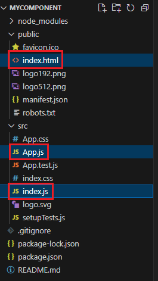

1. # jsx문법
   리액트에서 모듈이라고 부르며 자바에서는 라이브러리라고 합니다.   
   일반적으로 src디렉토리는 소스를 저장하는 디렉토리입니다.   

      

   node_modules 디렉토리 : 노드 모듈 디렉토리   
   public 디렉토리 : 정적인 파일을 저장하기 위한 디렉토리   

   index.html : 처음 화면에 출력되는 부분   
   ```html
      <title>React App</title>
      <body>
         <noscript>You need to enable JavaScript to run this app.</noscript>
         <div id="root"></div> <!-- 이부분에 시작화면이 렌더링 됩니다 -->
      ...
      </body>
   ```   

   App.js : 첫 화면에 보여질 컴포넌트   
   ```javascript
      function App() {
         return (
            //루트 태그는 반드시 1개가 필요
            <div>
               ...
            </div>
         );
      }

      export default App;
   ```   
   App()가 하나의 함수 컴포넌트이며 이 함수를 호출하게 index.js에서 호출하게 됩니다.   
   
   index.js : Entry Point     
   ```javascript
      import App from './App'; //App import
      import reportWebVitals from './reportWebVitals';

      const root = ReactDOM.createRoot(document.getElementById('root'));
      root.render(
      <React.StrictMode>
         <App /> //App사용
      </React.StrictMode>
      );
   ```   

   App.js에서 컴포넌트를 작성,   
   index.html에서 화면에 보여줄 html작성,   
   index.js에서 App.js의 컴포넌트와 index.html의 root부분을 합쳐서 렌더링   

   App.css: App 컴포넌트의 디자인   
   App.test.js: App을 테스트하기 위한 파일   
   index.css: Entry Point 의 디자인   

   JSX의 시작과 끝   
   시작: 일반적으로 () 안에 들어있는 부분이 JSX의 시작을 알립니다.   
   끝: ()가 닫히는 부분까지가 JSX의 끝입니다.   

   return다음 () 부분이 jsx 범위가 됩니다.   

1. # jsx안에서 root태그가 반드시 1개 필요하다
   ```javascript
      // 함수형 컴퍼넌트
      function App1() {
         return (
            //루트 태그는 반드시 1개가 필요
            <div>
               <h1>hello react</h1>
               <h1>hello jin</h1>
            </div>
         );
      }

      //다른 파일에서 사용할 수 있도록 export한다
      export default App;
   ```

1. # jsx안에서 자바스크립트 표현식을 사용할 때는 {}로 감싸준다
   ```javascript
      function App2(){
         const name = '리액트';

         return(
            <div>
               <h1>{name} hello!</h1>
               <h1>{name} world!</h1>
            </div>
         );
      }

      export default App2;
   ```

1. # jsx안에서 조건부 연산자(삼항 연산자) 사용
   ```javascript
      function App3(){
         const name = 'react';

         return(
            <div>
               {/* ==가 아니라 ===를 사용 */}
               {name === 'react' ? <h1>react입니다.</h1> : <h1>리액트가 아닙니다.</h1>}
            </div>
         );
      }

      export default App3;
   ```  

1. # jsx외부에서는 if 조건문 사용 가능   

   ```javascript
      function App3_1(){
         let state = '';
         const login = 'y';

         if(login == 'y'){
            state = '로그인 성공';
         }else{
            state = '로그인 실패';
         }

         return(
            <div>
               {state}
            </div>
         );
      }

      export default App3_1;
   ```  

1. # jsx의 주석문

   ```javascript
      function App8(){
         //const name = 'react';

         return (
            <div>
               {/* jsx주석문 입니다 */}
               {/* <div>{name}</div> */}
               //이런 주석이나
               /* 이런 주석은 페이지에 그대로 나타나게 됩니다. */
            </div>
         );
      }

      export default App8;
   ```