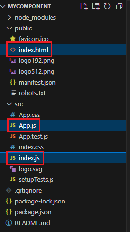

1. # 파일 설명
   
   일반적으로 src디렉토리는 소스를 저장하는 디렉토리입니다.   

      

   node_modules 디렉토리 : 노드 모듈 디렉토리   
   public 디렉토리 : 정적인 파일을 저장하기 위한 디렉토리   

   index.html : 처음 화면에 출력되는 부분   
   ```html
      <title>React App</title>
      <body>
         <noscript>You need to enable JavaScript to run this app.</noscript>
         <div id="root"></div> <!-- 이부분에 시작화면이 렌더링 됩니다 -->
      ...
      </body>
   ```   

   App.js : 첫 화면에 보여질 컴포넌트   
   ```cs
      function App() {
         return (
            //루트 태그는 반드시 1개가 필요
            <div>
               ...
            </div>
         );
      }

      export default App;
   ```   
   App()가 하나의 함수 컴포넌트이며 이 함수를 index.js에서 호출하게 됩니다.   
   
   index.js : Entry Point   
   ```javascript
      import App from './App'; //App import
      import reportWebVitals from './reportWebVitals';

      const root = ReactDOM.createRoot(document.getElementById('root'));
      root.render(
      <React.StrictMode>
         <App /> //App사용
      </React.StrictMode>
      );
   ```   

   App.js에서 컴포넌트를 작성   
   index.html에서 화면에 보여줄 html작성   
   index.js에서 App.js의 컴포넌트와 index.html의 root부분을 합쳐서 렌더링   

   App.css: App 컴포넌트의 디자인   
   App.test.js: App을 테스트하기 위한 파일   
   index.css: Entry Point 의 디자인   

   리액트에서 모듈이라고 부르며 자바에서는 라이브러리라고 합니다.   

1. # JSX범위
   JSX의 시작과 끝   
   시작: 일반적으로 () 안에 들어있는 부분이 JSX의 시작을 알립니다.   
   끝: ()가 닫히는 부분까지가 JSX의 끝입니다.   

   return다음 () 부분이 jsx 범위가 됩니다.   

   ```javascript

      ..return 밖은 자바스크립트 영역..

      function App(){

         ..return 밖은 자바스크립트 영역..

         return (

            ..return 안은 HTML영역..
            return 안쪼깅 JSX부분

         )
      }
   ```   
   <br>
   jsx안에서 자바스크립트를 사용할 때는 { } 로 감싸줍니다.   
   ```javascript
      function App(){

         let age = 20; 

         return (
            <div>
               나의 나이는 {age}입니다.
            </div>
         )
      }
   ```   
   <br>
   jsx 안에서 { } 안은 변수로 인식   
   ```javascript
      function App(){

         let age = 20; 

         return (
            <div>
               나의 나이는 {age >= 20? '성인' : 미성년 }입니다. //성인은 문자로 인식, 미성년은 변수로 인식
            </div>
         )
      }
   ```   
   미성년을 변수로 인식해서 오류가 납니다. '미성년' , "미성년" 쌍따옴표과 홑따옴표 모두 문자로 인식합니다.

1. # JSX 기초 문법

   1. 변수 선언은 let 혹은 const만 가능.   

   1. JSX 안에서는 if문 사용 불가/ 대신, 삼항 연산자 사용.   
   조건 ? 값(true) : 거짓(false)   

   1. 조건부 렌더링(조건 && 값(true))   
   조건이 참이면 값이 출력, 조건이 false이면 값이 출력되지 않음   
   조건부 렌더링은 false 경우가 없다.   

   1. return __앞에__ 태그가 1개이면 ( ) 생략 가능   
   ```javascript
      function App() {

         //정상 작동
         return <div>
            나의 나이는 {age >= 20? '성인' : "미성년" }입니다. 
            </div>
         
         //오류 발생
         return 
            <div> 
               나의 나이는 {age >= 20? '성인' : "미성년" }입니다. 
            </div>

         //오류 발생
         return <div>
            나의 나이는 {age >= 20? '성인' : "미성년" }입니다. 
            </div><div></div>
      }
   ```

   1. 변수 선언은 undefined가 할당   
   ```javascript
      import './App.css';

      let a; //undefined 할당

      function App() {

         let b;  //undefined 할당

         console.log(a, b)

         return <div>
            </div>
      }

      export default App;
   ```   
   undefined와 null은 다릅니다. null은 아무것도 없는 것이고 undefined는 메모리는 차지하고 있는데 값이 없는 것입니다.   


1. # 괄호 사용

   `{ }`(중괄호)와 `{``{``}``}`(이중괄호)와 `[]`(대괄호)를 어떠한 경우에 사용하는지 정리해 보았습니다.   
   <br>
   __`{}`(중괄호)의 사용__   
   1)JSX 내에서 JavaScript 표현식 실행   
   변수, 함수 호출, 조건문 등 JavaScript 코드를 직접 작성하여 JSX 내에 값을 삽입합니다.   
   ```javascript   
      const name = '홍길동';
      const element = <h1>안녕하세요, {name}님!</h1>;
   ```   
   코드를 사용할 때는 주의가 필요합니다.

   2)컴포넌트 내에서 props 전달   
   부모 컴포넌트에서 자식 컴포넌트로 데이터를 전달할 때 사용합니다.   
   ```javascript
      <MyComponent name={name} age={30} />
   ```

   3)컴포넌트 내에서 스타일 지정
   ```javascript
      const divStyle = { color: 'blue', fontSize: '20px' }; 
      <div style={divStyle}>Hello</div>
   ```
   <br>
   __`{``{``}``}`(이중 중괄호)의 사용__   
   CSS 속성값으로 바로 대입할 때   
   ```cs
      <button style={{color:'red'}}>
   ```
   <br>
   __`[ ]`(대괄호)의 사용__   
   1)배열 생성
   ```javascript
      const numbers = [1, 2, 3, 4, 5];
   ```
   
   2)배열 요소 접근   
   배열의 특정 인덱스에 있는 요소에 접근합니다.   
   ```javascript
      const firstNumber = numbers[0];
   ```   
   
   3)조건부 렌더링 (삼항 연산자와 함께)   
   조건에 따라 다른 요소를 렌더링할 때 사용됩니다.   
   ```javascript
      const isLoggedIn = true;
      const greeting = isLoggedIn ? <h1>환영합니다!</h1> : <p>로그인해주세요.</p>;
   ```   

   4)Spread 연산자   
   배열이나 객체를 확산하여 다른 배열이나 객체에 합칠 때 사용합니다.   
   ```javascript
      const arr1 = [1, 2];
      const arr2 = [3, 4];
      const combinedArr = [...arr1, ...arr2];
   ```
   5)Destructuring
   배열이나 객체를 분해하여 변수에 할당할 때 사용합니다.
   ```javascript
      const [x, y] = [10, 20];
   ```
   <br>
   __`{ }`(중괄호) 안에 태그를 사용하는 경우__   
   1)조건부 렌더링   
   ```javascript
      const isLoggedIn = true;

      return (
      <div>
         {isLoggedIn && <p>로그인되었습니다.</p>}
      </div>
      );
   ```   

   2)배열 또는 객체를 이용한 반복   
   ```javascript
      const items = [
         { id: 1, name: 'item1' },
         { id: 2, name: 'item2' }
      ];

      return (
      <ul>
         {items.map(item => (
            <li key={item.id}>{item.name}</li>
         ))}
      </ul>
      );
   ```   

   3)컴포넌트 분리   
   ```javascript
      function MyComponent(props) {
         return <div>{props.children}</div>;
      }

      return (
      <MyComponent>
         <h1>제목</h1>
         <p>내용</p>
      </MyComponent>
      );
   ```

1. # 괄호 범위
   ```javascript
       <div>
         {subject.map((e) => { //자바스크립트 영역
            return(        // return() html영역
            <div key={e}>
               <h1>sdf</h1>
               <h5 className="subjectTitle">{e}</h5> //html영역 안에서 {e} : 자바스크립트 영역
            </div>
            )
         })}
      </div>
   ```   
   중괄호는 { } 자바스크립트 영역이 되고,   
   return 소괄호 ( ) 는 html영역이 되고,   
   이 안에서 {e}는 다시 자바스크립트 영역이 됩니다.   

1. # jsx안에서 root태그가 반드시 1개 필요하다
   ```javascript
      // 함수형 컴퍼넌트
      function App1() {
         return (
            //루트 태그는 반드시 1개가 필요
            <div>
               <h1>hello react</h1>
               <h1>hello jin</h1>
            </div>
         );
      }

      //다른 파일에서 사용할 수 있도록 export한다
      export default App;
   ```

1. # jsx안에서 자바스크립트 표현식을 사용할 때는 {}로 감싸준다
   ```javascript
      function App2(){
         const name = '리액트';

         return(
            <div>
               <h1>{name} hello!</h1>
               <h1>{name} world!</h1>
            </div>
         );
      }

      export default App2;
   ```

1. # jsx안에서 조건부 연산자(삼항 연산자) 사용
   ```javascript
      function App3(){
         const name = 'react';

         return(
            <div>
               {/* ==가 아니라 ===를 사용 */}
               {name === 'react' ? <h1>react입니다.</h1> : <h1>리액트가 아닙니다.</h1>}
            </div>
         );
      }

      export default App3;
   ```  

1. # jsx외부에서는 if 조건문 사용 가능   

   ```javascript
      function App3_1(){
         let state = '';
         const login = 'y';

         if(login == 'y'){
            state = '로그인 성공';
         }else{
            state = '로그인 실패';
         }

         return(
            <div>
               {state}
            </div>
         );
      }

      export default App3_1;
   ```  

1. # jsx의 주석문

   ```javascript
      function App8(){
         //const name = 'react';

         return (
            <div>
               {/* jsx주석문 입니다 */}
               {/* <div>{name}</div> */}
               //이런 주석이나
               /* 이런 주석은 페이지에 그대로 나타나게 됩니다. */
            </div>
         );
      }

      export default App8;
   ```

1. # 배열에 html
   react는 배열에 html태그를 넣어놔도 출력가능합니다.   
   ```javascript
      ["<div>안녕</div><div>멀리</div><div>뱃고동이 들리면</div>"].map(function(e){
         document.write(e)
      })

      s결과값:
      안녕
      멀리
      뱃고동이 들리면
      안녕
      멀리
      뱃고동이 들리면
   ```

1. # 유의사항
   1. HTML태그 내에 JavaScript 연산
      ```javascript
         const App = ()=>{
            const a=5, b=6;
            return <div>{a}+{b}={a+b}</div>
         }
      ```   
      return문에 HTML과 자바스크립트를 사용한 JSX를 입력합니다. 자바스크립트 변수나 연산식을 JSX에서 사용하기 위해서 { }(중괄호)를 사용합니다.   

   1. Class -> className
      ```javascript
         <div class="titleCss"> //class라 적으면 안됨
         <div className="titleCss"> //className으로 적어야 됨
      ```

   1. 스타일은 objec로    
      ```javascript
         <div className="greeting" sytle={`{`padding:10, color:'red'`}`}>{name}님 반갑습니다.
         </div>
      ```
      {}를 2개 사용하는 이유는 첫번째 중괄호는 자바스크립트를 사용하겠다는 뜻이고 두번째 중괄호는 객체를 사용하겠다는 뜻입니다.   
      font-size, padding-left과 같이 "-"를 사용하는 속성은 camelCase로 적습니다. fontSize, paddingLeft,..   

   1. 닫는 태그 필수 
      ```javascript
         <br> -> <br />
         <input type="text"> -> <input type="text" />
      ```

   1. 최상단 element는 반드시 하나 
   ```javascript
      const App = () => `{`
         return (
            <div>Hello</div> //최상단 element 2개
            <div>World</div>
         )
      `}`
   ```        
   최상단 element가2개라 error발생   

   ```javascript
       const App = () => {
         return (
            <>{ } //<- 최상단 element 1개
               <div>Hello</div>
               <div>World</div>
            </>
         )
      }
      //또는
      return (
            <div> //<- 최상단 element 1개
               <div>Hello</div>
               <div>World</div>
            </div>
         )
   ```

1. #  CSS 설정할때 속성명을 카멜 표기법으로 작성
   같은 파일 안에서 스타일을 적용할 때는 카멜 표기법   

   ```javascript
      function App5(){
         const name = '리액트'

         const style={
            backgroundColor : 'black', //카멜 표기법
            color : 'aqua',
            fontSize : '48px',         //카멜 표기법
            fontWeight : 'bold',       //카멜 표기법
            padding : 16
         }

         return (
            <div style={style}>{name}</div>
         );
      }

      export default App5;
   ```   

1. # 외부 css파일 적용
   src폴더에 이미 App.css 이름의 스타일시트 파일이 있습니다. 여기에 스타일을 추가 후 js파일에서 import를 합니다.   
   클래스를 적용시킬 때 cs에서는 class란 속성으로 적용을 시켰지만 react에서는 __className__ 속성으로 적용시켜야합니다.   

   같은 내부 파일에서 css를 적용시킬 때는 카멜 표기법을 사용하지만 외부에서 적용시킬 때는 `-(하이픈)`을 사용합니다.   

   App.css파일   
   ```cs
      .react {
         background-color: aqua;
         color : black;
         font-weight: bold;
         font-size: 16px;
      }
   ```

   App.js파일   
   ```javascript
      import './App.css';  //스타일이 있는 css파일 import

      function App6(){
         const name = '리액트';

         return(
            <div>
               <div className='react'>{name}</div> //className 속성
            </div>
         );
      }

      export default App6;
   ```   
   상단에 App.css파일을 import시킵니다.   

1. # 열린 태그 닫기
   열린 태그는 반드시 닫아 주어야합니다.   

   ```html
      <input><br> : 에러발생(잘못된 입력)
      <input></input><br></br> : 올바른 입력
   ```   

   예제   
   ```javascript
      function App(){
         const name = '리액트';

         return(
            <div>
               <div>{name}</div>
               <form>
                  <input type="button"></input> //정상 입력
                  <input type="button" />       //정상 입력
                  <input type="button">         //오류 발생
               </form>
            </div>
         );
      }

      export default App;
   ```   
