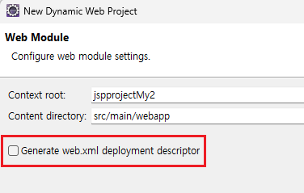
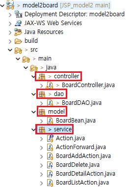
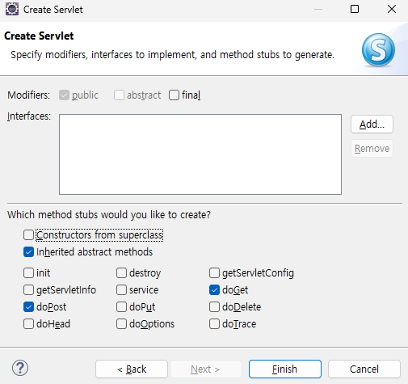
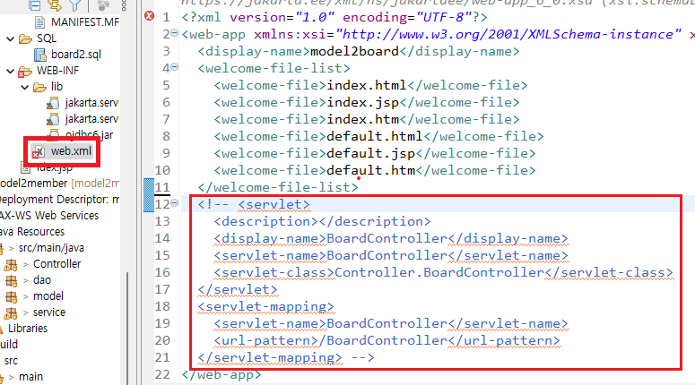

1. # 프로젝트 생성 순서
      
   web.xml 파일 생성 체크   

      
   META-INF 폴더 안에 context.xml   
   WEB_INF/lib 폴더 안에 jar 라이브러리 추가   

   __DB생성__   
   webapp폴더 → SQL폴더 → board2.sql   
   Data Source Explorer에서 DB connection 연결   

   webapp폴더 → board폴더 → 모든 jsp파일   

   *DTO(model) → DAO(dao) → Controller → Service 순서로 작성   
      

   __Model - DTO__   
   BoardBean.java   
   db와 변수이름 타입이 일치해야된다. db의 table을 가져와서 작성!   

   __DB - DAO__   
   BoardDAO.java   
   ```java
      import java.sql.Connection;
      import javax.naming.Context;
      import javax.naming.InitialContext;
      import javax.sql.DataSource;

      public class BoardDAO {
            // 싱글톤 : 객체 생성을 한번만 수행 하는것.
            private static BoardBean instance = new BoardBean();

            public static BoardBean getInstance() { // 정적 메소드
               return instance;
            }

            // 컨넥션풀에서 컨넥션을 구해오는 메소드
            private Connection getConnection() throws Exception {
               Context init = new InitialContext();
               DataSource ds = (DataSource) init.lookup("java:comp/env/jdbc/orcl");
               return ds.getConnection();
            }
      }
   ```

   __Controller__   
   servlet생성   
   

   톰캣 버전에 따라 컨트롤러 주소 설정이 2가지   
   1)서블릿 맵핑 2)어노테이션   

   어노테이션으로 경로를 설정하기 위해서 web.xml파일에서 서블릿 맵핑 부분은 주석처리   
   

   어노테이션으로 처리   
   ```java
      @WebServlet("*.do") //<-- *.do으로 어노테이션 설정, 확장자가 do이면 전부 이쪽으로 접속
   ```

   -web.xml을 사용할 경우-   
   ```xml
      <servlet>
         <description></description>
         <display-name>BoardController</display-name>
         <servlet-name>BoardController</servlet-name>
         <servlet-class>Controller.BoardController</servlet-class>
      </servlet>
      <servlet-mapping>
         <servlet-name>BoardController</servlet-name>
         <url-pattern>*.do</url-pattern> <!-- 이부분을 *.do로 입력 -->
      </servlet-mapping> 
   ```
   서블릿 맵핑을 사용할 경우 url-pattern 부분에 *.do입력   


   __컨트롤러 서블릿 전체 소스__   
   ```java
      @WebServlet("*.do")
      public class BoardController extends HttpServlet {
         private static final long serialVersionUID = 1L;
         
         //doGet(), doPost() 메소드의 공통적인 작업 처리
         protected void doProcess(HttpServletRequest request, HttpServletResponse response) throws ServletException, IOException {
         }
         
         protected void doGet(HttpServletRequest request, HttpServletResponse response) throws ServletException, IOException {
            System.out.println("get");
            
            doProcess(request, response);
         }

         protected void doPost(HttpServletRequest request, HttpServletResponse response) throws ServletException, IOException {
            System.out.println("post");
            
            doProcess(request, response);
         }
      }
   ```

   Service
   
   Action.jsava
   ActionForward.java
   BoardAddAction.java
   BoardListAction.java
   BoardDetailAction.java
   BoardReplyForm.java
   BoardReply.java


    -> DAO -> Controller -> Service


1. # 주요 기능
   1.Connection Pool   
   2.request, session 객체 공유 설정   
   3.Controller클래스 : Java Servlet   
   4.Model = Service + DAO   
      Service, DTO, DAO 클래스   
   5.View(화면 인터페이스) : EL, JSTL사용   

1. # 프로그램 주요 파일
   Controller클래스 - MemberController.java   

   DTO클래스 : model - MemberDTO.java(DTO크래스)   
   DAO클래스 : dao - MemberDAO.java(DAO클래스)   

   Action인터페이스 : service - Action.java   
   
   ActionForward클래스 : service - ActionForwad.java   

   Service클래스 : service =>   
   MemberInert.java(회원가입)    
   IdCheck.java(ID중복검사)   
   Login.java(로그인)   
   Logout.java(로그아웃)   
   UpdateMember.java(정보수정폼)   
   Update.java(정보수정)   
   DeleteMember.java(회원탈퇴폼)   
   Delete.java(회원탈퇴)   

1. # 작성 순서

   controller -> service -> dao -> service -> controller -> view

   1)DB파일을 가져와서 DTO만들기   
   2)DAO만들기   
   3)Servlet - Controller만들기
   :memberForm.jsp -> Controller   
   =>memberForm.jsp의 form action으로 Controller의 .do로 전송   
   4)Service - 부모 인터페이스(Action) 만들기   
   5)Service - ActionForward 클래스 만들기   
   6)Service - MemberInert 클래스 만들기

1. # DAO만들기
   dbcp방식 - Connection Pool   

   ```java
      public class MemberDAO {
         private static MemberDAO instance = new MemberDAO(); 
               
         public static MemberDAO getInstance() {
            return instance;
         }
         
         //컨넥션풀에서 컨넨ㄱ션을 구해오는 메소드
         private Connection getConnection() throws Exception {
            Context init = new InitialContext();
            DataSource ds = (DataSource) init.lookup("java:comp/env/jdbc/orcl");
            return ds.getConnection();
         }
         
         //회원가입
         public int insert(MemberDTO member) {
            int result = 0;
            return result;
         }
      }
   ```

1. # Controller - servlet
   File -> New -> Servlet으로 생성   

   1)톰캣 버전 9점 대 - 어노테이션으로 추가   
   ```java
      /* @WebServlet("/MemberController") */
      @WebServlet("*.do") //do확장자로 요청하는 모든 요청을 받는다는 의미
      public class MemberController extends HttpServlet {
         private static final long serialVersionUID = 1L;

         protected void doGet(HttpServletRequest request, HttpServletResponse response) throws ServletException, IOException {
            response.getWriter().append("Served at: ").append(request.getContextPath());
         }

         protected void doPost(HttpServletRequest request, HttpServletResponse response) throws ServletException, IOException {
            doGet(request, response);
         }
      }
   ```

   2)톰캣 버전 10점 대 - WEB-INF/web.xml 파일에 servlet이 자동 맵핑됨   
   ```xml
      <servlet>
         <description></description>
         <display-name>MemberController</display-name>
         <servlet-name>MemberController</servlet-name>
         <servlet-class>Controller.MemberController</servlet-class>
      </servlet>
      <servlet-mapping>
         <servlet-name>MemberController</servlet-name>
         <url-pattern>/MemberController</url-pattern>
      </servlet-mapping>
   ```

1. # 실행순서
   로그인 session 이 있다 - main페이지
   sesstio이 이 없다 - 로그인

   memberForm.jsp -> MemberInsert.do(controller) -> 

   main.jsp -> UpdateMember.do(controller) : controller에서

   