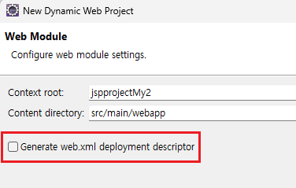
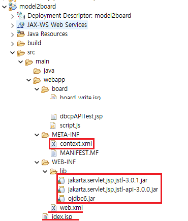
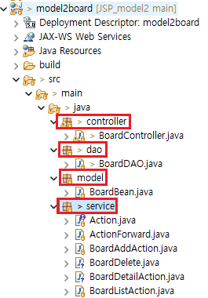
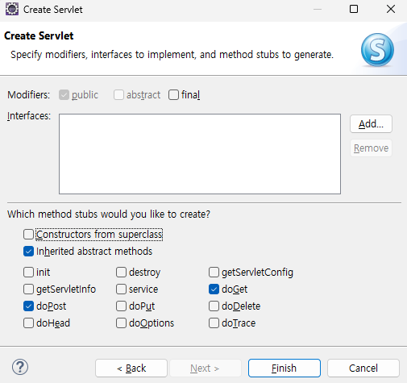
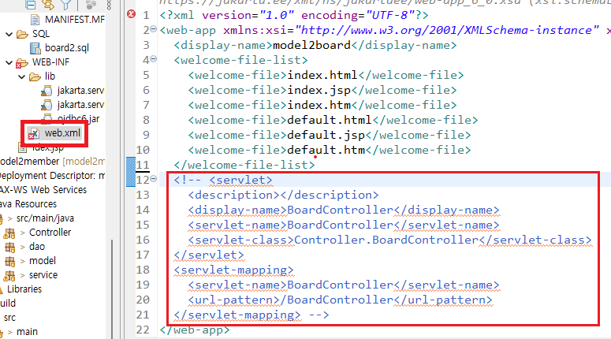

1. # 프로젝트 생성 순서
      
   web.xml 파일 생성 체크   

      
   META-INF 폴더 안에 context.xml   
   WEB_INF/lib 폴더 안에 jar 라이브러리 추가   

   __DB생성__   
   webapp폴더 → SQL폴더 → board2.sql   
   Data Source Explorer에서 DB connection 연결   

   webapp폴더 → board폴더 → 모든 jsp파일   

   *DTO(model) → DAO(dao) → Controller → Service 순서로 작성   
      

   __Model - DTO__   
   BoardBean.java   
   db와 변수이름 타입이 일치해야된다. db의 table을 가져와서 작성!   

   __DB - DAO__   
   BoardDAO.java   
   ```java
      import java.sql.Connection;
      import javax.naming.Context;
      import javax.naming.InitialContext;
      import javax.sql.DataSource;

      public class BoardDAO {
            // 싱글톤 : 객체 생성을 한번만 수행 하는것.
            private static BoardBean instance = new BoardBean();

            public static BoardBean getInstance() { // 정적 메소드
               return instance;
            }

            // 컨넥션풀에서 컨넥션을 구해오는 메소드
            private Connection getConnection() throws Exception {
               Context init = new InitialContext();
               DataSource ds = (DataSource) init.lookup("java:comp/env/jdbc/orcl");
               return ds.getConnection();
            }
      }
   ```

   __Controller__   
   servlet생성   
   

   톰캣 버전에 따라 컨트롤러 주소 설정이 2가지   
   1)서블릿 맵핑 2)어노테이션   

   어노테이션으로 경로를 설정하기 위해서 web.xml파일에서 서블릿 맵핑 부분은 주석처리   
   

   어노테이션으로 처리   
   ```java
      @WebServlet("*.do") //<-- *.do으로 어노테이션 설정, 확장자가 do이면 전부 이쪽으로 접속
   ```

   -web.xml을 사용할 경우-   
   ```xml
      <servlet>
         <description></description>
         <display-name>BoardController</display-name>
         <servlet-name>BoardController</servlet-name>
         <servlet-class>Controller.BoardController</servlet-class>
      </servlet>
      <servlet-mapping>
         <servlet-name>BoardController</servlet-name>
         <url-pattern>*.do</url-pattern> <!-- 이부분을 *.do로 입력 -->
      </servlet-mapping> 
   ```
   서블릿 맵핑을 사용할 경우 url-pattern 부분에 *.do입력   

   __컨트롤러 서블릿 전체 소스__   
   ```java
      @WebServlet("*.do") //do 확장자는 모두 이쪽으로
      public class Controller extends HttpServlet {

         protected void doProcess(HttpServletRequest request, HttpServletResponse response) throws ServletException, IOException {
            
            String requestURI = request.getRequestURI(); //전체 URI를 가져온다
            String contextPath = request.getContextPath(); //현재 프로제트명을 가져온다.
            String command = requestURI.substring(contextPath.length());
            
            System.out.println(requestURI);  //mymodel2board/LoginForm.do
            System.out.println(contextPath); //mymodel2board
            System.out.println(command); 	 //LoginForm.do
         }

         //링크를 걸거나 location이동
         protected void doGet(HttpServletRequest request, HttpServletResponse response) throws ServletException, IOException {
            System.out.println("doGet");
            doProcess(request, response);
         }

         //form을 통해 전송 시
         protected void doPost(HttpServletRequest request, HttpServletResponse response) throws ServletException, IOException {
            System.out.println("doPost");
            doProcess(request, response);
         }

      }
   ```
   HTTP Request는 웹 서버에 데이터를 요청하는 방식 6가지입니다.   

   GET: 서버에서 특정 리소스를 가져오는 데 사용됩니다.   
   POST: 서버에 새로운 데이터를 생성하는 데 사용됩니다. 예를 들어, 웹 양식 데이터를 서버에 전송하거나 파일을 업로드할 때 사용됩니다.   
   PUT: 서버에 있는 기존 리소스를 전체적으로 업데이트하는 데 사용됩니다.   
   DELETE: 서버에 있는 기존 리소스를 삭제하는 데 사용됩니다.   
   PATCH: 서버에 있는 기존 리소스를 부분적으로 업데이트하는 데 사용됩니다.   
   HEAD: GET 요청과 비슷하지만, 응답 본문 대신 응답 헤더만 반환합니다. 주로 리소스의 메타데이터를 확인할 때 사용됩니다.   

   Service 에서   
   Action.java / ActionForward.java 먼저 생성  Action.java는 Interface   

   BoardAddAction.java / BoardListAction.java   
   BoardDetailAction.java / BoardReplyForm.java / BoardReply.java 에서 Action.java를 상속   

   <span style="color:red">*jsp에서 form의 요청주소와 service의 이름을 같게 해야 함.</span>

   Action.java - 인터페이스   
   ```javascript
      public interface Action {
         //추상 메서드
         public ActionForward execute(HttpServletRequest request, HttpServletResponse response) throws Exception;
      }
   ```

   ActionForward.java
   ```javascript
      public class ActionForward { //Forward 방식 설정
         private boolean redirect;
         private String path;
         
         public boolean isRedirect() {
            return redirect;
         }
         public String getPath() {
            return path;
         }
         public void setRedirect(boolean redirect) {
            this.redirect = redirect;
         }
         public void setPath(String path) {
            this.path = path;
         }
      }
   ```

   forward if문   
   ```javascript
      //포워딩 처리
		if(forward != null) {
			if(forward.isRedirect()) { //redirect 방식으로 포워딩
				response.sendRedirect(forward.getPath());
			}else {
				RequestDispatcher dispatcher = request.getRequestDispatcher(forward.getPath());
				dispatcher.forward(request, response);
			}
		}
   ```

   __session은 redirect와 dispather 다 사용 가능__   
   __request는 dispather만 사용 가능__   

   ```javascript
      BoardDTO board = new BoardDTO();
   ```
   Dto클래스를 초기화할 때 int형은 자동 0으로 초기화   


1. # 프로그램 실행 순서
   첫글 입력 board_write.jsp(view) → Controller → BoardAddAction.java(service) → redirect:BoardListAction.do → Controller → BoardListAction.java(service) → board_list.jsp(view) 

1. # el, jstl, jsp 값 출력 비교

   ```java
   글 갯수 : ${listcount} 개 //el	
	
	글 갯수 : <%= count %>  //jstl

	<%
	int count = ((Integer)request.getAttribute("listcount")).intValue();
	%> //jsp
   ```

1. # 주요 기능
   1.Connection Pool   
   2.request, session 객체 공유 설정   
   3.Controller클래스 : Java Servlet   
   4.Model = Service + DAO   
      Service, DTO, DAO 클래스   
   5.View(화면 인터페이스) : EL, JSTL사용   

1. # 프로그램 주요 파일
   Controller클래스 - MemberController.java   

   DTO클래스 : model - MemberDTO.java(DTO크래스)   
   DAO클래스 : dao - MemberDAO.java(DAO클래스)   

   Action인터페이스 : service - Action.java   
   
   ActionForward클래스 : service - ActionForwad.java   

   Service클래스 : service =>   
   MemberInert.java(회원가입)    
   IdCheck.java(ID중복검사)   
   Login.java(로그인)   
   Logout.java(로그아웃)   
   UpdateMember.java(정보수정폼)   
   Update.java(정보수정)   
   DeleteMember.java(회원탈퇴폼)   
   Delete.java(회원탈퇴)   

1. # 작성 순서

   controller -> service -> dao -> service -> controller -> view

   1)DB파일을 가져와서 DTO만들기   
   2)DAO만들기   
   3)Servlet - Controller만들기
   :memberForm.jsp -> Controller   
   =>memberForm.jsp의 form action으로 Controller의 .do로 전송   
   4)Service - 부모 인터페이스(Action) 만들기   
   5)Service - ActionForward 클래스 만들기   
   6)Service - MemberInert 클래스 만들기

1. # DAO만들기
   dbcp방식 - Connection Pool   

   ```java
      public class MemberDAO {
         private static MemberDAO instance = new MemberDAO(); 
               
         public static MemberDAO getInstance() {
            return instance;
         }
         
         //컨넥션풀에서 컨넨ㄱ션을 구해오는 메소드
         private Connection getConnection() throws Exception {
            Context init = new InitialContext();
            DataSource ds = (DataSource) init.lookup("java:comp/env/jdbc/orcl");
            return ds.getConnection();
         }
         
         //회원가입
         public int insert(MemberDTO member) {
            int result = 0;
            return result;
         }
      }
   ```

1. # Controller - servlet
   File -> New -> Servlet으로 생성   

   1)톰캣 버전 9점 대 - 어노테이션으로 추가   
   ```java
      /* @WebServlet("/MemberController") */
      @WebServlet("*.do") //do확장자로 요청하는 모든 요청을 받는다는 의미
      public class MemberController extends HttpServlet {
         private static final long serialVersionUID = 1L;

         protected void doGet(HttpServletRequest request, HttpServletResponse response) throws ServletException, IOException {
            response.getWriter().append("Served at: ").append(request.getContextPath());
         }

         protected void doPost(HttpServletRequest request, HttpServletResponse response) throws ServletException, IOException {
            doGet(request, response);
         }
      }
   ```

   2)톰캣 버전 10점 대 - WEB-INF/web.xml 파일에 servlet이 자동 맵핑됨   
   ```xml
      <servlet>
         <description></description>
         <display-name>MemberController</display-name>
         <servlet-name>MemberController</servlet-name>
         <servlet-class>Controller.MemberController</servlet-class>
      </servlet>
      <servlet-mapping>
         <servlet-name>MemberController</servlet-name>
         <url-pattern>/MemberController</url-pattern>
      </servlet-mapping>
   ```

1. # 실행순서
   로그인 session 이 있다 - main페이지
   sesstio이 이 없다 - 로그인

   memberForm.jsp -> MemberInsert.do(controller) -> 

   main.jsp -> UpdateMember.do(controller) : controller에서

   