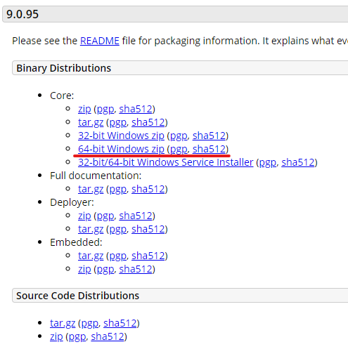
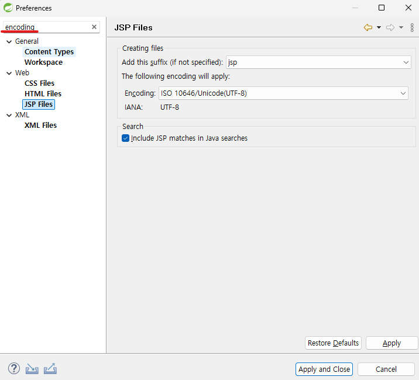
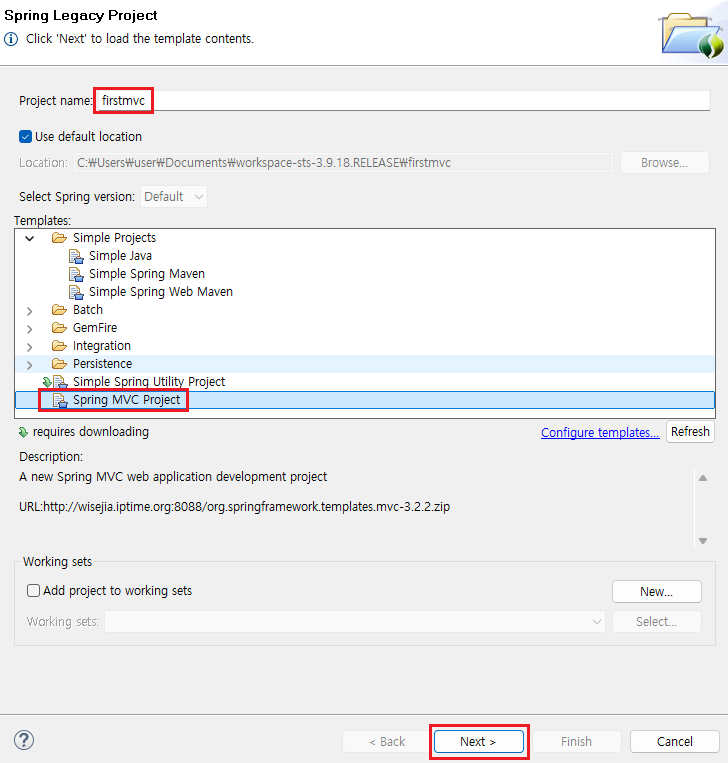
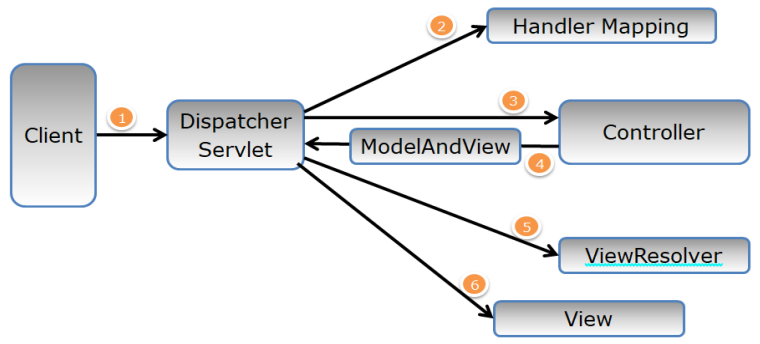
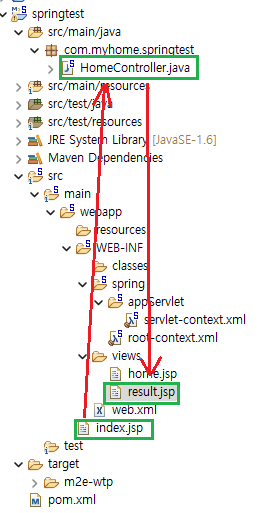
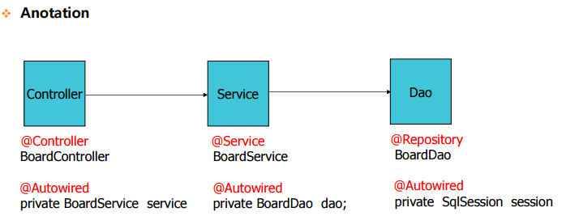
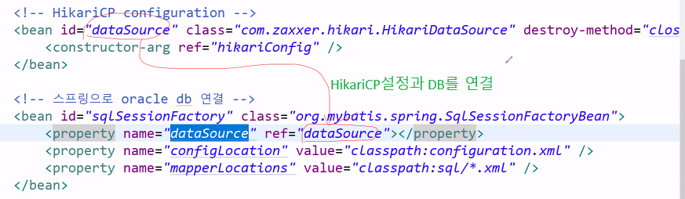
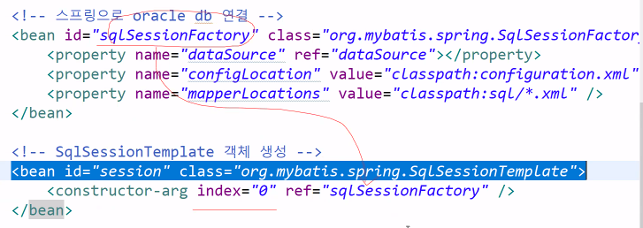

1. # Spring
   "경량 컨테이너"(크기와 부하의 측면)로서 자바 객체를 직접 관리   

   __제어의 역행(IOC : Inversion of Control)__   
   개발자가 코드의 제어 흐름을 처리하지 않고, 스프링 프레임워크가 객체의 라이프사이클 및 실행 흐름을 관리한다.   

   __의존성 주입(DI : Dependency Injection)__   
   각각의 계층이나 서비스들 간에 의존성이 존재할 경우 프레임워크가 서로 연결시켜준다.   

   __관점지향 프로그래밍(AOP : Aspect-Oriented Programming)__   
   트랜잭션이나 로깅, 보안과 같이 여러 모듈에서 공통적으로 사용하는 기능의 경우 해당 기능을 분리하여 관리할 수 있다.   

   __모델-뷰-컨트롤러 패턴__   
   웹 프로그래밍 개발시 거의 표준적인 방식인 "Spring MVC"라 불리는 모델-뷰-컨트롤러 패턴을 사용   

   Java 11 설치   
   Apache Tomcat 9 설치   
   STS 3.9.x 설치   

   톰캣을 버전이 다르게 2개 이상 사용하는 경우, 하나는 install을 하고 나머지는 압축을 풀어 사용하는 버전을 선택하면 됩니다.   
   압축되어 있는 톰캣을 다운받아 압축을 풉니다   
      

   STS3를 설치 후 utf-8로 변경합니다.   
      

   *Spring MVC Project를 생성하는 과정 오류   
   
   위에 부분에서 Spring MVC Project를 선택하고 next를 눌렀는데   
   ```
      An error has occurred. See error log for more details.
      Could not initialize class com.thoughtworks.xstream.converters.collections.PropertiesConverter
   ```
   다음과 같은 에러가 나타나는 경우   
   
   원인 : java 버전이 너무 높아서 발생하는 에러입니다.   
   
   <에러 해결 방법>
   압축 해제한 STS폴더로 들어가서 sts.ini 파일을 열어서 맨 위에 아래 2줄을 추가하고 다시 실행하면
   해결된다.
   ```cs
      -vm
      C:\Program Files\Java\jdk-11\bin\javaw.exe
   ```

   servlet-context.xml
   root-context.xml
   은 자동으로 실행이 안되기 때문에 web.xml에 등록

   handler mapping -> requestMapping
   

   web.xml에 <url-pattern>/<url-pattern>
   '/' 값을 받는게 handler mapping   

      

   __Anotaion을 이용한 DI__   
   ```xml
      <context:component-scan base-package="sample15"/>
   ```
   1. sample15 패키지 하위 클래스를 스캔한다는 의미를 가진다.   
   2. sample15 패키지 하위 클래스에 @Component, @Controller, @Service, @Repository 어노테이션이 붙어있는 클래스는 @Autowired 어노테이션을 이용해서 필요한 빈 객체를 setter 메소드 없이 자동으로 주입을 받는다   

   자바 : 할당
   스프링 : 주입

   xml로 객체 생성을 쉽게, 의존성을 줄이면서 만드는 것 - IOC   
   IOC로 만든 객체에 값을 주입하는 것(할당하는 것) - DI   

   생성자로 값 주입(할당) - Construction DI   
   Setter로 값 주입(할당) - Setter DI   

   xml를 이용해서 객체 생성 - IOC   
   생성된 객체의 생성자에 값 주입 - 생성자DI   
   Setter로 값 주입 - Setter DI   

   bean파일을 만들었다고 자동으로 설정되어 읽는 것이 아니라 따로 파일을 읽어들여야 메모리에 할당이 되고 실행 됨   
   ApplicationContext ac = new FileSystemXmlApplicationContext("beans01.xml");

   빈 간의 의존 관계를 컨테이너(=>xml파일)에서 설정하고 관리 한다는 개념   

   **빈(Bean)**은 스프링 컨테이너가 관리하는 객체를 의미합니다. 더 간단히 말하면, 스프링 애플리케이션에서 사용되는 모든 객체를 빈이라고 생각하면 됩니다.
   
   resource디렉토리 classpath:beans08.xml

   

   ```xml
      <beans:bean class="org.springframework.web.servlet.view.InternalResourceViewResolver">
         <beans:property name="prefix" value="/WEB-INF/views/" />
         <beans:property name="suffix" value=".jsp" />
      </beans:bean>	
   ```
   setter DI : property가 setter의미, prefix변수에 "/WEB-INF/views/" 입력

   prefix : view파일이 저장되어 있는 최상위 디렉토리   
   suffix : view파일의 확장자

   web.xml
   ```xml
   <!-- 한글 인코딩 설정 : post방식 -->
      <filter>
         <filter-name>CharacterEncodingFilter</filter-name>
         <filter-class>org.springframework.web.filter.CharacterEncodingFilter</filter-class>
         <init-param>
            <param-name>encoding</param-name>
            <param-value>UTF-8</param-value>
         </init-param>
         <init-param>
            <param-name>forceEncoding</param-name>
            <param-value>true</param-value>
         </init-param>
      </filter>
      <filter-mapping>
         <filter-name>CharacterEncodingFilter</filter-name>
         <url-pattern>/*</url-pattern>
      </filter-mapping>
   ```

   __servelt-context.xml__   
   base-package : 자바 파일 저장되어 있는 최상위 디렉토리
   <context:component-scan base-package="com.ch.hello" />

   index.jsp파일이 없으면 실행할 때 오른쪽 마우스 -> Run as -> Run on Server

   ```java
      @RequestMapping("/color")
      public String color(Model model){
         ...
      }
   ```
   @RequestMapping("/color") 애노테이션이 붙은 메서드에서 Model 객체를 매개변수로 선언하는 것은 Spring MVC에서 View에 데이터를 전달하기 위한 가장 일반적인 방법입니다.   

1. # 환경 설정 파일
   1.pom.xml : maven의 환경 설정 파일   
   2.web.xml : project의 환경 설정 파일   
   3.servlet-context.xml : spring의 환경 설정 파일   
   4.root-context.xml : spring의 환경 설정 파일   
   5.configuration.xml : mybatis의 환경 설정 파일   
   6.Mapper파일 : Dept.xml, Eml.xml   

   Model model : 뷰 페이지로 값을 가져갈 때만 사용

   request.getParameter => @RequestParam : name값으로 값을 받을 때 사용   
   개별적으로 값을 받을 때 RequestParam    
   변수명과 앞에서 받는 name이 같으면 생략 가능   
   ```javascript
      @Controller
      public class HomeController {
         @RequestMapping("/addr")
         public String addr(@RequestParam("name") String name, @RequestParam("addr") String addr, Model model) {
            model.addAttribute("name", name);
            model.addAttribute("addr", addr);
            return "addr";
         }

         //jsp에서 보내는 name과 변수명이 같으면 @RequestParam 생략 가능
         @RequestMapping("/addr")
         public String addr(@String name, String addr, Model model) {
            model.addAttribute("name", name);
            model.addAttribute("addr", addr);
            return "addr";
         }
      }
   ```   
   앞에서 넘겨주는 값이 2개 이상일 때 ModelAttribute로 값을 받습니다.  
   ModelAttribute는 값을 받을 때 사용   
   model.addAttribute는 값을 넘겨줄 때 사용    
   ```javascript
      @RequestMapping("/addr2")
      
      //넘어오는 값이 2개 이상이면 ModelAttribute로 저장
      public String addr2(@ModelAttribute Person p, Model model) 
      {
         model.addAttribute("person", p);
         return "addr2";
      }

      //Person 클래스의 멤버변수와 name 변수명이 동일하면 생략가능
      public String addr2(Person p, Model model)
      {
         model.addAttribute("person", p);
         return "addr2";
      }
   ```

   views는 화면에 보여주는 결과 파일이기 때문에 바로 실행하면 안됨
   webapp는 바로 실행가능

   1개의 객체를 DTO로 전송 후 받기
   @RestController : 스프링 버전이 4.0부터 지원
   ```java
      //요청 측
      <script>
         location.href="sample";
         // location.href = "list";
      </script>


      /*
      * 1.스프링 버전 4.x 부터 지원하는 어노테이션
      * 2.@RestController = @Controller + @ResponseBody(값을 돌려주는 기능을 하는 어노테이션)
      * 반환타입이 주로 DTO 
      */
     
      //@RestContoller 이용
      @RestController 
      public class SampleController {
         @RequestMapping("/sample")
         public SampleVo sample() {
            SampleVo sv = new SampleVo();
            sv.setMno(23);
            sv.setFirstName("홍");
            sv.setLastName("길동");
            return sv;
         }
      }

      //@Controller와 @ResponoseBody 이용
      @Controller //@Controller 사용
      public class SampleController {
         @RequestMapping("/sample")
         public @ResponseBody SampleVo sample() { //@ResponseBody를 사용한 경우
            SampleVo sv = new SampleVo();
            sv.setMno(23);
            sv.setFirstName("홍");
            sv.setLastName("길동");
            return sv;
         }
      }
   ```

   List를 전송하고 받는 예제   

   __fileupload__   

   pom.xml   
   ```xml
      <!-- fileupload -->
	   <!-- 아파치 그룹에서 제공하는 라이브러리 -->

      <dependency>
			<groupId>commons-fileupload</groupId>
			<artifactId>commons-fileupload</artifactId>
			<version>1.3</version>
		</dependency>
		<dependency>
			<groupId>commons-io</groupId>
			<artifactId>commons-io</artifactId>
			<version>1.3.2</version>
		</dependency>
   ```

   upload.jsp
   ```html
      <form action="upload.do" method="post" enctype="multipart/form-data">
   ```   
   method방식 post 필수!   
   enctype="multipart/form-data" 필수!   

   root-context.xml
   ```java
      <bean id="multipartResolver"
         class="org.springframework.web.multipart.commons.CommonsMultipartResolver">
      </bean>	
   ```
   <td><input type="file" name="file"></td> 
   type과 name로 file을 알 수 있다

   UploadController.java
   ```java
      public String upload(@RequestParam("file") MultipartFile mf, Model model, HttpSession session)
			throws IllegalStateException, IOException {
		
		String fileName = mf.getOriginalFilename();		// 첨부파일명
		int fileSize = (int) mf.getSize();              // 첨부파일 크기(Byte) 
		
		String path = session.getServletContext().getRealPath("/upload");
   ```

   RequestParam으로 이름 file을 받음   
   mf : 파일에 대한 정보   
   HttpSession session으로 session정의   

   __인터셉터__   

   인터셉터는 로그인 할 때만 사용
   세션이 있으면 넘어가고 없으면 로그인 페이지로 이동   
   세션의 유무를 인터셉터가 따진다.
   ```xml
      <!-- Interceptor설정 -->	
      <beans:bean id="lc" class="com.ch.ch07.LoginCheck"/>
      <interceptors>
         <interceptor>
            <mapping path="/upload.do"/> <!-- 요청 이름값 -->
            <beans:ref bean="lc"/>
         </interceptor>
      </interceptors>
   ```
   /upload.do를 하면 com.ch.ch07.LoginCheck로 가서 세션 체크한다

   root-context.xml   
      
   Mybatis2 설정

   root-context.xml   
      
   sqlsession과 db의 연결
   

1. # MyBatis3
   1)root-context.xml : <mybatis-spring:scan base-package="myBatis3.mapper"/>
   2)<mapper namespace="myBatis3.mapper.DetpDao">
   3)mapper 폴더의 DeptDao.java   
   ```java
      public interface DeptDao {
         List<Dept> list();

         int insert(Dept dept);

         Dept select(int deptno);

         int update(Dept dept);

         int delete(int deptno);
      }
   ```