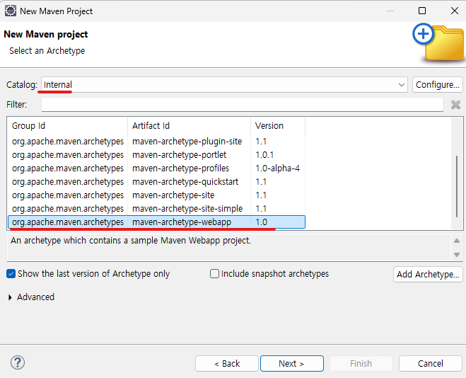
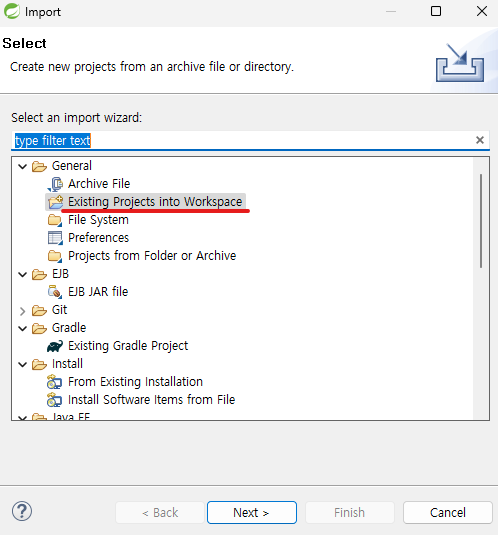

1. # maven 프로젝트 생성
   File → New → Maven Project   
      

   Catalog를 Internal로 선택 → maven-archetype-webapp를 선택
      
   
   오른쪽 마우스 → properties → Java Build Path, Project Facets에서 자바와 Dynamic Web Moudle 등 버전 설정   

   https://mvnrepository.com/ 에서 라이브러리를 복사해서 pom.xml에 복사   

1. # maven project import
   maven project는 war파일로 압축을 하면 설정이 바뀌기 때문에 압축을 해서 압축 파일을 그대로 import해야 한다.   

   import → Exising Projects into Workspace      
      

   Copy projects into workspace를 선택   
      

1. # MyBatis
   SQL Mapping Framework - Easy & Simple   
   자바 코드로부터 SQL문을 분리해서 관리   
   매개변수 설정과 쿼리 결과를 읽어오는 코드를 제거   
   작성할 코드가 줄어서 생산성 향상&유지 보수 편리   
   iBatis -> MyBatis   

   Spring 5.0+ 이상   
   Mybatis-spring 2.0+ 이상   
   MyBatis 3.5+ 이상   

   1)태그의 요소 input type의 name   
   2)dto의 변수명   
   3)db 컬럼명   
   위에 3가지 이름이 일치해야 한다.   

   MyBatis 설정 파일 3가지   
   resources   
   db.properties   
   mybatis-config   
       

   mybatis-config 변수값이 db.properties에 들어있습니다. mybatis-config.xml에서 변수값들은 db.properties 설정에 있는 값들이 입력됩니다.   

   ```
      MemberDao -> mybatis-config.xml(mybatis 환경설정파일) -> member.xml(mapper파일)    
   ```
   MemberDao에서 mybatis-config.xml을 참조하고, mybatis-config.xml에서 member.xml을 참조합니다.   

   ```
      MemberDao -> Sqlsession(Sql문을 실행시키는 메소드를 제공하는 인터페이스)   
   ```
   MemberDao에서 Sqlsession 인터페이스를 통해 mybatis에 접근합니다.   

   __MemberDao.java__    
   ```java   
      public class MemberDao {
         //SqlSession : myBatis에서 제공하는 인터페이스 이름   
         //SqlSession을 상속받은 것이 sqlsessionTemplate  둘 다 사용 가능   
         private SqlSession getSession() {
            SqlSession session=null;
            Reader reader=null;
            try {
               reader = Resources.getResourceAsReader("mybatis-config.xml"); //mybatis-config.xml를 읽어온다
               SqlSessionFactory sf = new SqlSessionFactoryBuilder().build(reader);
               session = sf.openSession(true); //insert, delete를 하면 자동 commit을 한다.

            } catch (IOException e) {
               System.out.println(e.getMessage());
            }
            return session;
         }

            // 회원가입
         public int insert(Member member) {
            int result = 0;
            SqlSession session=null;
            try { 
               session = getSession(); 
               result = session.insert("insert", member);			
               //member.xml의 insert를 불러온다
            } catch (Exception e) {
               System.out.println(e.getMessage());
            }
            return result;
         }

         // 회원목록 조회
         public List<Member> list() {
            List<Member> list = new ArrayList<Member>();
            SqlSession session=null;
            try { 
               session = getSession(); 
               list = session.selectList("list");  
               //member.xml에서 list를 불러온다
            } catch (Exception e) {
               System.out.println(e.getMessage());
            }
            return list;
         }
         
         // 회원수정
         public int update(Member mem) {
            int result = 0;
            SqlSession session=null;
            try { 
               session = getSession(); 
               result = session.update("update", mem);
            } catch (Exception e) {
               System.out.println(e.getMessage());
            }
            return result;
         }
         // 회원삭제
         public int delete(String id) {
            int result = 0;
            SqlSession session=null;
            try { 
               session = getSession(); 
               result = session.delete("delete", id);
            } catch (Exception e) {
               System.out.println(e.getMessage());
            }
            return result;
         }
      }
   ```
   SQL문에 따라 실행되는 메소드가 정해져있습니다.   

   SQL문 - 메소드   
   insert - int insert()   
   update - int update()   
   delete - int delete()   
   select - Object selectOne() : 검색 결과가 1개인 경우에 사용   
   List selectList() : 검색 결과가 여러개인 경우에 사용   

   __db.properties__   
   ```java
      #mysql
      #jdbc.driverClassName=com.mysql.jdbc.Driver
      #jdbc.url=jdbc:mysql://localhost:3306/jsptest
      #jdbc.username=jspid
      #jdbc.password=jsppass

      #oracle
      jdbc.driverClassName=oracle.jdbc.driver.OracleDriver
      jdbc.url=jdbc:oracle:thin:@localhost:1521:xe
      jdbc.username=totoro
      jdbc.password=totoro123
   ```

   __mybatis-config.xml__   
   ```java
      <?xml version="1.0" encoding="UTF-8" ?>
      <!DOCTYPE configuration
      PUBLIC "-//mybatis.org//DTD Config 3.0//EN"
      "http://mybatis.org/dtd/mybatis-3-config.dtd">
      <configuration>
         <properties resource="db.properties" /> //db.properties를 소스로 한다
         <typeAliases> //별칭을 정한다
            <typeAlias type="model.Member" alias="member"></typeAlias> //model 패키지에 Member 클래스를 간단히 member로 하겠다
         </typeAliases>
         <environments default="development"> //db연동 관련 정보
            <environment id="development">
               <transactionManager type="JDBC" />
               <dataSource type="POOLED">
                  <property name="driver" value="${jdbc.driverClassName}" />
                  <property name="url" value="${jdbc.url}" />
                  <property name="username" value="${jdbc.username}" />
                  <property name="password" value="${jdbc.password}" />
                  //${jdbc.driverClassName}, ${jdbc.url}, ... 변수는 전부 db.properties에 있다, 변수없이 바로 사용해도 된다.
               </dataSource>
            </environment>
         </environments>
         <mappers> //위에 값들을 가지고 member.xml을 맵핑 시킨다.
            <mapper resource="member.xml" /> //mapper 태그
         </mappers>
      </configuration>
   ```   
   Mapper 태그는 일반적으로 데이터베이스와 애플리케이션 사이의 매핑을 담당하는 설정 요소를 의미합니다.

   __member.xml__   
   ```java
      <?xml version="1.0" encoding="UTF-8" ?>
      <!DOCTYPE mapper PUBLIC "-//mybatis.org//DTD Mapper 3.0//EN"
      "http://mybatis.org/dtd/mybatis-3-mapper.dtd">

      <mapper namespace="memberns"> //mapper값이 여러개인 경우 이를 막기위한 논리적 영역 구분 이름, namespace 안에서 id는 1개 다른 namespace인 경우 id는 같아도 된다.
      //result = session.insert("memberns.insert", member);	

         //select를 구분하기 위한 id값
         //select는 여러개가 올 수 있지만 id만 1개만 가능
         //parameterType : 전달되는 값의 자료형
         //resultType : 리턴되는 값의 자료형
         //mybatis-config.xml에서 alias를 member로 두지 않았다면
         //resultType="model.Member"
         //parameerType="model.Member" 전부 써줘야 한다
         //*select만 resultType이 있다. update, delete는 resultType이 없다.
         //select count(*)인 경우 resultType은 int가 된다.
         //dto와 컬럼명이 일치해야 자동 저장 가능
         //id는 중복 될 수 없고, 
         //DAO의 session.selectList("list"); , session.insert("insert", member); , session.update("update", mem);	  
         <select id="list" resultType="member"> 
            select * from member22
         </select>
         
         <select id="select" parameterType="String" resultType="member">
            select * from member22 where id = #{id} 
         </select> //DAO의 session.selectOne("select", id);에서 넘겨준다
         
         <insert id="insert" parameterType="member">
            insert into member22 values (#{id}, #{password})
         </insert>  //DAO의 session.insert("insert", member);에서 넘겨준다

         //resultType이 없어도 적용값의 행만큼 반환
         <update id="update" parameterType="member"> 
            update member22 set password = #{password} where id = #{id}
         </update> //DAO의 session.update("update", mem);에서 넘겨준다
         
         //resultType이 없어도 적용값의 행만큼 반환
         <delete id="delete" parameterType="String">
            delete from member22 where id = #{id}
         </delete> //DAO의 session.delete("delete", id);에서 넘겨준다
         
      </mapper>
   ```
   update와 delete 쿼리를 실행할 경우 일반적으로 영향을 받은 행의 개수를 나타내는 int형 값을 __자동으로 반환__ 합니다.   
 

톰캣이 10.1 => Dynamic web module version : 6.0
톰캣 10.0 => Dynamic web module version : 4.5

   
