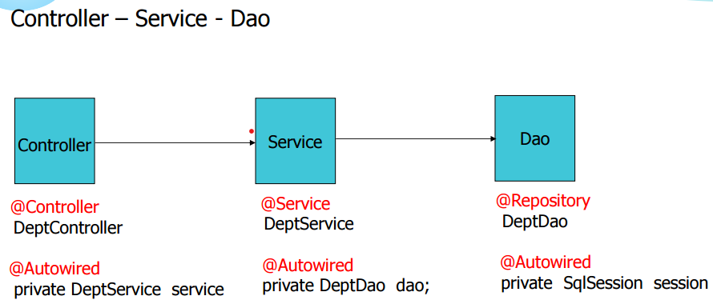

1. # 어노테이션 입력 순서
      
   
   컨트롤러에서는 Service 객체에 Autowired주입   
   서비스에서는 Dao 객체에 Autowired주입   
   Dao에서는 SqlSession객체에 Autowired주입   

1. # 입력 순서   
   1)보여주기   
   2)입력 : 부서 입력버튼 클릭   
   ```
      deptInsertForm.do → deptInsertForm.jsp → Form submit::deptInsert.do → (db에서 부서 중복 확인 결과를 받음) 
      → deptInsert.jsp : 
      (중복 부서가 없는 경우) → location.href::deptList.do →  deptList.jsp
      (중복 부서가 있는 경우) → history.go(-1)::deptInsertForm.jsp
   ```   
   3)수정   
   4)삭제   

1. # 보여주기 상세
   1. ## index.jsp
      ```javascript
         <script>
         location.href="deptList.do";
         </script>
      ```

   1. ## Dispatcher Servlet

   1. ## Controller
      ```java
         @Controller
         public class DeptController {

            @Autowired
            private DeptService ds; //Controller에서는 Service에 Autowired

            @RequestMapping("deptList.do")
               public String deptList(Model model) {
                  List<Dept> list = ds.list(); //db연동 필요
                  model.addAttribute("list", list);
                  return "deptList";
               }
         }
      ```
      서비스는 __db연동을 할 때만__ 넘어간다. db연동을 하지 않으면 뷰페이지로 바로 리턴   

   1. ## ServiceImpl
      ServiceImpl은 Service를 상속받는다   
      Service : 선언만   
      ServiceImpl : Dao 호출   

      ```java
         @Service
         public class DeptServiceImpl implements DeptService {
            @Autowired
            private DeptDao dd;

            public List<Dept> list() {
               return dd.list();
            }
      ```
      1)ServiceImpl위에 @Service 어노테이션   
      2)ServiceImpl은 Service를 상속 받음   
      3)Dao에 @Autowired 주입

   1. ## DaoImpl
      DaoImpl은 Dao를 상속받는다   
      Dao : 선언만   
      DaoImpl : SqlSession 호출   

      ```java
         import org.mybatis.spring.SqlSessionTemplate;

         @Repository
         public class DeptDaoImpl implements DeptDao {
            @Autowired
            private SqlSessionTemplate st;

            public List<Dept> list() {
               return st.selectList("deptns.list");
            }
            //st.selectList("네임스페이스.아이디")
         }
      ```
      1)DaoImpl위에 @Repository 어노테이션   
      2)DaoImpl은 Dao를 상속 받음   
      3)SqlSessionTemplate을 import   
      4)SqlSessionTemplate에 @Autowired 주입

      *SqlSessionTemplate는 pom.xml에 dependency된 라이브러리에 저장되어 있다
      
      Dao에서 SqlSession에 접근하여 SqlSessionTemplate를 실행.   
      SqlSession : Sql문을 실행시키는 메소드를 제공   
      SqlSessionTemplate : SqlSession을 상속받은 구현 클래스   
         

   1. ## 쿼리를 실행 후 결과값을 가지고
      select 쿼리 결과를 Object로 돌려주는데 SqlSession이 다운캐스팅으로 하는 것   

      예)
      DaoImpl.java
      ```java
         public Dept select(int deptno) {
            return st.selectOne("deptns.select", deptno);
         }
      ```   
      retrun 결과의 타입이 Dept로 클래스이다. 원래는 select결과로 Object가 되는데 리턴 타입으로 바로 Dept클래스를 사용하는 건 SqlSession이 다운캐스팅을 했기 때문이다.   

   1. ## 다시 반대로 DaoImpl -> ServiceImpl -> Controller
      처음 Controller 소스   
      ```java
         @RequestMapping("deptList.do")
         public String deptList(Model model) {
            List<Dept> list = ds.list(); //DaoImple로 부터 결과값을 받아옴
            model.addAttribute("list", list);
            return "deptList"; //deptList.jsp로 이동
         }
      ```
      /views/deptList.jsp로 이동   

1. # Dept.xml 설명 - 순서에서 제외
   ```xml
      <mapper namespace="deptns">

      <!-- 실제 클래스의 변수명과 sql의 컬럼명이 다른 경우 어떻게 맵핑 시킬지 정의한 resultMap 부분 -->
      <!--
      type에 오는 값은 configuration.xml파일에 있는
		<typeAlias alias="dept" type="myBatis2.model.Dept" />
      alias 값
      -->
      <resultMap id="deptResult"    type="dept">
         <result property="deptno" column="deptno" />
         <result property="dname"  column="dname" />
         <result property="loc"	  column="loc" />
      </resultMap>

      <!-- 같은 select라도 id값을 다르게 지정 -->
      <!-- 필드명과 컬럼명이 다른 경우 resultMap으로 리턴 -->
      <select id="list" resultMap="deptResult">
         select * from dept order by deptno
      </select>
      
      <!-- 필드명과 컬럼명이 같은 경우 resultType으로 리턴 -->
      <select id="select" parameterType="int" resultType="dept">
         select * from dept where deptno=#{deptno}
      </select>

      <update id="update" parameterType="dept">
         update dept set dname=#{dname},loc=#{loc} where deptno=#{deptno}
      </update>
   ```
   SqlSessionTemplate에서 mapper 태그의 네임스페이스로 접근   
   mapper 태그의 네임스페이스는 데이블 갯수에 따라서 수가 늘어난다.   
   하나의 네임스페이스 안에서는 id가 겹치면 안되지만 다른 네임스페이스 안에서는 중복되어도 된다 - 네임스페이스는 논리적 영역을 구분   

1. # 바로 뷰로 이동하는 경우
   ```java
      //부서 등록 폼
      @RequestMapping("deptInsertForm.do")
      public String deptInsertForm() {
         return "deptInsertForm";
      }
   ```   
   DB와 연동될 필요가 없기 때문에 바로 deptInsertForm.jsp로 이동   

1. # jsp와 Controller 이동 방법
   jsp에서 submit을 하면 Controller로 이동   
   jsp에서 location.href를 하면 Controller로 이동   

   Controller에서는 return하면 jsp로 이동   

1. # 테이블 갯수에 따라 변하는 것
   컨트롤러 서비스 DTO DAO 전부 테이블 수에 따라 증가


