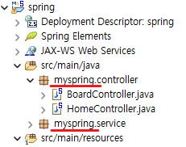
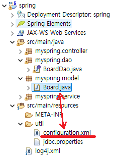
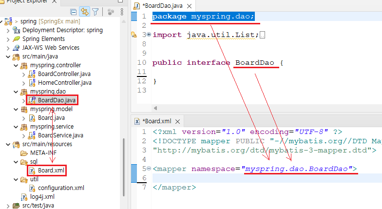

1. # 실습 개요
   spring 실습   

   프로젝트 명 : spring   

   계정생성   
   sqlplus system/oracle   

   create user spring identified by spring123;   
   grant connect, resource to spring;   

   ```javascript
      테이블명 : myboard  

      create table myboard(   
         no number primary key,
         writer varchar2(20),
         passwd varchar2(20),
         subject varchar2(50),
         content varchar2(100),
         readcount number,
         register date 
      );

      시퀀스 : myboard_seq
      create sequence myboard_seq
      start with 1
      increment by 1
      nocache;
   ```

   __java - myspring__   
   controller - BoardController.java   
   service - BoardService.java   
   dao - BoardDao.java   
   model - Board.java   

   __resources__   
   util - configuration.xml   
   sql - board.xml   

   __board__   
   boardform.jsp (글작성 폼)   
   boardlist.jsp (글목록)   
   boardcontent.jsp (상세 페이지)   
   boardupdateform.jsp (글수정 폼)   
   boarddeleteform.jsp (글삭제 폼)   

   -relation webpage process-   
   ```
      no: db의 sequence primary key
      page : 현재 페이지

      boardlist.jsp (글목록)  → boardform.jsp (글작성 폼)  → boardwrite.do → insertresult.jsp → boardlist.jsp (글목록)   

      boardlist.jsp (글목록) → : no, page 전달,  boardcontent.do → boardcontent.jsp (상세 페이지)  

      boardcontent.jsp (상세 페이지)  → : page전달, boardlist.do → boardlist.jsp (글목록)

      boardcontent.jsp (상세 페이지)  → : page, no 전달, boardupdateform.do → boardupdateform.jsp (글수정 폼) 
      → boardupdate.do  → updateresult.jsp (page, no) 
      
      boardcontent.jsp (상세 페이지) → boarddeleteform.jsp (글삭제 폼)  (page, no) 
   ```

   __환경 설정 파일 작성 순서__   
   <span style="color:red">수정 후 바로바로 실행</span>
   1) pom.xml   
      기존파일에서 붙혀넣기 → maven update → 실행해보기   
      
   2) web.xml   
   ```xml
      <!-- 한글 인코딩 설정 : post방식 -->
      <filter>
         <filter-name>CharacterEncodingFilter</filter-name>
         <filter-class>org.springframework.web.filter.CharacterEncodingFilter</filter-class>
         <init-param>
            <param-name>encoding</param-name>
            <param-value>UTF-8</param-value>
         </init-param>
         <init-param>
            <param-name>forceEncoding</param-name>
            <param-value>true</param-value>
         </init-param>
      </filter>
      <filter-mapping>
         <filter-name>CharacterEncodingFilter</filter-name>
         <url-pattern>/*</url-pattern>
      </filter-mapping>
   ```

   3) servlet-context.xml   
   3-1)webapp / index.jsp파일 생성
   ```html
      <script>location.href = "test.do";</script>
   ```
   
   controller에 test.do 지정
   ```java
      @Controller
      public class HomeController {
         
         private static final Logger logger = LoggerFactory.getLogger(HomeController.class);
    
         @RequestMapping(value = "/test.do", method = RequestMethod.GET)
         //value="/"를 value="/test.do"로 변경
         public String home(Locale locale, Model model) {
            
            ...

            return "home";
         }
      }
   ```

      이후에
   ```javascript
      <context:component-scan base-package="com.myhome.spring" />
      =>
      <context:component-scan base-package="myspring" />
   ```
   base-package의 이름이 어떤 이름을 설정하냐에 따라 결정   
   com.myhome을 myspring으로 변경함   
      
   
   4) configuration.xml → Board.java(DTO)가 만들어져있어야한다.   
   5) board.xml → BoardDAO.java(DAO)가 만들어져있어야한다.   
   6) root-context.xml → db설정이 되어있어야하고, configureation.xml과 board.xml설정이 되어있어야한다.   

   따라서 설정은 나중에 하고 일단 DTO, Controller, Service, DAO를 먼저 생성한다.   

   __DTO 생성__   
   Board.java   
   __Controller, Service 생성__   
   controller - BoardController.java   
   service - BoardService.java   
   __DAO 생성__   
   BoardDAO.java   

   7)DTO 생성
   sql테이블에 적용된 설정을 가져와서 생성. 필드명과 컬럼명이 같아야 한다.   

   8)Controller 작성   
   ```java
      @Controller
      public class BoardController {
         @Autowired
         private BoardService service;
      }
   ```   

   9)service 작성   
   ```java
      @Service
      public class BoardService {
         @Autowired //db쪽 설정이 안 끝났는데 BoardDao에 Autowired를 적용해서 지금은 error발생
         private BoardDao dao; //이때 BoardDao는 인터페이스
      }
   ```

   10)dao 종류 설정해서 생성   
   1 - 클래스 : Repository어노테이션을 붙인다.   
   2 - 인터페이스: 하나씩 연결해준다.   

   인터페이스로 생성   
   ```java
      @Mapper
      public interface BoardDao {
         
      }
   ```

   *지금 실행하면 error발생.   
   ```
      서블릿 [appServlet]을(를) 위한 Servlet.init() 호출이 예외를 발생시켰습니다.
   ```
   이유 : 설정이 아직 안 끝났는데 BoardDao에 어노테이션을 넣었기 때문   
   BoardService에 @Autowired를 생략하고 다시 실행하면 error발생하지 않음   

   11)configuration.xml 파일 생성 - DTO와 연결해서 mybatis 별칭 설정 파일   
   src/main/resources에 util폴더 생성 후 저장   
   ```xml
      <?xml version="1.0" encoding="UTF-8" ?>
      <!DOCTYPE configuration PUBLIC "-//mybatis.org//DTD Config 3.0//EN"
      "http://mybatis.org/dtd/mybatis-3-config.dtd">

      <configuration>
         <typeAliases>
            <typeAlias alias="dept" type="myspring.model.Board" />
         </typeAliases>	
      </configuration>
   ```   
   이때 DTO클래스(Board)가 존재해야 Board를 설정할 수 있다   
      
  
   12)Board.xml   
      

   ```xml
      <?xml version="1.0" encoding="UTF-8" ?>
      <!DOCTYPE mapper PUBLIC "-//mybatis.org//DTD Mapper 3.0//EN"
      "http://mybatis.org/dtd/mybatis-3-mapper.dtd">

      <mapper namespace="myspring.dao.BoardDao">
      <!-- namespace경로가 BoardDao의 경로와 일치 -->
      </mapper>
   ```         

   13)root-context.xml   
   밑에 파일 전체 복사해서 붙여넣고 중간부분만 수정   
   ```xml
      <?xml version="1.0" encoding="UTF-8"?>
      <beans xmlns="http://www.springframework.org/schema/beans"
         xmlns:xsi="http://www.w3.org/2001/XMLSchema-instance"
         xmlns:context="http://www.springframework.org/schema/context"
         xmlns:mybatis-spring="http://mybatis.org/schema/mybatis-spring"
         xsi:schemaLocation="http://mybatis.org/schema/mybatis-spring http://mybatis.org/schema/mybatis-spring-1.2.xsd
            http://www.springframework.org/schema/beans http://www.springframework.org/schema/beans/spring-beans.xsd
            http://www.springframework.org/schema/context http://www.springframework.org/schema/context/spring-context-4.3.xsd">
         
         <bean id="hikariConfig" class="com.zaxxer.hikari.HikariConfig">
            <property name="driverClassName" value="oracle.jdbc.driver.OracleDriver"></property> 
            <property name="jdbcUrl" value="jdbc:oracle:thin:@localhost:1521:xe"></property>
            <property name="username" value="spring"></property> <!-- 수정 -->
            <property name="password" value="spring123"></property> <!-- 수정 -->
         </bean>

         <!-- HikariCP configuration -->
         <bean id="dataSource" class="com.zaxxer.hikari.HikariDataSource" destroy-method="close">
            <constructor-arg ref="hikariConfig" />
         </bean>

         <!-- 스프링으로 oracle db 연결 -->
         <bean id="sqlSessionFactory" class="org.mybatis.spring.SqlSessionFactoryBean">
            <property name="dataSource" ref="dataSource"></property>
            <property name="configLocation" value="classpath:util/configuration.xml" /> <!-- 경로 수정 -->
            <property name="mapperLocations" value="classpath:sql/*.xml" /> <!-- 파일 이름 수정 -->
         </bean>	
         
         <!-- DAO클래스의 패키지 경로 -->
         <mybatis-spring:scan base-package="myspring.dao"/><!-- 패키지명 수정 -->
      </beans>
   ```
   base-package의 경로   
      

   *여기 root-context.xml파일의 설정이 끝나야 Service에서 @Autoriwed를 주입해도 에러가 나지 않는다   

   14)webapp/board 폴더를 만들고 jsp파일 생성  

1. # STS에 Data source Management 추가
   [Help] - Install New Software...   

   Add 버튼 클릭   

   Name :  DTP   
   Location : http://download.eclipse.org/datatools/1.14.1.201712071719/repository/   

   Contact all update sites during install to find required software 옵션 체크 해제   

1. # Board.xml
   ```xml
      <mapper namespace="myspring.dao.BoardDao">

      <!-- congifuration의 alias에 의해 parameterType="board" 가능 -->
      <insert id="insert" parameterType="board">
         insert into myboard values(myboard_seq.nextval, #{writer}, #{passwd}, #{subject}, #{content}, 0 , sysdate)
         <!-- insert into myboard values(myboard_seq.nextval, '홍길동', '123', '길동 글', '길동 글 내용', 0 , sysdate); -->
      </insert>
   ```
   namespace : DAO인 BoardDao의 경로   
   id : 메서드명   
   parameterType : configuration의 alias에 설정된 DTO값


1. # xml에 매개변수 전달
   ```java
      //List<Board> boardlist = service.getBoardList(startRow, endRow);
      //xml파일에 매개변수 2개를 전달 못함
      List<Board> boardlist = service.getBoardList(page);
   ```