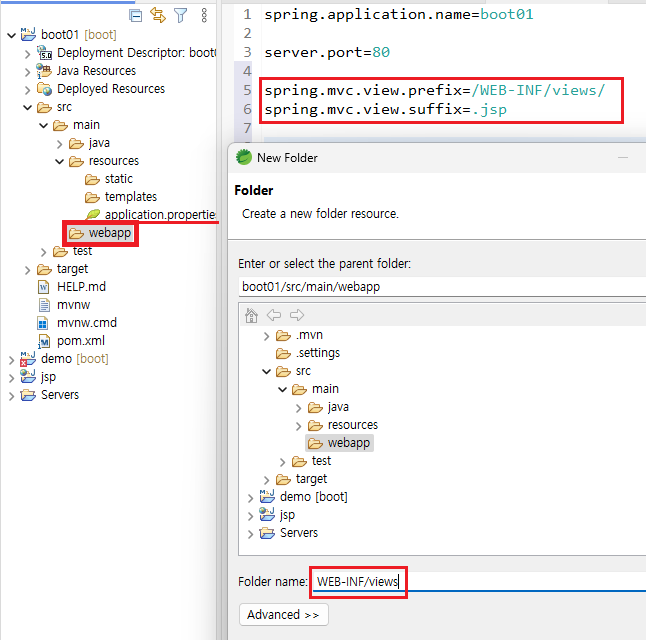
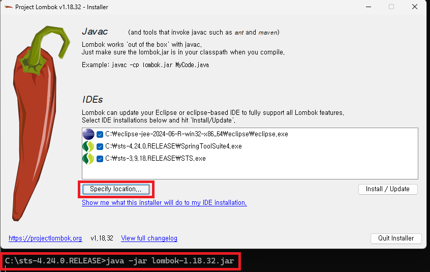
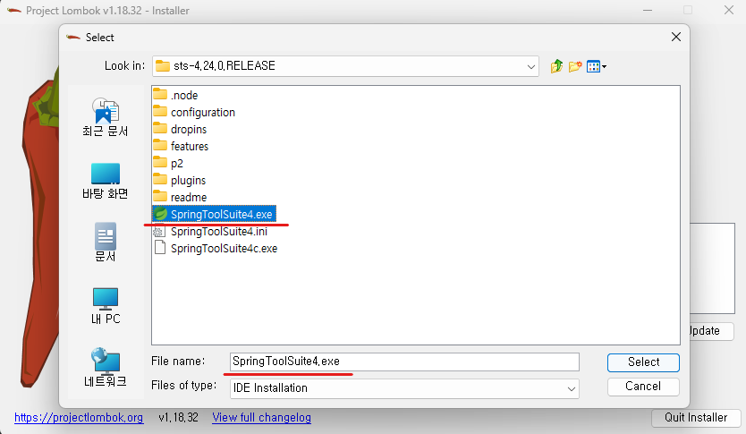
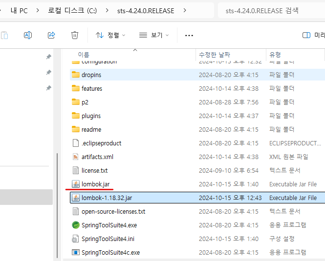
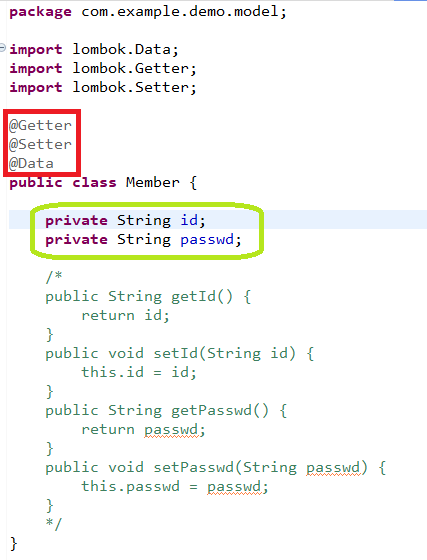
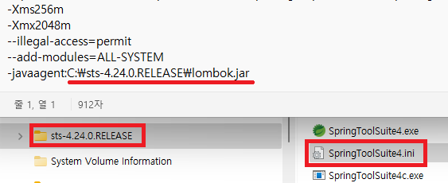

1. # Spring Boot
   
   war : 배포시 아파치 톰캣 외부서버가 필요   
   jar : 내장 톰캣으로 실행   

   Dynamic web module 버전은 톰캣에 의해 결정   
   톰캣 10.1 => Dynamic web moudle : 6.0   

   gradle : build.gradle 이 자동 생성되며 이 파일이 gradle 설정 파일   
   maven : pom.xml이 자동 생성되면 이 파일이 maven 설정 파일   

   resources/static : 공유폴더, 이미지나 txt파일등을 저장

   templates : thymeleaf를 사용할 때 html파일을 전부 templates에 저장   
   *단, thymeleaf 설정이 되어있어야 한다.   
   thymeleaf vs jstl   

   application.properties : 환경 설정 파일   
   포트, db 설정 등을 입력   

   webapp : jsp파일

1. # properties파일을 yml로

   application.properties 
   ```
      server.port=80
   ```

   application.yml   
   ```
      server:
         port: 80
   ```

   https://mageddo.com/tools/yaml-converter   

1. # jsp파일 사용할 폴더 생성

   application.properties 파일에 설정 경로 저장
   ```cs
      spring.mvc.view.prefix=/WEB-INF/views/
      spring.mvc.view.suffix=.jsp
   ```
   폴더 경로는 임의대로 수정 가능   

       

1. # index.jsp 파일 생성
   webapp폴더 안에 index.jsp파일 생성   

   responseBody가 있는 경우 Controller를 사용

   @RestController = @Controller + @ResponseBody 

   jsp에서 jstl 사용하기 위한 라이브러리   
   ```
      <!-- jakarta jstl -->
      <dependency>
         <groupId>org.glassfish.web</groupId>
         <artifactId>jakarta.servlet.jsp.jstl</artifactId>
         <version>3.0.0</version>
      </dependency>
   ```

1. # 외부 톰캣과 내장 톰캣의 차이
   외부 톰캣 : http://localhost/demo/ : 프로젝트명 포함, 포트 없음   
   내장 톰캣 : http://localhost:8005/ : 프로젝트명 없음, 포트 포함   

   외부 톰캣   
   http://localhost/boot01/index.jsp : __webapp/index.jsp 파일__ 이 자동으로 실행됨
   http://localhost/boot01/hi
   http://localhost/boot01/welcome
   http://localhost/boot01/abc
   http://localhost/boot01/hello
   http://localhost/boot01/gugu

   내장 톰캣   
   http://localhost/index.html :  __resources/static/index.html 파일__ 이자동으로실행됨
   http://localhost/hi
   http://localhost/welcome
   http://localhost/abc
   http://localhost/hello
   http://localhost/gugu

   내장 톰캣은 페이지를 넘기는 hello.jsp, gugu.jsp를 불러오지 못 한다. jsp파일을 찾아가게 하는 라이브러리
   ```
      <!--내장Tomcat실행시jsp파일을사용하기위한의존라이브러리-->
      <dependency>
         <groupId>org.apache.tomcat.embed</groupId>
         <artifactId>tomcat-embed-jasper</artifactId>
         <scope>provided</scope>
      </dependency>
   ```

   ctrl + shift + f : pom.xml 자동 정렬   

   pom.xml에 dependency로 추가 했다고 바로 실행되는 것이 아니다.

1. # Lombok

   dependency만으로 Lombok이 실행되는 것이 아니라 Lombok을 다운 받은 후 최초 한번은 lombok을 실행해줘야 한다.

   ```
      https://projectlombok.org/all-versions
   ```

   다운 받는다.   

   *STS3을 닫은 후 실행!   
    
    STS4의 폴더 안으로 다운 받은 Lombok의 jar파일을 이동
      

   Specify location을 클릭 후 sts실행 파일을 선택
      

   Install / Update 실행   
      

   lombok.jar 파일이 생성됨   
      

   @Getter과 @Setter로 선언   
      

   ini(설치파일)파일의 마지막 줄에 lombok경로가 설정됨   
      

1. # MyBatis
   