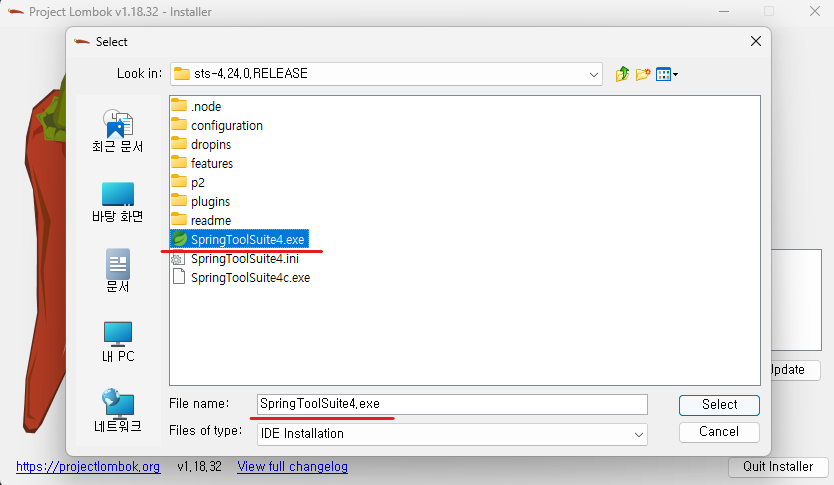
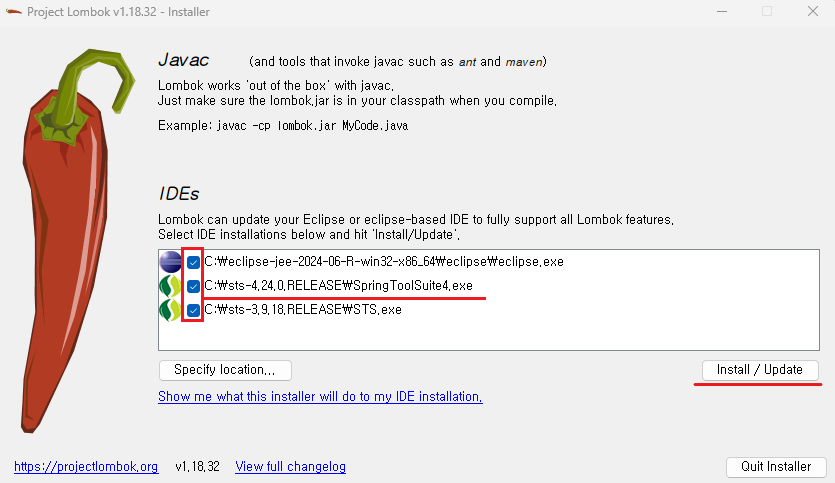
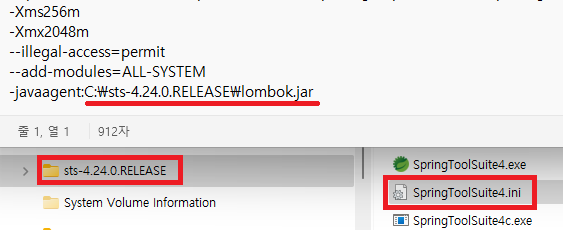

1. # Spring Boot
   
   war : 배포시 아파치 톰캣 외부서버가 필요   
   jar : 내장 톰캣으로 실행   

   Dynamic web module 버전은 톰캣에 의해 결정   
   톰캣 10.1 => Dynamic web moudle : 6.0   

   gradle : build.gradle 이 자동 생성되며 이 파일이 gradle 설정 파일   
   maven : pom.xml이 자동 생성되면 이 파일이 maven 설정 파일   

   resources/static : 공유폴더, 이미지나 txt파일등을 저장

   templates : thymeleaf를 사용할 때 html파일을 전부 templates에 저장   
   *단, thymeleaf 설정이 되어있어야 한다.   
   thymeleaf vs jstl   

   application.properties : 환경 설정 파일   
   포트, db 설정 등을 입력   

   webapp : jsp파일

1. # pom.xml - Maven

   pom.xml파일 dependency 추가   
   ctrl + shift + f : 자동 정렬 기능   

   __Maven__   
   ```xml
      <!-- 내장 Tomcat실행시 jsp 파일을 사용하기 위한 의존 라이브러리 -->
		<dependency>
			<groupId>org.apache.tomcat.embed</groupId>
			<artifactId>tomcat-embed-jasper</artifactId>
			<scope>provided</scope>
		</dependency>
		<!-- jstl -->
		<dependency>
			<groupId>org.glassfish.web</groupId>
			<artifactId>jakarta.servlet.jsp.jstl</artifactId>
			<version>3.0.0</version>
		</dependency>

		<!-- 추가 end -->
   ```
   오른쪽 마우스 - update maven

1. # build.gradle - Gradle
   ```cs
      dependencies {
         // jsp
         implementation 'org.apache.tomcat.embed:tomcat-embed-jasper'
         // jakarta jstl
         implementation 'org.glassfish.web:jakarta.servlet.jsp.jstl:3.0.0'
         // spring-boot-configuration-processor : @ConfigurationProperties 사용
         implementation 'org.springframework.boot:spring-boot-configuration-processor'
         // jwt 
         implementation 'io.jsonwebtoken:jjwt-api:0.12.3'
         runtimeOnly 'io.jsonwebtoken:jjwt-impl:0.12.3'
         runtimeOnly 'io.jsonwebtoken:jjwt-jackson:0.12.3'
         // spring web
         implementation 'org.springframework.boot:spring-boot-starter-web'
         // mybatis
         implementation 'org.mybatis.spring.boot:mybatis-spring-boot-starter:3.0.3'
         // lombok
         compileOnly 'org.projectlombok:lombok'
         annotationProcessor 'org.projectlombok:lombok'
         // mysql
         runtimeOnly 'com.mysql:mysql-connector-j'
         // sprign-boot
         developmentOnly 'org.springframework.boot:spring-boot-devtools'
         providedRuntime 'org.springframework.boot:spring-boot-starter-tomcat'
         testImplementation 'org.springframework.boot:spring-boot-starter-test'
         testImplementation 'org.mybatis.spring.boot:mybatis-spring-boot-starter-test:3.0.3'
         // junit
         testRuntimeOnly 'org.junit.platform:junit-platform-launcher'
      }
   ```  

   오른쪽 마우스 -> Reload Projects   

1. # application.properties 설정

   ```t
      spring.mvc.view.prefix=/WEB-INF/views/
      spring.mvc.view.suffix=.jsp

      server.port=80

      # oracle - hikari 포함
      spring.datasource.hikari.driver-class-name=oracle.jdbc.OracleDriver
      spring.datasource.hikari.jdbc-url=jdbc:oracle:thin:@localhost:1521:xe
      spring.datasource.hikari.username=spring
      spring.datasource.hikari.password=spring123
      
      # Oracle - hikari 제외
      spring.datasource.driver-class-name=oracle.jdbc.OracleDriver
      spring.datasource.url=jdbc:oracle:thin:@127.0.0.1:1521:xe (Oracle 설치 서버 IP :  포트 : DB 이름)
      spring.datasource.username=ID
      spring.datasource.password=PW

      # MySql
      spring.datasource.driver-class-name=com.mysql.cj.jdbc.Driver (MySql)
      spring.datasource.url=mysql://localhost:3306/test_db (MySql 설치 서버 IP : 포트 / DB 이름)
      spring.datasource.username=ID
      spring.datasource.password=PW
   ```

   __properties파일을 yml로 변환__
   https://mageddo.com/tools/yaml-converter   

1. # application.yml 로 설정
   ```yml
      #mySql
      spring:
         datasource:
            driver-class-name: com.mysql.cj.jdbc.Driver
            username: jspid
            url: jdbc:mysql://localhost3306/jsptest
            #url: jdbc:mysql://localhost:3306/jsptest?characterEncoding=UTF-8&serverTimezone=UTC
            password: jsppass
         mvc:
            view:
               prefix: /WEB-INF/views/
               suffix: .jsp
         
         server.port: 80

         # Mapper Xml Location
         mybatis:
         mapper-locations: 
            classpath:mapper/**/*.xml
   ```

1. # pom.xml의 오라클과 메이븐 dependency를 때문에 처음 실행이 안됨

   밑에 2개 dependency를 주석처리하면 실행 됨   
   ```
      <!--<dependency>
			<groupId>org.mybatis.spring.boot</groupId>
			<artifactId>mybatis-spring-boot-starter</artifactId>
			<version>3.0.3</version>
		</dependency>

		<dependency>
			<groupId>com.oracle.database.jdbc</groupId>
			<artifactId>ojdbc11</artifactId>
			<scope>runtime</scope>
		</dependency>-->
   ```

1. # jsp파일 사용할 폴더 생성 - maven

   application.properties 파일에 설정 경로 저장
   ```cs
         spring.mvc.view.prefix=/WEB-INF/views/
         spring.mvc.view.suffix=.jsp
   ```

   webapp/WEB-INF/views 로 생성

       

   *폴더 경로는 임의대로 수정 가능   

1. # jsp파일 사용할 폴더 생성 - gradle
   main/webapp/WEB-INF/views 경로로 직접 생성   

1. # DatabaseConfiguration.java
   main/java/com/example/demo/configuration/DatabaseConfiguration.java   

   DatabaseConfiguration.java 파일 안에  
   ```java
      applicationContext.getResources("classpath:/mapper/*.xml"));
      ...
      sqlSessionFactoryBean.setTypeAliasesPackage("com.example.demo.model");
   ```

1. # mapper 폴더 생성
   resources/mapper - ooo.xml폴더 생성   
   다른 폴더에 있는 board.xml파일 복사해서 붙여넣기   

   ```xml
      <?xml version="1.0" encoding="UTF-8" ?>
      <!DOCTYPE mapper PUBLIC "-//mybatis.org//DTD Mapper 3.0//EN"
      "http://mybatis.org/dtd/mybatis-3-mapper.dtd">

      <mapper namespace="boardns">

         <insert id="insert" parameterType="board">
            insert into boardtest values(boardtest_seq.nextval,#{name},#{subject},#{content},sysdate)
         </insert>
         
         <select id="list" resultType="board">
            select * from boardtest
         </select>

      </mapper>

   ```

1. # DTO파일 생성
   main/java/com/example/demo/model - BoardBean.java 생성   

   BoardBean.java   

   ```java
      @Data
      @Alias("board") //mapper파일에서 사용
      public class BoardBean {
         
         private int board_num;
         private String board_name;
         private String board_pass;
         private String board_subject; //글제목
         private String board_content; //글내용
         private int board_re_ref; //글그룹번호
         private int board_re_lev; //답변글 깊이
         private int board_re_seq; //답변글 출력순서
         private int board_readcount; //조회수
         private String board_date; //등록날짜
      }
   ```

1. # 내장 톰캣 구동 -------------------------

1. # DB생성

1. # controller생성

   ```java
      @Controller
      public class BoardController {

         @Autowired  //DI개념
         private BoardService service;
      }
   ```
1. # service생성

   ```java
      @Service
      public class BoardService {

         @Autowired
         private BoardDao dao;
      }
   ```

1. # dao생성

   ```java
      @Repository //클래스일 때 Repository, 인터페이스 Mapper
      public class BoardDao {

         @Autowired
         private SqlSession session;
      }
   ```

1. # board폴더 생성
   webapp안에 /WEB-INF/views/board 폴더 생성
   ```
      webapp/WEB-INF/views/board
   ```

1. # index.jsp 파일 생성
   webapp폴더 안에 index.jsp파일 생성   
   ```   
      webapp/index.jsp
   ```
   responseBody가 있는 경우 Controller를 사용

   @RestController = @Controller + @ResponseBody 

   jsp에서 jstl 사용하기 위한 라이브러리   
   ```
      <!-- jakarta jstl -->
      <dependency>
         <groupId>org.glassfish.web</groupId>
         <artifactId>jakarta.servlet.jsp.jstl</artifactId>
         <version>3.0.0</version>
      </dependency>
   ```

1. # 외부 톰캣 실행 --------------------------------
   index.jsp파일을 생성했기 때문에 가능   


1. # 외부 톰캣과 내장 톰캣의 차이
   외부 톰캣 : http://localhost/demo/ : 프로젝트명 포함, 포트 없음   
   내장 톰캣 : http://localhost:8005/ : 프로젝트명 없음, 포트 포함   

   외부 톰캣   
   http://localhost/boot01/index.jsp : __webapp/index.jsp 파일__ 이 자동으로 실행됨
   http://localhost/boot01/hi
   http://localhost/boot01/welcome
   http://localhost/boot01/abc
   http://localhost/boot01/hello
   http://localhost/boot01/gugu

   내장 톰캣   
   http://localhost/index.html :  __resources/static/index.html 파일__ 이자동으로실행됨
   http://localhost/hi
   http://localhost/welcome
   http://localhost/abc                                                                                                                                                                                                                
   http://localhost/hello
   http://localhost/gugu

   내장 톰캣은 페이지를 넘기는 hello.jsp, gugu.jsp를 불러오지 못 한다. jsp파일을 찾아가게 하는 라이브러리
   ```
      <!--내장Tomcat실행시jsp파일을사용하기위한의존라이브러리-->
      <dependency>
         <groupId>org.apache.tomcat.embed</groupId>
         <artifactId>tomcat-embed-jasper</artifactId>
         <scope>provided</scope>
      </dependency>
   ```

   ctrl + shift + f : pom.xml 자동 정렬   

   pom.xml에 dependency로 추가 했다고 바로 실행되는 것이 아니다.

1. # Lombok

   dependency만으로 Lombok이 실행되는 것이 아니라 Lombok을 다운 받은 후 최초 한번은 lombok을 실행해줘야 한다.

   ```
      https://projectlombok.org/all-versions
   ```

   다운 받는다.   

   *STS3을 닫은 후 실행!   
    
    STS4의 폴더 안으로 다운 받은 Lombok의 jar파일을 이동
      

   Specify location을 클릭 후 sts실행 파일을 선택
      

   Install / Update 실행   
      

   lombok.jar 파일이 생성됨   
      

   @Getter과 @Setter로 선언   
      

   ini(설치파일)파일의 마지막 줄에 lombok경로가 설정됨   
      

