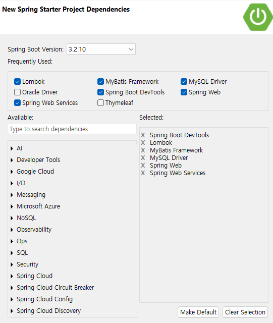

1. # 전체 구조
      

1. # 프로젝트 생성시 환경 설정

     

1. # dependency
   jsp와 jstl을 사용하기 위해 dependency 2개 추가

   ```cs
      dependencies {
         // jsp
         implementation 'org.apache.tomcat.embed:tomcat-embed-jasper'
         // jakarta jstl
         implementation 'org.glassfish.web:jakarta.servlet.jsp.jstl:3.0.0'

         implementation 'org.springframework.boot:spring-boot-starter-web'
         implementation 'org.springframework.boot:spring-boot-starter-web-services'
         implementation 'org.mybatis.spring.boot:mybatis-spring-boot-starter:3.0.3'
         compileOnly 'org.projectlombok:lombok'
         developmentOnly 'org.springframework.boot:spring-boot-devtools'
         runtimeOnly 'com.mysql:mysql-connector-j'
         annotationProcessor 'org.projectlombok:lombok'
         providedRuntime 'org.springframework.boot:spring-boot-starter-tomcat'
         testImplementation 'org.springframework.boot:spring-boot-starter-test'
         testImplementation 'org.mybatis.spring.boot:mybatis-spring-boot-starter-test:3.0.3'
         testRuntimeOnly 'org.junit.platform:junit-platform-launcher'
      }      
   ```

   Gradle 업데이트   
   프로젝트 위에서 오른쪽 마우스 -> Gradle -> refresh gradle project   

1. # application.properties 설정

   ```yml                            
      # JSP 환경 설정
      spring.mvc.view.prefix=/WEB-INF/views/
      spring.mvc.view.suffix=.jsp

      # 포트 설정
      server.prort=80

      # mysql 환경 설정
      spring.datasource.driver-class-name=com.mysql.cj.jdbc.Driver
      spring.datasource.url=jdbc:mysql://localhost:3306/membersdb
      spring.datasource.username=hjcompany
      spring.datasource.password=hjpass

      #Mybatis 설정
      #Mybatis 매퍼 파일 경로 : ~/메인패키지/mapper/**Mapper.xml
      mybatis.mapper-locations=classpath:/mapper/*.xml

      #Mybatis ResultType 매핑 패키지 경로
      mybatis.type-aliases-package=com.example.controllerexercise2.model
      #생성된 별칭은 클래스의 단순 이름과 동일합니다. (예: Board 클래스 -> board 별칭)
   ```

1. # mapper 생성

   src/main/resources 밑에 mapper/boardMapper.xml 파일 생성   
   ```
      src/main/resources/mapper/boardMapper.xml
   ```   

   -boardMapper.xml-   
   ```xml
      <?xml version="1.0" encoding="UTF-8" ?>
      <!DOCTYPE mapper PUBLIC "-//mybatis.org//DTD Mapper 3.0//EN"
      "http://mybatis.org/dtd/mybatis-3-mapper.dtd">

      <mapper namespace="com.example.controllerexercise2.dao.BoardDao">

         <select id="getList" resultType="board">
            select * from board
         </select>

      </mapper>
   ```

1. # JSP파일과 경로 생성

   1.index.jsp파일 생성
      src/main 폴더 밑에 webapp/index.jsp 파일 생성   
      
      ```
         경로 : src/main/webapp/index.jsp
      ```
      -index.jsp-   
      ```html
         <%@ page language="java" contentType="text/html; charset=UTF-8"
            pageEncoding="UTF-8"%>
         <!DOCTYPE html>
         <html>
         <head>
         <meta charset="UTF-8">
         <title>Insert title here</title>
         </head>
         <body>
            <script>
               location.href="list"; //list.jsp가 아니라 list만 입력
            </script>
         </body>
         </html>
      ```
      index.jsp파일에서 가장 위줄에 빨간색 표시가 나타난 경우   
      1)프로젝트위에 오른쪽 마우스 → properties → Project Facets → Dynamic Web Moudle 6.0으로 설정   

      2)Windows → Preferences → XML (Wild Web Developer) → Download external resources like references DTD, XSD 선택   

   2.WEB-INF/views 생성
      src/main 폴더 밑에 webapp/WEB-INF/views 폴더 생성
      ```
         src/main/webapp/WEB-INF/views
      ```   
      board에 대한 jsp파일을 따로 모으기 위해 board폴더도 생성   
      ```
         src/main/webapp/WEB-INF/views/board
      ```

1. # Controller, Service, Model(DTO), DAO 차례로 생성

   1.Model 먼저   
      Board.java
      ```java
         @Alias("board")
         @Data
         public class Board {
            private int board_num;
            private String board_userId;
            private String board_userPw;
            private String board_subject; 	//글제목
            private String board_content; 	//글내용
            private int board_re_ref; 		   //글그룹번호
            private int board_re_lev; 		   //답변글 깊이
            private int board_re_seq; 		   //답변글 출력순서
            private int board_readcount; 	   //조회수
            private Date board_date; 		   //등록날짜	
         }
      ```

   2.DAO : interface로 만들고 Mapper어노테이션 추가
      -BoardDAO.java-
      ```java
         @Mapper
         public interface BoardDao {
            public List<Board> getList();
         }
      ```

   3.Service   
      -BoardService.java-   
      ```java
         @Service
         public class BoardService {

            @Autowired
            private BoardDao dao;
            
            public List<Board> getList() {
               List<Board> list = dao.getList();
               return list;
            }
         }  
      ```

   4.Controller
      -BoardController.java-   
      ```java
         @Controller
         public class BoardController {

            @Autowired
            private BoardService service;
            
            @RequestMapping("list") //mapping주소는 index.jsp의 list와 일치. list.jsp아님
            public String list() {
               
               List<Board> list = service.getList();
               System.out.println(list);

               return "board/list";
            }
         }
      ```

   