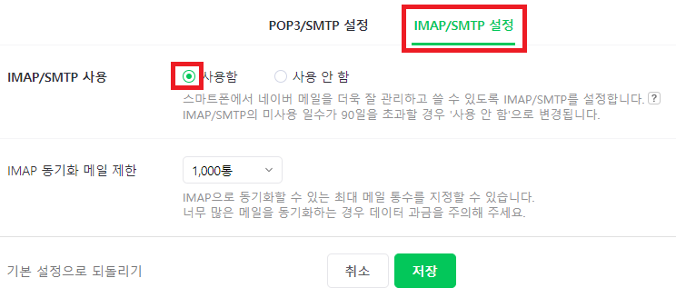

 
1. # Mail Server
   Windows : Exchange Server   
   Linux : SendMail, Qmail   

1. # Mail Server Protocol
   Mail 송신 : SMTP - 25번   
   Main 수신 : POP3 - 110번   

   네이버나 구글 같은 사이트가 메일 서버인 SMTP, POP3를 지원해준다   

1. # Email 전송 라이브러리 종류
   1.Apache Commons Email 라이브러리 사용   
   2.Jakarta Mail 라이브러리 사용   

1. # Naver Email 설정

   로그인 후 환경 설정으로 이동   
      

   POP3를 사용 설정   
     

   IMap 사용 설정   
     

   포트 번호를 알아둡니다.   
     


1. # Naver Email - Apache Commons Email 라이브러리 사용 

   dependency 추가 - Gradle사용   
   -build.gradle 파일-   
   ```java
      // email
      implementation 'org.apache.commons:commons-email:1.5'
   ```
   
   -Controller.java-   
   ```java
      @Controller
      public class MailTest {

         @RequestMapping("/send.do")
         public String send(Model model) {

            Random random = new Random();
            int a = random.nextInt(100); //임시비번처럼 나중에 메일로 보내게 된다

            // Mail Server 설정
            String charSet = "utf-8";
            String hostSMTP = "smtp.naver.com"; //SMTP 서버 제공 주소
            String hostSMTPid = "natista00@naver.com";
            String hostSMTPpwd = "@"; 		// 비밀번호 입력

            // 보내는 사람 EMail, 제목, 내용
            String fromEmail = "natista00@naver.com";
            String fromName = "친절한 홍길동씨";
            String subject = "Overflow인증메일입니다.";

            // 받는 사람 E-Mail 주소
            String mail = "natista99@gmail.com";

            try {
               HtmlEmail email = new HtmlEmail();
               email.setDebug(true);
               email.setCharset(charSet);
               email.setSSL(true);
               email.setHostName(hostSMTP);
               email.setSmtpPort(465);

               email.setAuthentication(hostSMTPid, hostSMTPpwd);
               email.setTLS(true);
               email.addTo(mail, charSet);
               email.setFrom(fromEmail, fromName, charSet);
               email.setSubject(subject);
               email.setHtmlMsg("<p align = 'center'>Overflow에 오신것을 환영합니다.</p><br>" 
                           + "<div align='center'> 인증번호 : " + a + "</div>");
               email.send();
            } catch (Exception e) {
               System.out.println(e);
            }		
            model.addAttribute("result", "good~!!\n 등록된 E-Mail 확인");

            return "result";
         }
   ```

1. # Naver Email - Jakarta Mail 라이브러리 사용   

   ```java
      //email
      implementation 'org.springframework.boot:spring-boot-starter-mail:3.0.5'
      implementation 'org.springframework:spring-context:6.0.7'
      implementation 'org.springframework:spring-context-support:6.0.7'
      implementation 'com.sun.mail:jakarta.mail:2.0.1'
   ```

   