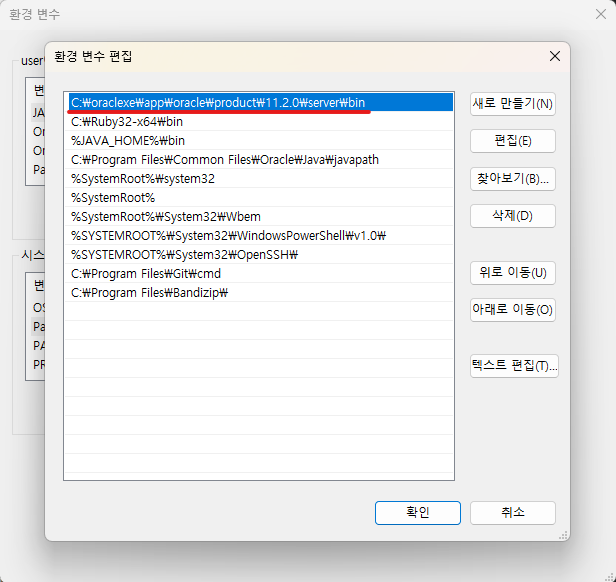
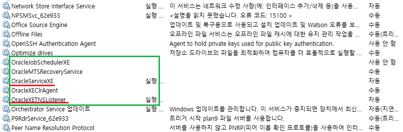

1. # 오라클 설정
   Oracle을 다운 받아서 설치하면 경로는 자동 설정이 됩니다.   
      

   Oracle을 설치하면 서비스에 5개의 서비스가 생성되는데 
   OracleServiceXE와 OracleXETNSListener이 가장 중요한 서비스입니다.   
      

1. # cmd에서 오라클 계정접근

   DBA 계정 : sys, system   
   교육용 계정 : scott, hr   

   ```js
      C:\Users\user>sqlplus system/oracle

      SQL*Plus: Release 11.2.0.2.0 Production on 수 7월 24 16:51:02 2024

      Copyright (c) 1982, 2014, Oracle.  All rights reserved.
      Connected to:
      Oracle Database 11g Express Edition Release 11.2.0.2.0 - 64bit Production

      SQL> show user    //현재 접속 계정
      USER is "SYSTEM"
      
      SQL> select * from tab;  //table가져오기
      SQL> connect system/oracle  //계정 변경
      Connected.
      
      SQL> show user       
      USER is "SYSTEM"
      
      SQL> conn sys/oracle as sysdba
      Connected.
      
      SQL> show user
      USER is "SYS"
   ```   
   system보다 sys가 상위 계정이기 때문에 sys로 접속시   
   'as sysdba'를 입력해줘야 합니다.   

1. # scott계정 활성화
      scott계정은 오라클에서 제공하는 연습용 계정입니다.   

      scott.sql 파일 내용
      ```sql
         Rem Copyright (c) 1990 by Oracle Corporation
         Rem NAME
         REM    UTLSAMPL.SQL
         Rem  FUNCTION
         Rem  NOTES
         Rem  MODIFIED
         Rem	gdudey	   06/28/95 -  Modified for desktop seed database
         Rem	glumpkin   10/21/92 -  Renamed from SQLBLD.SQL
         Rem	blinden   07/27/92 -  Added primary and foreign keys to EMP and DEPT
         Rem	rlim	   04/29/91 -	      change char to varchar2
         Rem	mmoore	   04/08/91 -	      use unlimited tablespace priv
         Rem	pritto	   04/04/91 -	      change SYSDATE to 13-JUL-87
         Rem   Mendels	 12/07/90 - bug 30123;add to_date calls so language independent
         Rem
         rem
         rem $Header: utlsampl.sql 7020100.1 94/09/23 22:14:24 cli Generic<base> $ sqlbld.sql
         rem
         SET TERMOUT OFF
         SET ECHO OFF

         rem CONGDON    Invoked in RDBMS at build time.	 29-DEC-1988
         rem OATES:     Created: 16-Feb-83

         GRANT CONNECT,RESOURCE,UNLIMITED TABLESPACE TO SCOTT IDENTIFIED BY TIGER;
         ALTER USER SCOTT DEFAULT TABLESPACE USERS;
         ALTER USER SCOTT TEMPORARY TABLESPACE TEMP;
         CONNECT SCOTT/TIGER
         DROP TABLE DEPT;
         CREATE TABLE DEPT
               (DEPTNO NUMBER(2) CONSTRAINT PK_DEPT PRIMARY KEY,
            DNAME VARCHAR2(14) ,
            LOC VARCHAR2(13) ) ;
         DROP TABLE EMP;
         CREATE TABLE EMP
               (EMPNO NUMBER(4) CONSTRAINT PK_EMP PRIMARY KEY,
            ENAME VARCHAR2(10),
            JOB VARCHAR2(9),
            MGR NUMBER(4),
            HIREDATE DATE,
            SAL NUMBER(7,2),
            COMM NUMBER(7,2),
            DEPTNO NUMBER(2) CONSTRAINT FK_DEPTNO REFERENCES DEPT);
         INSERT INTO DEPT VALUES
            (10,'ACCOUNTING','NEW YORK');
         INSERT INTO DEPT VALUES (20,'RESEARCH','DALLAS');
         INSERT INTO DEPT VALUES
            (30,'SALES','CHICAGO');
         INSERT INTO DEPT VALUES
            (40,'OPERATIONS','BOSTON');
         INSERT INTO EMP VALUES
         (7369,'SMITH','CLERK',7902,to_date('17-12-1980','dd-mm-yyyy'),800,NULL,20);
         INSERT INTO EMP VALUES
         (7499,'ALLEN','SALESMAN',7698,to_date('20-2-1981','dd-mm-yyyy'),1600,300,30);
         INSERT INTO EMP VALUES
         (7521,'WARD','SALESMAN',7698,to_date('22-2-1981','dd-mm-yyyy'),1250,500,30);
         INSERT INTO EMP VALUES
         (7566,'JONES','MANAGER',7839,to_date('2-4-1981','dd-mm-yyyy'),2975,NULL,20);
         INSERT INTO EMP VALUES
         (7654,'MARTIN','SALESMAN',7698,to_date('28-9-1981','dd-mm-yyyy'),1250,1400,30);
         INSERT INTO EMP VALUES
         (7698,'BLAKE','MANAGER',7839,to_date('1-5-1981','dd-mm-yyyy'),2850,NULL,30);
         INSERT INTO EMP VALUES
         (7782,'CLARK','MANAGER',7839,to_date('9-6-1981','dd-mm-yyyy'),2450,NULL,10);
         INSERT INTO EMP VALUES
         (7788,'SCOTT','ANALYST',7566,to_date('13-7-1987','dd-mm-yyyy'),3000,NULL,20);
         INSERT INTO EMP VALUES
         (7839,'KING','PRESIDENT',NULL,to_date('17-11-1981','dd-mm-yyyy'),5000,NULL,10);
         INSERT INTO EMP VALUES
         (7844,'TURNER','SALESMAN',7698,to_date('8-9-1981','dd-mm-yyyy'),1500,0,30);
         INSERT INTO EMP VALUES
         (7876,'ADAMS','CLERK',7788,to_date('13-7-1987','dd-mm-yyyy'),1100,NULL,20);
         INSERT INTO EMP VALUES
         (7900,'JAMES','CLERK',7698,to_date('3-12-1981','dd-mm-yyyy'),950,NULL,30);
         INSERT INTO EMP VALUES
         (7902,'FORD','ANALYST',7566,to_date('3-12-1981','dd-mm-yyyy'),3000,NULL,20);
         INSERT INTO EMP VALUES
         (7934,'MILLER','CLERK',7782,to_date('23-1-1982','dd-mm-yyyy'),1300,NULL,10);
         DROP TABLE BONUS;
         CREATE TABLE BONUS
            (
            ENAME VARCHAR2(10)	,
            JOB VARCHAR2(9)  ,
            SAL NUMBER,
            COMM NUMBER
            ) ;
         DROP TABLE SALGRADE;
         CREATE TABLE SALGRADE
               ( GRADE NUMBER,
            LOSAL NUMBER,
            HISAL NUMBER );
         INSERT INTO SALGRADE VALUES (1,700,1200);
         INSERT INTO SALGRADE VALUES (2,1201,1400);
         INSERT INTO SALGRADE VALUES (3,1401,2000);
         INSERT INTO SALGRADE VALUES (4,2001,3000);
         INSERT INTO SALGRADE VALUES (5,3001,9999);
         COMMIT;

         SET TERMOUT ON
         SET ECHO ON
      ```   
      해당 명령어들을 scott.sql이란 이름으로 저장 후 `C:\`에 저장합니다.   

      ```sql   
         C:\>sqlplus system/oracle  --system계정으로 oracle에 접속
         SQL> @c:\scott.sql         --@명령어로 scott.sql파일을 실행
         SQL> alter user scott identified by tiger;   --scott계정의 비번을 tiger로 설정
         SQL> conn scott/tiger      --scott계정으로 계정을 전환
         SQL> select * from tab;    --테이블 목록 확인
      ```   

      


   