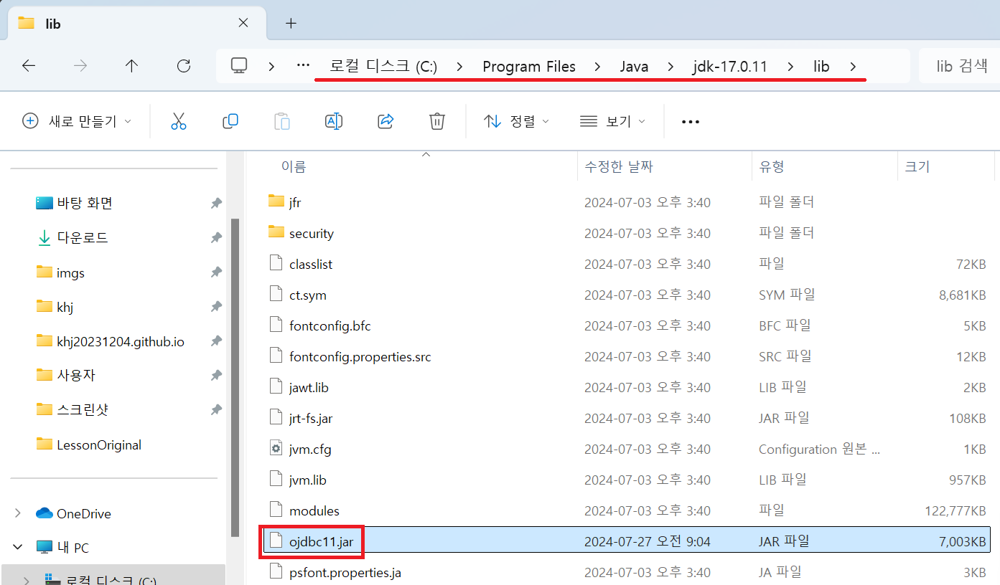
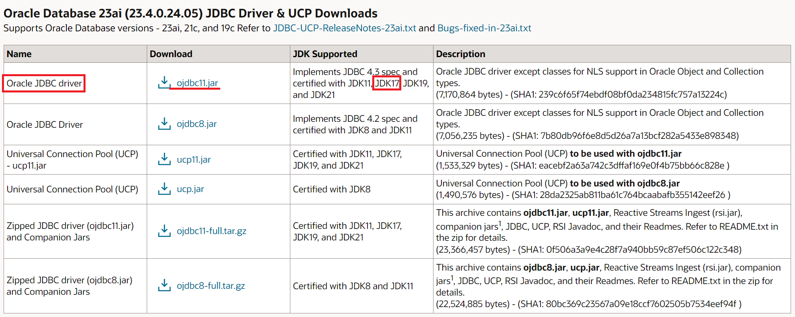
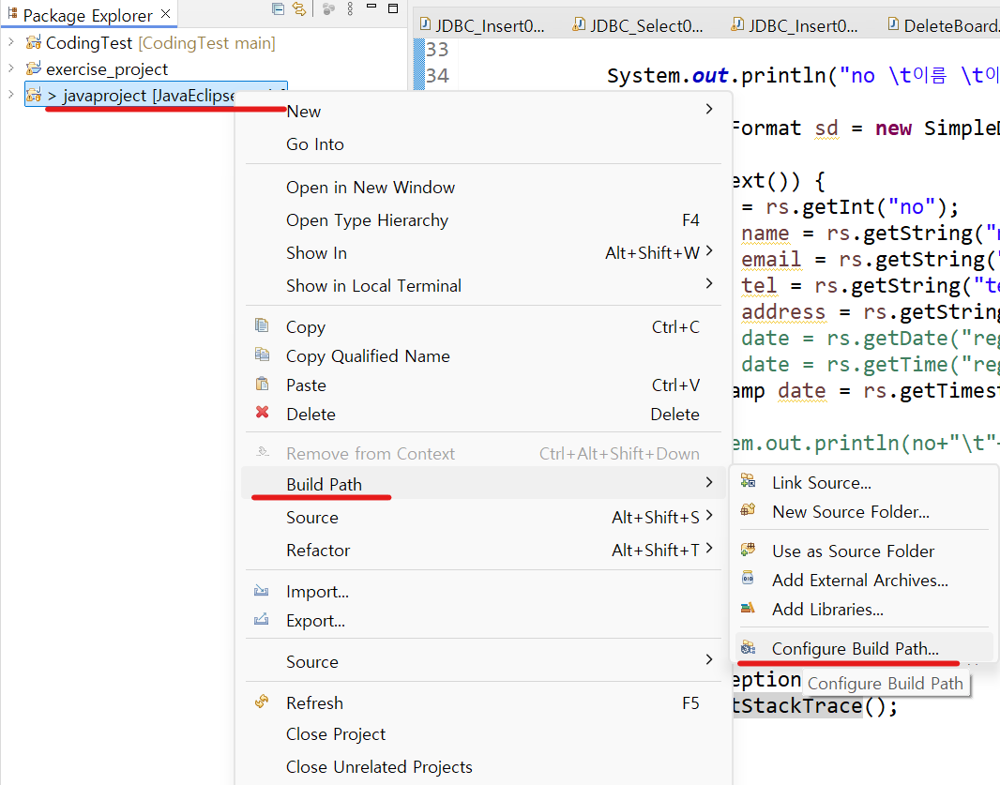
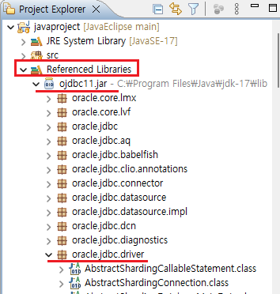
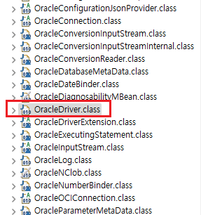

1. # 오라클 설치
   <a href="https://www.oracle.com/kr/downloads/#category-database">https://www.oracle.com/kr/downloads/#category-database</a>

   Database Express Edition으로 들어가서 21C 버전을 선택합니다.   

   설치 중 나오는 암호 입력창이 있는데 이 암호는 cmd를 통해 sqlplus로 접속시 필요하므로 잘 기억해야 합니다.   
      

   Database Enterprise/Standard Edition과 Database Express Edition이 있는 Database Enterprise/Standard Edition는 설치시 파일이 2개인 것도 있고 복잡하고 삭제시 레지스터리까지 지워야하지만 Database Express Edition는 설치도 간단하고 제어판에서만 지워도 깔끔히 제거가 됩니다.   
      

1. # 오라클 Path와 Service

   Oracle을 다운 받아서 설치하면 경로는 자동 설정이 됩니다.   
      

   Oracle을 설치하면 서비스에 5개의 서비스가 생성되는데 
   OracleServiceXE와 OracleXETNSListener이 가장 중요한 서비스입니다.   
      

1. # cmd에서 오라클 계정접근

   DBA 계정 : sys, system   
   교육용 계정 : scott, hr   
      

   cmd창으로 오라클에 접속   
   ```js
      C:\Users\user>sqlplus system/oracle

      SQL*Plus: Release 11.2.0.2.0 Production on 수 7월 24 16:51:02 2024

      Copyright (c) 1982, 2014, Oracle.  All rights reserved.
      Connected to:
      Oracle Database 11g Express Edition Release 11.2.0.2.0 - 64bit Production

      SQL> show user    //현재 접속 계정
      USER is "SYSTEM"
      
      SQL> select * from tab;  //table가져오기
      SQL> connect system/oracle  //계정 변경
      Connected.
      
      SQL> show user       
      USER is "SYSTEM"
      
      SQL> conn sys/oracle as sysdba
      Connected.
      
      SQL> show user
      USER is "SYS"
   ```   
   system보다 sys가 상위 계정이기 때문에 sys로 접속시   
   'as sysdba'를 입력해줘야 합니다.   

1. # JDBC 파일 다운
   JDBC는 Java Database Connectivity의 약자로 자바와 데이터베이스를 연동하기 위한 인터페이스입니다. 자바 애플리케이션에서 표준화된 방법으로 설계되어 다양한 데이터베이스에 접속할 수 있으며, 이를 설치하기 위해 개발 회사는 자사 제품에 접속할 수 있는 JDBC드라이버를 제공합니다.   
   그래픽카드를 구입하면 그에 맞는 드라이버가 필요하듯이 DB를 자바에서 연동하기 위해서는 해당 DB에 맞는 드라이버가 필요합니다.   

   오라클 DBMS - 오라클 JDBC드라이버 필요   
   MySQL DBMS - MySQL JDBC드라이버 필요  
   IBM DB2 DBMS - IBM DB2 JDBC드라이버 필요   

   드라이버는 해당 제품의 홈페이지에서 구할 수 있듯이 오라클은 오라클 홈페이지에서, MySQL은 MySQL 홈페이지에서 각각 드라이버를 구할 수 있습니다.   

   <a href="https://www.oracle.com/database/technologies/appdev/jdbc-downloads.html">오라클 버젼</a>   
   자바 버전에 따른 JDBC드라이버 목록입니다.   

   ```
      C:\Program Files\Java\jdk-17\lib
   ```   
   해당 경로에 JDBC파일을 저장합니다.   
      

1. # JDBC 다운받기
   <a href="https://www.oracle.com/kr/database/technologies/appdev/jdbc-downloads.html">https://www.oracle.com/kr/database/technologies/appdev/jdbc-downloads.html</a>   

      

1. # 이클립스에서 JDBC 경로 설정
   JDBC파일을 다운받아서 lib폴더에 저장했다면 이클립스에서 JDBC파일을 라이브러리로 추가해줘야 합니다.   

   프로젝트마다 각각 빌드패스를 설정해줘야 합니다. 해당 프로젝트 위에서 마우스 오른쪽 버튼을 누른 후 가장 밑에 Properties를 선택합니다.   
      

   또는 오른쪽 마우스 버튼 →  Build Path → Configure Build Path를 선택하여 Build Path로 바로 갑니다.   
      

   Libraries → Classpath → Add Exteranl JARs...를 선택합니다.   
      
   C:\Program Files\Java\jdk-17\lib 경로의 ojdbc11.jar파일을 선택합니다.   

   ```
      String driver = "oracle.jdbc.driver.OracleDriver";
		String url = "jdbc:oracle:thin:@localhost:1521:xe";
   ```   
   oracle.jdbc.driver : 패키지명   
   OracleDriver : 클래스명   
   oracle.jdbc.driver 패키지에 OracleDriver라는 클래스 1개만 자바 연동시 사용하게 됩니다.   

      

      

