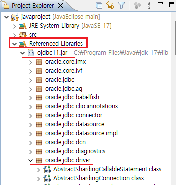
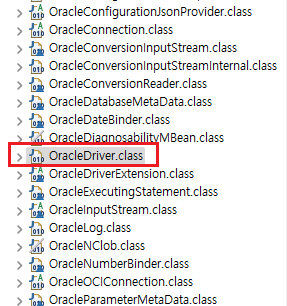

1. # JDBC
   JDBC는 Java Database Connectivity의 약자로 자바와 데이터베이스를 연동하기 위한 인터페이스입니다. 자바 애플리케이션에서 표준화된 방법으로 설계되어 다양한 데이터베이스에 접속할 수 있으며, 이를 설치하기 위해 개발 회사는 자사 제품에 접속할 수 있는 JDBC드라이버를 제공합니다.   
   그래픽카드를 구입하면 그에 맞는 드라이버가 필요하듯이 DB를 자바에서 연동하기 위해서는 해당 DB에 맞는 드라이버가 필요합니다.   

   오라클 DBMS - 오라클 JDBC드라이버 필요   
   MySQL DBMS - MySQL JDBC드라이버 필요  
   IBM DB2 DBMS - IBM DB2 JDBC드라이버 필요   

   드라이버는 해당 제품의 홈페이지에서 구할 수 있듯이 오라클은 오라클 홈페이지에서, MySQL은 MySQL 홈페이지에서 각각 드라이버를 구할 수 있습니다.   

   <a href="https://www.oracle.com/database/technologies/appdev/jdbc-downloads.html">오라클 버젼</a>   
   자바 버전에 따른 JDBC드라이버 목록입니다.   

   ```
      C:\Program Files\Java\jdk-17\lib
   ```   
   에 JDBC파일을 저장합니다.   

   ```
      String driver = "oracle.jdbc.driver.OracleDriver";
		String url = "jdbc:oracle:thin:@localhost:1521:xe";
   ```   
   oracle.jdbc.driver : 패키지명   
   OracleDriver : 클래스명   
   oracle.jdbc.driver 패키지에 OracleDriver라는 클래스 1개만 자바 연동시 사용하게 됩니다.   

      
      

