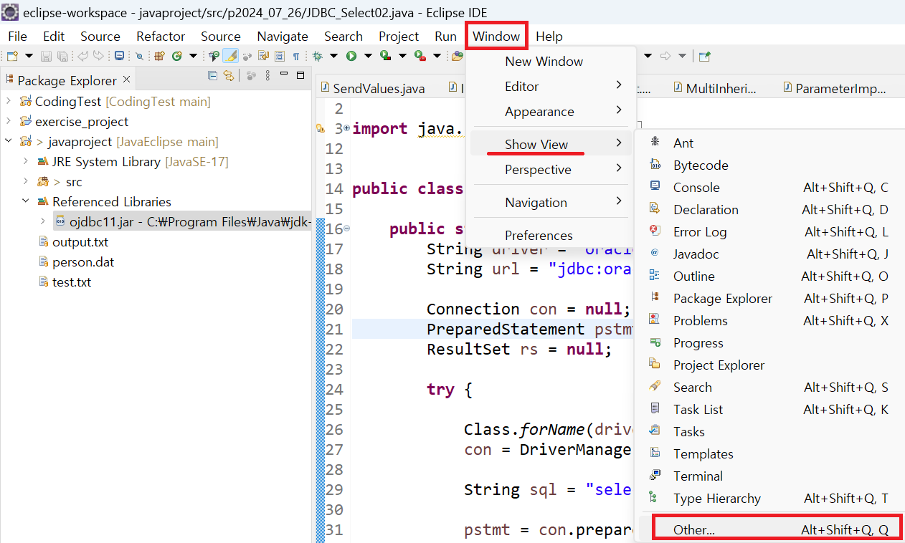
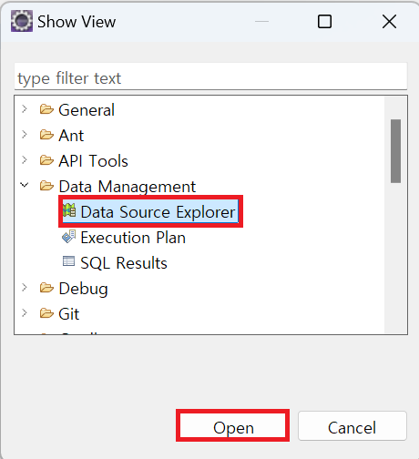
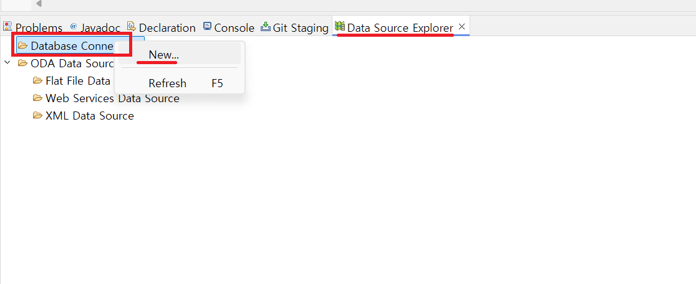
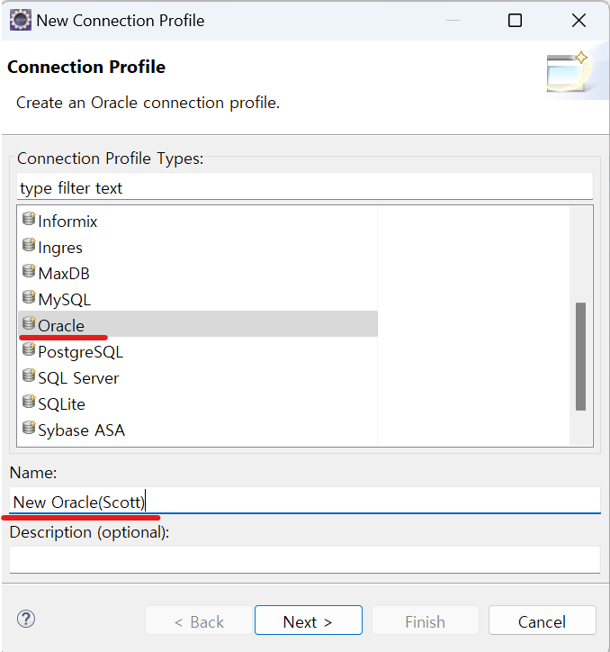
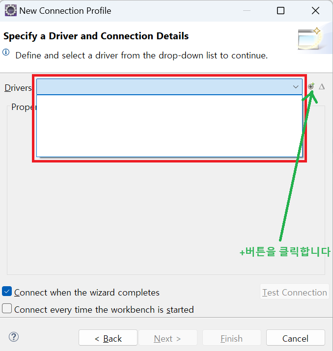

1. # 오라클 버젼확인

cmd창에서 sqlplus "/as sysdba"입력

```cs
   C:\Users\natis>sqlplus "/as sysdba"

   SQL*Plus: Release 11.2.0.2.0 Production on 토 7월 27 20:38:05 2024
      
   Copyright (c) 1982, 2014, Oracle.  All rights reserved.


   Connected to:
   Oracle Database 11g Express Edition Release 11.2.0.2.0 - 64bit Production

   SQL>
```
1. # 이클립스에서 오라클 연동
   이클립스에서 오라클을 사용하기 위해서는 Data Source Explorer를 이용합니다.   

   Window → Show View → Other을 선택합니다.   
      

   Data Management → Data Source Explorer를 선택합니다.   
      

   콘솔이 있는 하단에 Data Source Explorer가 나타납니다. 여기서 Database Connections에서 마우스 오른쪽 버튼을 눌러 New를 선택합니다.   
      

   데이터베이스 목록에서 오라클을 선택 후 Name에 원하는 데이터베이스 이름을 입력합니다.   
      


1. # Database Connections에 목록이 없는 경우

      

   해결 방법:
   메뉴 → help → install new software   
   