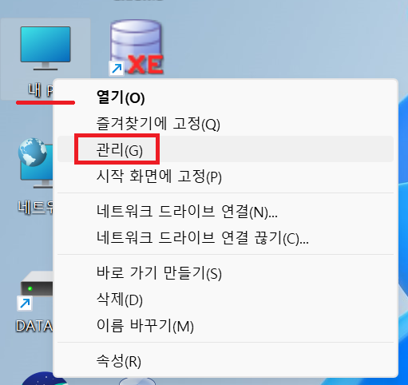
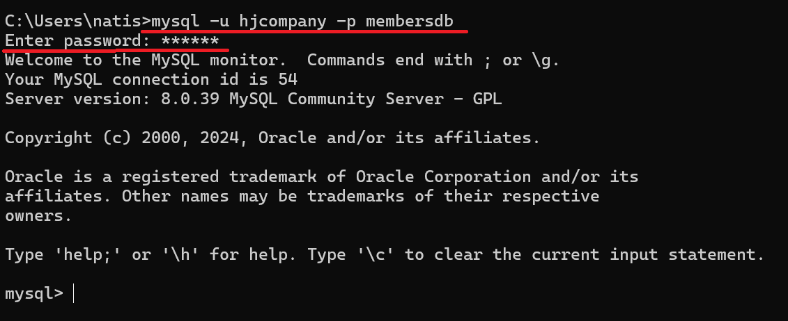

1. # MySql 다운받기

   <a href="https://www.mysql.com/downloads/">https://www.mysql.com/downloads/</a>

   사이트에서 가장 하단에 MySQL Community (GPL) Downloads »를 선택합니다.   
      

   MySQL Installer for Windows   
       

   MSI Installer를 다운 받습니다.   
      

   <span style="color:red">*설치전 컴퓨터 이름을 영어로 해야합니다. 한글이면 설치가 제대로 안됩니다</span>   

   full을 선택합니다.   
      

   제품을 각각 설치하게 됩니다.   
      
   Next 버튼이 활성화되면 누릅니다.   

      
   MySql은 포트가 3306입니다.   

   비밀번호를 입력해야 합니다. 오라클은 비번을 잊어버린 경우라도 방법이 있지만, MySql은 비번을 잊어버리면 새로 설치하는 방법밖에 없습니다.   
      

   Installation이 끝났습니다. finish를 누르면 Product Configuration이 나오고 환경설정을 계속하게 됩니다. next를 누릅니다.   
      

   앞에서 입력한 password를 입력하고 Check를 누릅니다.   
      

   이후 몇번의 excute와 next 버튼을 눌러 환경설정을 합니다.   

   Workbech가 나타나면 설치가 잘 된 것입니다.   
      

1. # 서비스에서 확인
   윈도우키 + R을 눌러 service.msc를 입력합니다.   
   또는
   바탕화면의 내 컴퓨터에서 오른쪽 마우스 → 관리를 통해 서비스를 실행합니다.   
      

   MySQL80 서비스가 실행되고 있는 것을 확인할 수 있습니다.   
      

1. # path설정
   MySQL은 크게 3곳의 폴더에 나눠서 설치가 됩니다.   
   Program Files   
   Program Files(x86)   
   ProgramData   
   각각의 폴더에 MySQL이란 폴더가 생성됩니다.    
      

   오라클은 자동으로 Path가 잡히기 때문에 설정이 필요없지만 MySQL은 Path설정을 해야합니다.   
   ```
      C:\Program Files\MySQL\MySQL Server 8.0\bin
   ```   
      

   cmd창에으로 mysql에 접속합니다.   
   mysql -uroot -p1234 mysql   
   <span style="color:red">명령어  -u계정명 -p비밀번호 접속할DB명</span>   
      

   ```
      show databases;   --데이터베이스 목록
      use sakila;       --데이터베이스 사용
      show tables;      --테이블 목록

      select user, host from user;  --user목록
   ```   
   명령어로 데이터베이스와 테이블을 확인할 수 있습니다.   

   __오라클은 계정단위로 이루어져있고 MySQL은 데이터베이스 단위로 이루어져있습니다.__   

1. # 일반계정 생성
   DB명 : jsptest   
   user : jspid   
   pass : jsppass   

   오라클은 xe라는 데이터베이스 안에 sys나 scott처럼 계정을 여러개 생성하여 사용하는 방식이고,   
   mysql은 데이터베이스 단위로 이루어져이 있기 때문에 여러개의 데이터베이스를 생성하여 이를 계정으로 사용하는 방식입니다.   

   root계정으로 접속 → 데이터베이스 생성   
   mysql Workbench에서 실행합니다.   

   1)root계정으로 접속   
   ```js
      create databse jsptest;    //jsptest라는 데이터베이스 생성

      //5.7이하 버전
      grant all privileges on jsptest.* to jspid@'%' identified by 'jsppass' with grant option;
      //jsptest데이터베이스에 jspid라는 user를 생성하고 jsppass라는 password를 설정하고 권한을 부여
      flush privileges;
      //재시작없이 설정 변경 적용

      //8버전부터
      create user jspid@'%' identified by 'jsppass';
      //jspid라는 user와 jsppass라는 password를 생성
      grant all privileges on jsptest.* to jspid@'%' with grant option;
      //jspid에 권한부여
      flush privileges;
      //재시작없이 설정 변경 적용
   ```   

   cmd창에서 jspid로 로그인합니다.   
      

1. # 일반 계정으로 커넥션 생성
   Workbench에서 상단에 집 모양을 클릭 후 빠져나옵니다.   
   MySQL Connections 옆에 + 버튼을 누릅니다.   
      
   
   아이디, 패스워드, 생성한 데이터베이스명을 입력합니다.   
      

   새로운 커넥션이 생성되었습니다.   
      