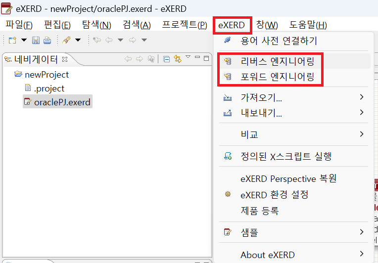

---
layout: single
title: 08_09.exerd
categories: SQL(Lesson)
tag: []
author_profile: false
---   

1. # mySql로 다이어그램 넘기기
   리버스 엔지니어링 : MySQL → eXERD - MySQL에 있는 테이블을 eXERD로 불러옴
   포워드 엔지니어링 : eXERD → MySQL - eXERD에서 설계한 테이블들을 MySQL로 전송

   eXERD → 리버스 엔지니어링 또는 포워드 엔지니어링 선택   
      

1. # 도움말 선택
   도움말 → 도움말 목차 
      

   검색에서 '리버스' → 하단에 '리버스 엔지니어링' 링크 선택   
      