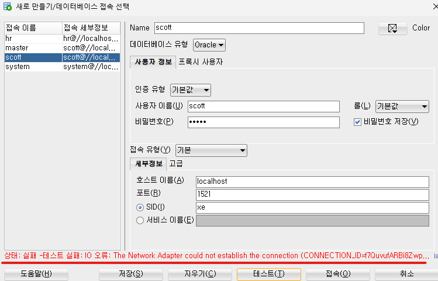
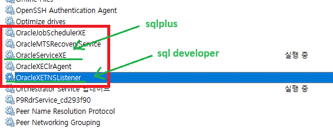
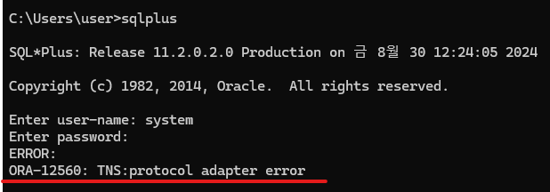

---
layout: single
title: developer연결 시 error
categories: SQL(Lesson)
tag: []
author_profile: false
---   

1. # developer연결 시 error
   sqlplus에서는 접속이 되는데 developer에서 연결 시 에러가 뜨는 경우   
      

   서비스에서 oracleXETNSListener를 실행합니다. OracleServiceXE만 실행되어 있어도 sqlplus는 실행됩니다.   
      

   OracleServiceXE 서비스가 꺼져있는 경우 sqlplus에서 에러가 발생합니다.   
      
   다음과 같은 error가 나타납니다.   

