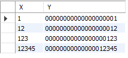

 
1. # int형 옆에 괄호 의미  
   zerofill 옵션을 사용했을 때 괄호안의 크기 만큼 앞의 빈칸에 0을 채움니다   

   ```sql
      CREATE TABLE TMP(
         X INT(20),
         Y INT(20) ZEROFILL
      );

      INSERT INTO TMP VALUES (1,1);
      INSERT INTO TMP VALUES (12,12);
      INSERT INTO TMP VALUES (123,123);
      INSERT INTO TMP VALUES (12345,12345);
   ```
     
