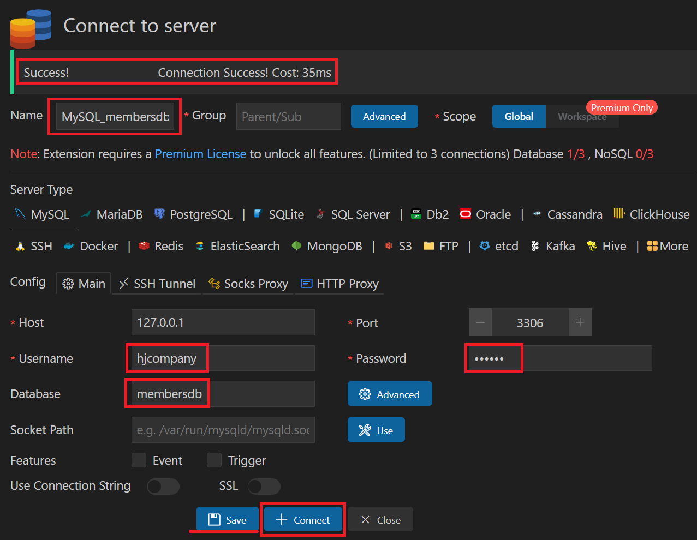

 
1. # 확장 팩 설치
   Extension 설치   
      

   connection 만들기   
      

   아이디, 비번, 데이터베이스명을 입력 후 하단에 Connect 클릭   
      
   입력 값들을 save 해놓을 수도 있습니다.   

   왼쪽 Explorer 탭에서 연결 확인   
      

   연결이 되면 기존 프로젝트의 sql확장자 파일에 다음과 같은 실행 커멘트가 자동으로 나타납니다.   
      

1. # VS Code에서 바로 쿼리 작성
   VS Code에서 MySql과 연동하여 바로 쿼리를 작성하기 위해서 db에 연결을 합니다.   

   user.sql 파일의 상단에 Active Connection을 클릭합니다.   

   추천 항목으로 다음과 같은 항목이 뜨면 차례로 선택합니다.   
     
    
   MySQL_membersdb -> membersdb  

   연결된 것을 확인 할 수 있습니다.
     