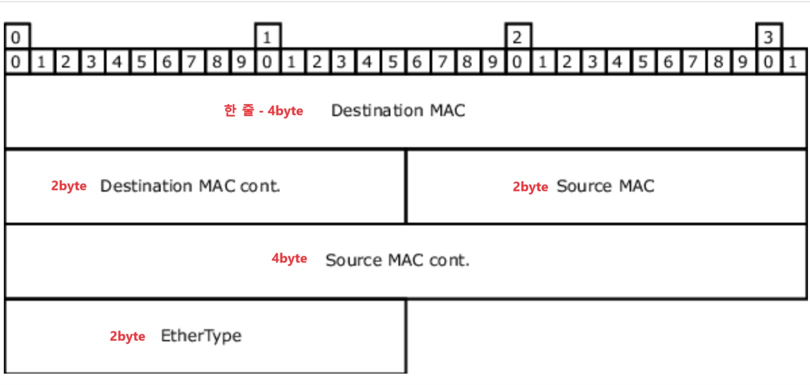
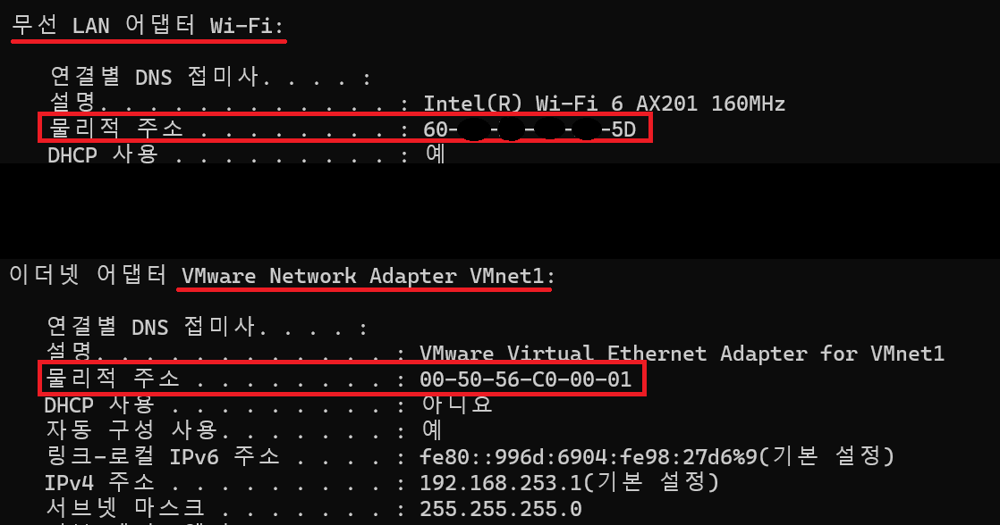
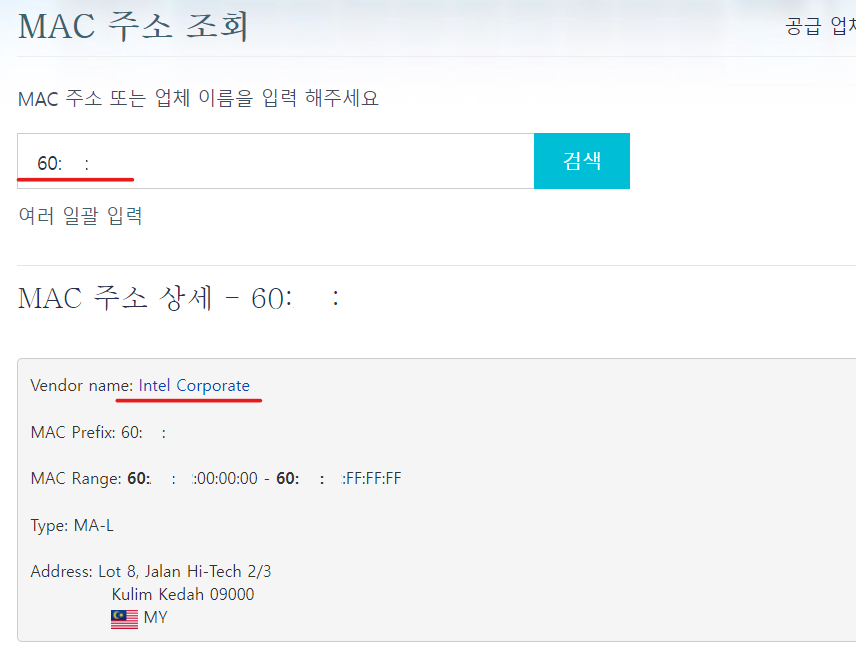
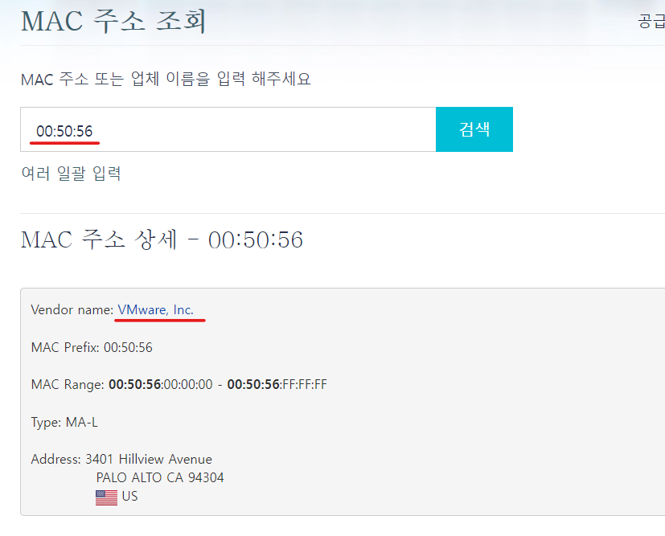
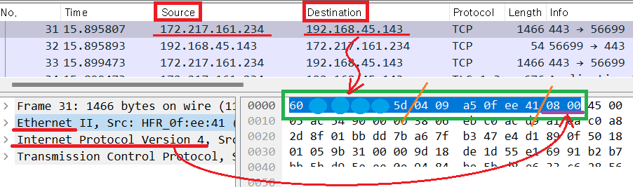
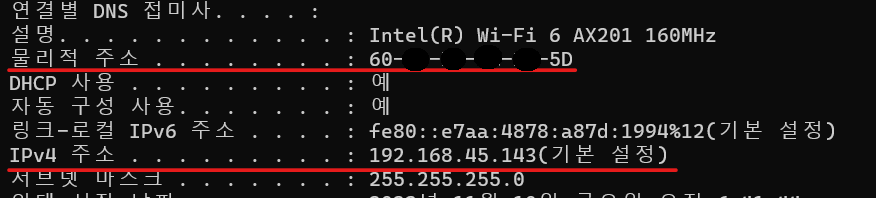

1. # OSI 2계층
   - 하나의 네트워크 대역 즉, 같은 네트워크 상에 존재하는 여러 장비들 중에서 어떤 장비가 어떤 장비에게 보내는 데이터를 전달   
   - 흐름제어, 오류제어 기능을 수행   
   - 하나의 네트워크 대역 LAN에서만 통신할 때 사용   
   - 스위치나 브릿지만으로 가까운 네트워크 끼리 통신 가능   
   - 다른 네트워크 대역과 통신할 때는 3계층까지 도입. 3계층의 주소와 프로토콜일 이용해야만 다른 네트워크와 통신이 가능   

1. # MAC주소
   - LAN 통신 시 사용되는 LAN카드에 존재하는 물리적 주소   
   - 16진수 12자리로 표시   
   ex)C0-E4-34-72-2B-62   
   C0-E4-34 : 앞에 3자리 - OUI(IEEE에서 부여하는 제조회사 식별 ID)   
   72-2B-62 : 뒤에 3자리 - 제조회사에서 부여한 고유번호   

1. # ethernet protocal   

      

   2. Destination MAC : 6byte로 목적지 MAC주소(OO-OO-OO-OO-OO-OO)가 입력됩니다.   
   2. Source MAC : 6byte로 출발지 MAC주소(OO-OO-OO-OO-OO-OO)가 입력됩니다.   
   *16진수 1개 4bit, 2개가 1byte -> MAC주소 'OO' 1개가 1byte, 'OO'이 총 6개로 6byte필요.   
   또는 16진수 12자리 총 48bit -> 48bit = 6byte   

   2. EtherType : 2byte 페이로드에 있는 상위 계층 프로토콜(ICMP,ARP,IP) 타입을 알려줍니다.   
   IPv4 : 0 8 0 0   
   ARP : 0 8 0 6   

1. # MAC주소 제조사 조회
   
   cmd에서 ipconfig /all로 MAC주소 확인   
      

   'MAC OUI 조회'로 검색   

   60:A5:E2의 MAC주소 값은 인텔이 제조사라는 것을 확인할 수 있습니다.   
      

   00:50:56의 MAC주소는 VMware에 실행하는 MAC주소로 제조사를 VMware로 나타납니다.   
      

1. # MAC주소 캡쳐

      
   앞에 6byte가 목적지(destination), 뒤에 6byte가 출발지(source)로 목적지 ip와 mac주소가 제 컴퓨터의 ip와 mac주소와 일치합니다.   
   가장 뒷쪽 0800은 EtherType으로 상위 프로토콜로 IPv4가 페이로드와 왔다는 것을 확인할 수 있습니다.

      
   

