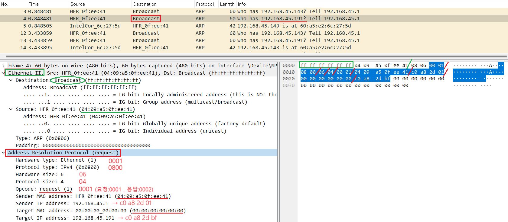

1. # ARP
   MAC주소를 IP주소를 이용해서 알아오는 프로토콜입니다. 같은 네트워크 대역에서 통신을 한다 하더라도 데이터를 보내기 위해선 7계층부터 캡슐화를 통해 데이터를 보내기 때문에 IP주소와 MAC주소가 모두 필요합니다. 이때 IP주소는 알고 MAC주소를 모를 때 ARP통신을 통해 MAC주소를 알아와서 통신을 하게 됩니다.   
       
   IP주소 : 인간이 사용하는 주소   
   MAC주소 : 컴퓨터가 사용하는 주소   
     
1. # ARP 프로토콜   
      
    
   0 &nbsp;4 &nbsp;8 &nbsp;12 16 ... 32   
   |&nbsp;&nbsp;&nbsp;|&nbsp;&nbsp;&nbsp;&nbsp;|&nbsp;&nbsp;&nbsp;&nbsp;|&nbsp;&nbsp;&nbsp;&nbsp;|&nbsp;...&nbsp;|   
      
   한 칸이 4bit, 총 8칸으로 한 줄 총 32bit = (8bit가 1byte) => 한 줄 4byte   
   전체 7줄로 총 28bytes 크기의 ARP프로토콜입니다.   
   16진수 한 문자 4bit  

   1. __Hardware Type__ : 2byte, 2계층에서 사용할 프로토콜을 명시합니다. ARP가 3계층 프로토콜이기 때문에 헤더로 추가할 프로토콜에 대한 정보를 입력합니다. 2계층의 대표 프로토콜은 이더넷이기 때문에 일반적으로 이더넷 타입을 16진수로 표현한 0 0 0 1 옵니다. 제일 뒤에 1이 이더넷을 뜻하게 됩니다.   
      
      Hardware Type = |0|0|0|1| (1칸 4bit)   
   
   1. __Protocol Type__ : 2byte, IP타입을 입력합니다. 일반적으로 IPv4 타입을 16진수로 표현한 0 8 0 0 옵니다.   
      
      Protocol Type = |0|8|0|0| (1칸 4bit)   
    
   1. __Hardware Address Length__ : 맥주소의 길이입니다. 맥주소는 16진수 
   12자리입니다. 4bit * 12 = 48bit = 6byte.   
   
      Hardware Address Length = |0|6| (1칸 4bit)   
   
   1. __Protocol Address Length__ : IPv4의 길이입니다. 8bit 4자리로 총 32bit = 4byte입니다.   
   
      Protocol Address Length = |0|4| (1칸 4bit)   

   1. __Opcode__ : Operation Code로 맥주소의 요청인지 응답인지를 식별하는 코드입니다. 4자리 수 중 가장 뒷자리가 1이면 요청, 2이면 응답입니다.   

      요청 시 : Opcode = |0|0|0|1|   
      응답 시 : Opcode = |0|0|0|2|      
   
   1. __Sender Hardware Address__ : 총 6byte, 하드웨어 어드레스란 맥 주소를 말합니다. 즉 송신 측의 맥주소가 입력됩니다.

   1. __Sender Protocal Address__ : 총 4bte, 프로토콜 어드레스란 IPv4의 IP주소를 얘기합니다. 즉 송신 측의 IP주소가 입력됩니다. IP주소는 16진수로 입력.

   2. __Target Hardware Address__ : 총 6byte, 수신 측의 맥주소가 입력됩니다.

   2. __Target Protocol Address__ : 총 4byte, 수신 측의 IP주소가 입력됩니다. IP주소는 16진수로 입력.  
   *이더넷 프로토콜의 경우만 특이하게 앞에 수신 측이 나오고 뒤에 송신 측이 나오는데, 그 외 대부분 프로토콜들은 앞에 송신 측이 나오고 뒤에 수신 측이 나옵니다.   

1. # MAC주소를 얻는 과정
   A컴퓨터가 C컴퓨터의 맥주소를 얻는 과정   

   1)A컴퓨터가 ARP요청 패킷을 만들어서 인캡슐레이션 후 |Eth|ARP요청| 이란 패킷을 만들어 보냅니다.      
   ARP : 0001(일정)/0800(일정)/06(MAC주소크기)/04(IP주소크기)/0001(요청)/aa aa aa aa aa aa(A컴퓨터 MAC주소)/192.168.0.10(A컴퓨터 IP주소)/00 00 00 00 00 00(목적지 MAC주소-모름)/192.168.0.30(목적지 IP주소-알고있음)    
   Eth : FF FF FF FF FF FF(목적지 MAC주소-모르기 때문에 전부 FF)/aa aa aa aa aa aa(출발지 MAC주소-자신의 IP주소)   

   2)패킷을 스위치에게 보냄   

   3)스위치는 2단계 장비이기 때문에 2계층 프로토콜까지만 확인 함. 즉 Eth만 확인 ARP는 확인하지 않음   

   4)Eth확인시 목적지에 MAC주소를 모르기 때문에 FF FF FF FF FF FF로 설정됨. 클래스에서 IP주소에서 가장 뒷 자리가 255로 채워진 주소는 브로드캐스팅이 되는데 MAC주소도 마찬가지로 전부 FF이면 브로드캐스팅이 됩니다.   
   →같은 네트워크 내에서 통신을 할 때 중계 장치는 스위치나 브릿지인 2계층 장비인데, 2계층 장비는 Eth(이더넷) 부분만 디캡슐레이션(열러보다?)을 합니다. 이 부분에는 IP주소는 없고 MAC주소만 있기 때문에 현재 MAC주소가 FF FF FF FF FF FF로 목적지를 알 수 없기 때문에 브로드캐스팅 방식으로 모든 호스트 컴퓨터에 패킷을 보내게 됩니다. 패킷을 받은 호스트 컴퓨터들은 ARP 3계층 프로토콜을 디캡슐레이션 한 후 ARP에 적혀있는 해당 IP컴퓨터만 응답을 하게 됩니다.

   5)브로드캐스팅으로 인해 C컴퓨터가 응답을 하고 자신의 MAC주소를 넣어 인캡슐레이션 이후 이 패킷을 A컴퓨터에게 보냅니다.   

   6)A컴퓨터가 패킷을 받아 디캡슐레이션 후 C컴퓨터의 MAC주소를 확인하고 이 MAC주소를 자신의 ARP(캐시) 테이블에 IP와 함께 MAC주소를 기록합니다.    

1. # ARP(chash) table
   windows cmd창에서 arp -a 입력

   ARP프로토콜은 3계층 프로토콜인데 같은 네트워크 대역에서만 사용됩니다.   
   ARP프로토콜이 사용되는 경우가 MAC주소를 몰라서 브로드캐스팅으로 MAC주소를 알아오는 과정에 사용이 되는데 브로드캐스팅의 경우 다른 대역의 길목에 있는 라우터에서 브로드캐스팅된 패킷을 외부로 넘겨주지 않기 때문입니다.
 
   *캐쉬 테이블이기 때문에 일정시간 경과 후 내용이 재작성됩니다.   
   *ARP테이블은 내 컴퓨터에도 있고 스위치, 라우터 같은 네트워크 장비에도 있는데 내 컴퓨터에 있는 ARP테이블은 내 컴퓨터와 통신하는 데이터에 한정되고 스위치는 같은 네트워크 범위, 라우터는 다른 네트워크 범위를 가지게 됩니다.   

1. # ARP WireShark
      
   Brodcasting이기 때문에 Ethernet의 목적지 MAC주소가 ff ff ff ff ff ff이고, ARP의 목적지 MAC주소가 00 00 00 00 00 00입니다.   
   Hardware type은 2계층 프로토콜인 Ethernet : 0001   
   Protocol type은 IPv4 : 0800   
   Hardware size 맥주소 크기 6byte : 06   
   protocol sizel IPv4의 크기 4byte : 04   
   Opcode는 현재 요청이기 때문에 0001, 응답이면 0002   
   패킷을 보내는 곳은 192.168.45.1로 게이트웨이가 되고,   
   목적지는 192.168.45.191이 됩니다.
