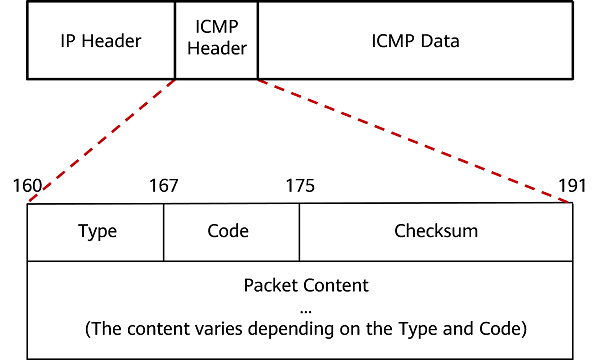
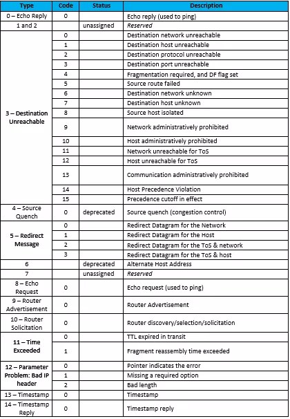

1. # IP
   비연결형 서비스 : 통신 상대방의 상태 미확인   
   비신뢰적 서비스 : 전송 오류에 대한 미확인    
   
1. # ICMP(Internet Control Message Protocol)
   비연결형이고 비신뢰적인 IP 프로토콜을 보안하기 위해 개발된 프로토콜입니다. IP를 보안하기 위해 개발된 프로토콜이지만 IP의 상위계층에서 동작합니다. OSI계층은 3계층으로 IP와 ICMP가 동일하지만 IP를 사용하기 때문에 IP보다 상위 계층에서 실제 동작을 합니다.    
   운영체제에서 오류메시지를 전송받는 데 주로 쓰임.   
   프로토콜 구조의 Type와 Code를 통해 오류 메시지를 전송 받음.   
    
   ● IP 데이터 그램 전달 오류에 대한 보고 서비스 - 오류 발생시 어떤 오류가 발생했는지 송신자에게 전달
    
   ● IP 데이터 그램을 위한 상태 정보 질의 서비스 - 수신자, 라우터 등에 원하는 정보를 질의를 통해 확인 후 송신자에게 전달    

1. # ICMP Protocol
      
    
   160bit ~ 191bit = 191-160+1 = 한 줄 총 32bit -> 4byte.
    
   하단 Packet Content까지 2줄로 ICMP는 총 8byte.
    
   프로토콜 자체는 간단하지만 메시지가 다양하고 많습니다. 요청 메시지를 보내면 그에 따른 응답 메시지를 보내는 방식입니다.   
    
   1. Type : 대분류   
   type이 나눠지고 해당 타입에 따라 code가 나눠집니다. type종류는 30가지가 있는데 이중 중요한 타입은 다음과 같습니다.   
      1. 0 : Echo Reply - 응답   
      1. 8 : Echo - 요청   
         icmp는 상대방과 통신을 확인 하기 위한 프로토콜로 8번으로 요청을 보내면 0번으로 응답을 합니다.   
       
      3. 3 : Destination Unreachable - 목적지까지 도달하지 못 한 경우 설정이 됩니다. 가는 경로 상에 문제.   
      예)라우터 등이 경로 설정을 잘못해서 목적지까지 도달 못 한 경우   
      3. 11 : Time Exceded - 목적지까진 갔지만 응답을 못 받는 경우 설정이 됩니다. 상대 네트워크나 컴퓨터가 문제.   
      예)상대방이 방화벽을 켜놓은 경우
       
      3. 5 : Redirect - 원격지에 있는 라우팅 테이블을 수정하는 경우 설정

   2. Code : 소분류   
   2. Checksum : 헤더에 오류가 있는지 없는지 확인하는 값입니다. 필드의 값들을 계산해서 설정 후 보내면 받는 쪽에서 똑같이 필드의 값을 계산해서 비교를 하게 됩니다. 

1. # ICMP 메시지 종류   
   