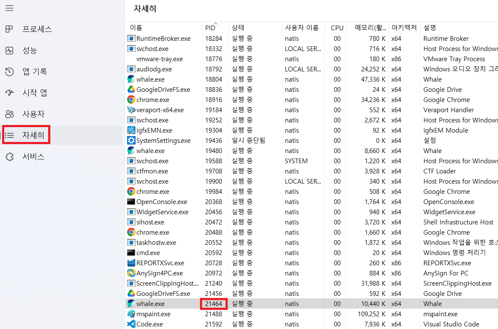

1. # 4계층
   전송 계층은 송신자의 프로세스와 수신자의 프로세스를 연결하는 통신 서비스를 제공합니다.  
   전송 계층은 연결 지향 데이터 스트림 지원, 신뢰성, 흐름 제어, 그리고 다중화와 같은 편리한 서비스를 제공합니다.
   전송 프로토콜 중 가장 잘 알려진 것은 연결 지향 전송 방식을 사용하는 전송 제어 프로토콜(TCP)입니다. 보다 단순한 전송에 사용되는 사용자 데이터 프로토콜(UDP)도 있습니다.   
   주소 체계는 포트 주소를 사용합니다.   

1. # 포트 번호
   컴퓨터가 아니라 특정 프로그램이 사용하기 위한 주소입니다.   
      
   특정 프로세스와 특정 프로세스가 통신을 하기 위해 사용합니다.   
      
   내 컴퓨터 안에서 하나의 포트는 하나의 프로세스만 사용 가능합니다.   
   외부 네트워크로 연결된 컴퓨터에서는 여러 개의 프로그램이 나의 한개 포트에 연결되는 것이 가능합니다.   
   예)   
   A컴퓨터 b프로그램을 5000번 포트에 연결 가능.   
   A컴퓨터 c프로그램을 5000번 포트에 연결 불가.   
   네트워크로 연결된 B컴퓨터의 b프로그램을 A컴퓨터의 5000번 포트에 연결 가능.   
   네트워크로 연결된 B컴퓨터의 c프로그램을 A컴퓨터의 5000번 포트에 연결 가능.   
   네트워크로 연결된 B컴퓨터의 d프로그램을 A컴퓨터의 5000번 포트에 연결 가능.   
      
   하나의 포로세스가 여러 개의 포트를 사용하는 것은 가능합니다.    
   
   포트 번호는 일반적으로 정해져 있지만 무조건 지켜야 하는 것은 아닙니다.   
   예를들어 일반적으로 웹 서비스는 80번 포트를 사용하지만 웹 서비스가 항상 80번 포트를 사용해야 되는 건 아닙니다.   

1. # 포트 종류
   2. __Well-known 포트__   
   0번 ~ 1023번    

   | 서비스 이름 | 포트 번호 |
   |:---------:|:---------:|
   | FTP | 20번, 21번 |
   | SSH | 22번 |
   | TELNET | 23번 |
   | SMTP | 25번 |
   | DNS | 53번 |
   | DHCP | 67번, 68번 |
   | TFTP | 69번 |
   | HTTP | 80번 |
   | POP3 | 110번 |
   | IMAP | 143번 |
   | IRC | 194번 |
   | HTTPS | 443번 |
      
   2. __Registered 포트__   
   1024번 ~ 49151번   

   | 서비스 이름 | 포트 번호 |
   |:---------:|:---------:|
   | 오라클 DB 서버 | 1521번 |
   | MySQL 서버 | 3306번 |
   | MS 원격 데스크탑 | 3389번 |
   
   2. __Dynamic 포트__   

   | 시작 포트 번호 | 마지막 포트 번호 |
   |:---------:|:---------:|
   | 49152번 | 65535번 |

   *일반적으로 서버라 하면 하드웨어적으로 상당히 고사양의 컴퓨터를 얘기합니다. 하지만 아주 고사양 컴퓨터라고 그 자체가 서버가 되지 않습니다. 서버의 기능을 실행하기 위해선 서버가 되는 프로그램을 컴퓨터에 설치해야 됩니다.
   즉 서버는 실행하는 프로그램입니다. 
   자신의 컴퓨터에 웹 서버를 설치해서 실행시키면 자신의 컴퓨터가 웹 서버가 됩니다. DNS서버를 설치해서 실행시키면 DNS서버가 됩니다. FTP서버를 설치해서 실행하면 FTP서버가 됩니다. 

1. # netstat
  Windows의 netstat 명령어는 다양한 옵션을 가지고 있습니다. 주요 옵션은 다음과 같습니다   

  -a : 모든 연결 및 수신 대기 포트를 표시합니다.   
  -b : 바이너리 실행 파일의 이름을 표시합니다.   
  -e : 이더넷 통계를 표시합니다.   
  -f : 외부 주소의 완전한 DNS 이름을 표시합니다.   
  -n : IP 주소 및 포트 번호를 숫자 형식으로 표시합니다.   
  -o : 연결에 대한 프로세스 ID를 표시합니다.   
  -p : 특정 프로토콜을 사용하는 연결만 표시합니다.   
  -r : 라우팅 테이블을 표시합니다.   
  -s : 프로토콜별 통계를 표시합니다.   
  -t : TCP 연결을 표시합니다.   
  -u : UDP 연결을 표시합니다.   
  -w : 워킹스테이션에 대한 워크스테이션 통계를 표시합니다.   
  -x : 네트워크 연결이 종료되지 않고 유지되는지 확인합니다.   

1. # 실습
   인터넷에 접속 후 cmd창에서 netstat -ano 출력 화면
      
   5천번대의 내 컴퓨터 포트와 목적지 IP주소에 443포트가 연결되어 있습니다.   

   PID값은 웨일 브라우저입니다.   
      