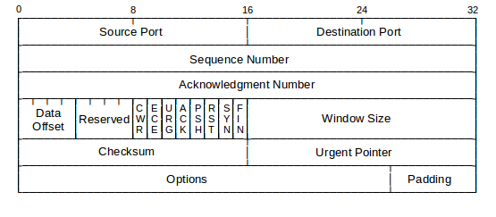

1. # TCP
   전송 제어 프로토콜(Transmission Control Protocl, TCP)은 인터넷에 연결된 컴퓨터에서 실행되는 프로그램 간에 통신을 안정적으로, 순서대로, 에러없이 교환 할 수 있게 합니다.   
   TCP의 안정성을 필요로 하지 않는 애플리케이션의 경우 일반적으로 TCP 대신 UDP를 사용합니다.   
   TCP는 UDP보다 안전하지만 느립니다. 하지만 사용자가 체감할 정도는 아니며 UDP와 비교했을 때 이론상 느리다 표현하지 2개가 구별될 정도로 뚜렷한 차이가 나지는 않습니다.
1. # TCP Protocol Header
      
   한 줄 4byte, 5줄로 총 20byte입니다. 
   마지막 Options와 Padding은 IP프로토콜의 Options and Padding과 똑같은 성격으로 추가적 정보가 붙는 필드입니다. 한 줄 4byte로 최대 10줄까지 추가되어 총 40byte가 더 늘어날 수 있습니다. 보통 Opstions 없이 사용하는 것이 일반적입니다.   
   
   1. __Source Port__   
      Source Port Number   
      크기 : 2byte   
      포트 번호 0 ~ 65535 : 2^16 = 65536로 총 16bit 필요. 16bit = 2byte.   
   
      데이터를 전송하는 측의 프로그램 포트 번호.   
   1. __Destination Port__   
      크기 : 2byte 포트 번호 0 ~ 65535 : 2^16 = 65536로 총 16bit 필요. 16bit = 2byte.   
   
      데이터를 받는 측의 프로그램 포트 번호.   
   1. __Data Offset__   
      Header의 길이입니다. IP프로토콜의 IHL과 같은 성격을 가집니다. 헤더의 길이 범위는 20byte ~ 60byte인데 주어진 공간이 4bit라 20을 4로 나눈 20/4=5, 5의 값을 쓰고 Options가 추가 될 때마다 1씩 더해지게 됩니다.

   1. __Reserved__
      예약될 필드로 사용되지 않습니다.   
   
   1. __Window Size__
      남아있는 TCP 버퍼 공간을 상대방에게 알려줍니다. 현재 어느 정도의 패킷까지 전송받아 처리 가능한지 전송 허용 가능 패킷 크기가 TCP 버퍼 공간에 따라 결정되기 때문에 이를 상대방에게 알려주는 필드입니다.
1. # TCP 플래그
   TCP는 서버와 클라언트가 통신시 서로 지속적으로 상대방의 상태를 확인하게 되는데 그 때 사용되는 상태 값이 TCP 플래가 됩니다.   
      
   TCP프로토콜의 Flags 부분 : CWR, ECE, URG, ACK, PSH, RST, SYN, FIN   
      
   이 중 URG, ACK, PSH, RST, SYN, FIN을 알아봅니다.   
   1. __URG__   
   urgent bit : 긴급 bit.   
   urgent bit가 1로 입력된 경우 TCP 프로토콜의 하단에 Urgent Pointer 필드에 어디서 어디까지가 urgent bit인지 범위를 설정해 놓게 됩니다.   
   
   1. __ACK__   
   Acknowledgment : 승인 bit.   
   
   1. __PSH__   
   Push : 밀어넣기 bit.   

   1. __RST__   
   Rest : 초기화 bit.   

   1. __SYN__   
   Synchronize : 동기화 bit.   

   1. __FIN__   
   Finish : 종료 bit.   

1. # TCP 통신 과정
   TCP는 인터넷, 자료 다운, 업로드, 게임, 파일 전송 등 우리가 사용하는 대부분의 통신이 TCP방식을 사용합니다. TCP를 이용한 데이터 통신을 할 때 프로세스와 프로세스를 연결할기 위해 __가장 먼저 수행되는 과정__ 입니다.   
   1) 클라이언트가 서버에게 요청 패킷을 보냄.   
   2) 서버가 클라이언트의 요청을 받아들이는 패킷을 보냄.   
   3) 클라이언트는 이를 최종적으로 수락하는 패킷을 보냄.   

   위의 3개의 과정을 __3Way Handshake__ 라고 부릅니다.   
      
   클라이언트 - 크롬같은 프로그램   
   웹 서버 - 톰캣, nginx, 아파치 등   

1. # TCP 상태 전이도
      
   실선 - 클라이언트의 상태 변화   
   점선 - 서버의 상태 변화   

   1) LISTEN : 포트를 열어놓은 상태(포트를 서버에서 사용하고 있는 상태) - 클라이언트의 요청을 계속 대기하고 있는 상태.   
   passive open : 서버가 수동적으로 포트를 개방 - 서버 포트.   
   2) SYN_SENT : 클라이언트가 포트를 열고 SYN를 서버에 보낸 상태.   
   appl : active open / send: SYN   
   active open : 클라이언트가 능동적으로 포트를 개방 - 클라이언트 포트.   
   3) SYN_RCVD : 서버가 SYN를 받고 응답과 함께 SYN를 클라이언트에게 보낸 상태   
   recv : SYN; send: SYN, ACK   
   recv: RST   
   4) ESTABLISHED : 연결이 클라이언트와 서버 간에 __연결이 수립이 된 상태__ - 3Way Handshake 과정이 끝나면 설정되는 상태.   
   5) 연결이 수립되었으니 이제부터 클라이언트 측에서 데이터를 요구하고 서버 측에선 데이터를 전송   

1. # 3Way Handshake 와 상태 전이
     
   통신 전 서버는 항상 대기 상테 - LISTEN   
   1) 클라이언트가 서버에게 요청 패킷을 보냄 - 클라이언트 : SYN_SENT 상태   
   2) 서버가 클라이언트의 요청을 받아들이는 패킷을 보냄 - 서버 : SYN_RCVD 상태   
   3) 클라이언트는 이를 최종적으로 수락하는 패킷을 보냄 - 클라이언트 : ESTABLISHED 상태   
   4) 클라이언트가 보낸 패킷을 서버가 수락 - 서버 : ESTABLISHED 상태   
   