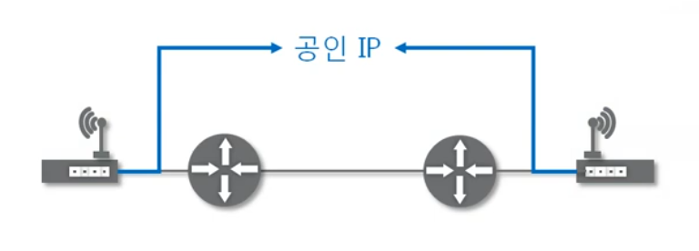
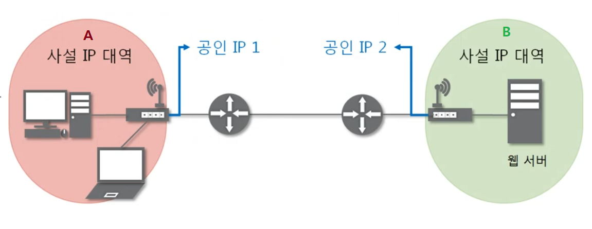
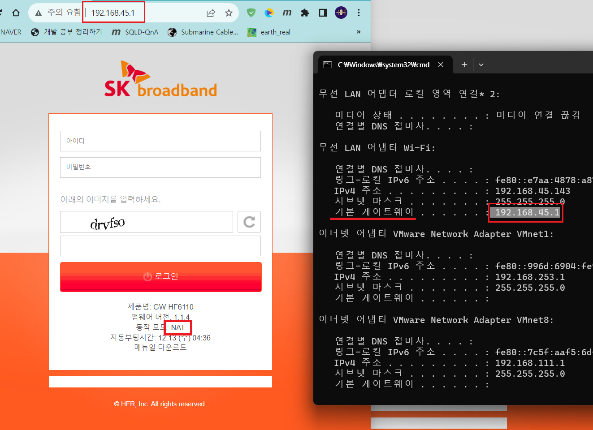
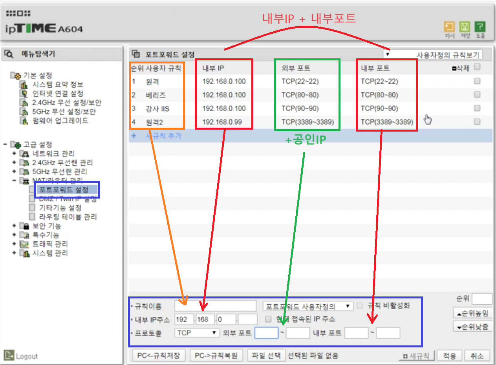

1. # NAT
   IP 패킷의 TCP/UDP 포트 숫자와 소스 및 목적지의 IP 주소 등을 재기록하면서 라우터를 통해 네트워크 트래픽을 주고 받는 기술을 말합니다. 패킷에 변화가 생기기 때문에 IP나 TCP/UDP의 체크섬(checksum)도 다시 계산되어 재기록해야 합니다. NAT를 이용하는 이유는 대개 사설 네트워크에 속한 여러 개의 호스트가 하나의 공인 IP주소를 사용하여 인터넷에 접속하기 위함입니다.   
   하지만 꼭 사설 IP를 공인 IP로 변환 하는 데에만 사용하는 기술은 아닙니다. "NAT는 사설IP와 공인IP를 바꾸는데 사용되는 기술" 이라고만 생각하시면 안 됩니다. NAT는 특정 IP주소에 특정 포트로 가능 경로를 다른 IP주소에 다른 포트로 가도록 설정하는 기술인데 이걸 주로 사설IP와 공인IP를 사용하는데 이용될 뿐입니다.  

1. # NAT 이용하기
   사설 IP대역에 있는 클라이언트에서 외부망으로 나갈 때 NAT Table에 해당 컴퓨터의 정보가 공인 IP정보와 함께 기록됩니다. 먼저 나간 클라이언트의 요청에 대한 응답으로 들어오는 서버 패킷은 이 NAT Table을 참고하여 신호를 보낸 사설 IP 대역 내에 있는 컴퓨터를 찾아갑니다. 만약 NAT Table에 클라이언트의 정보가 없으면 서버 측에서 보낸 응답 신호는 사설 IP 대역으로 들어갈 수가 없습니다.    

      
   사설 IP대역은 외부에서 알 수 없고, 외부에서는 공인 IP끼리만 통신을 하는 거와 같습니다.   

1. # 포트 포워딩(port forwarding: 포트로 향하는 것)
   포트 포워딩 또는 포트 매핑(port mapping)은 패킷이 라우터나 방화벽과 같은 네트워크 장비를 가로지르는 동안 특정 IP 주소와 포트 번호의 통신 요청을 특정 다른 IP와 포트 번호로 넘겨주는 네트워크 주소 변환(NAT)의 응용입니다.   
   이 기법은 게이트웨이(외부망)의 반대쪽에 위치한 사설 네트워크에 상주하는 호스트에 대한 서비스를 생성하기 위해 흔히 사용됩니다.  
   
1. # NAT로 포트 포워딩 사용하기
   NAT가 NAT Table을 두고 서로 다른 IP를 연결하는 기술이라면 포트 포워딩은 외부에서 특정 포트로 들어오는 모든 신호를 사설 대역의 특정 컴퓨터의 포트로 바로 연결시켜주는 기술입니다.
   보통 클라이언트가 먼저 요청을 보내게 되면 응답으로 서버쪽에서 보내는 패킷을 받는 "먼저 주고 이후에 응답을 받는" 과정으로 통신이 이루어지는데 포트 포워딩을 사용하면 먼저 나가는 신호가 없어도 바로 신호를 받아서 특정 컴퓨터로 데이터를 보낼 수 있습니다.   
      

   A사설 IP 대역에서 B사설 IP 대역에 있는 웹 서버로 접속을 하려고 합니다. 하지만 사설 IP 대역은 각각의 A, B에서는 보이지 않는 대역입니다. 인터넷 상엔 오직 공인 IP 대역만 보일 뿐입니다.   
   
   따라서 A사설 IP와 B사설 IP가 직접적으로 통신을 하는 것은 불가능 합니다. 대신 A사설 IP쪽에서 외부망에서 찾을 수 있는 공인 IP로 패킷을 보내는 것은 가능합니다.
   A사설 IP에서 직접 B사설 IP로 보내는 것이 아니라 공인 IP 2로 패킷을 전송하면 공인 IP 2의 라우터에 설정된 IP와 포트로 패킷이 전송되게 됩니다. IP와 포트 설정은 네트워크 장비(보통 라우터가 됩니다)에서 설정하게 되고 이러한 기술을 포트 포워딩이라고 합니다.   
   
1. # 포트포워딩 실습
      
   브라우저에서 게이트웨이 주소를 치면 NAT테이블로 접속 가능   

      
   공유기(DHCP기능+라우터기능)에 할당된 공인IP는 외부에서 접근할 수 있는 IP입니다.   
   공인IP(외부IP)+외부 포트 ↔ 사설IP(내부IP)+내부 포트   
   예)   
   34.56.101.2:22(외부IP + 22번포트) ↔ 192.168.0.100:22(사설IP + 22번포트)   
   외부 네트워크에서 34.56.101.2:22 라고 주소창에 치면 34.56.101.2의 주소를 가진 공유기까지 와서 포트포워딩 설정에 의해 사설IP 192.168.0.100 컴퓨터의 22번 포트로 접속하게 됩니다.   

