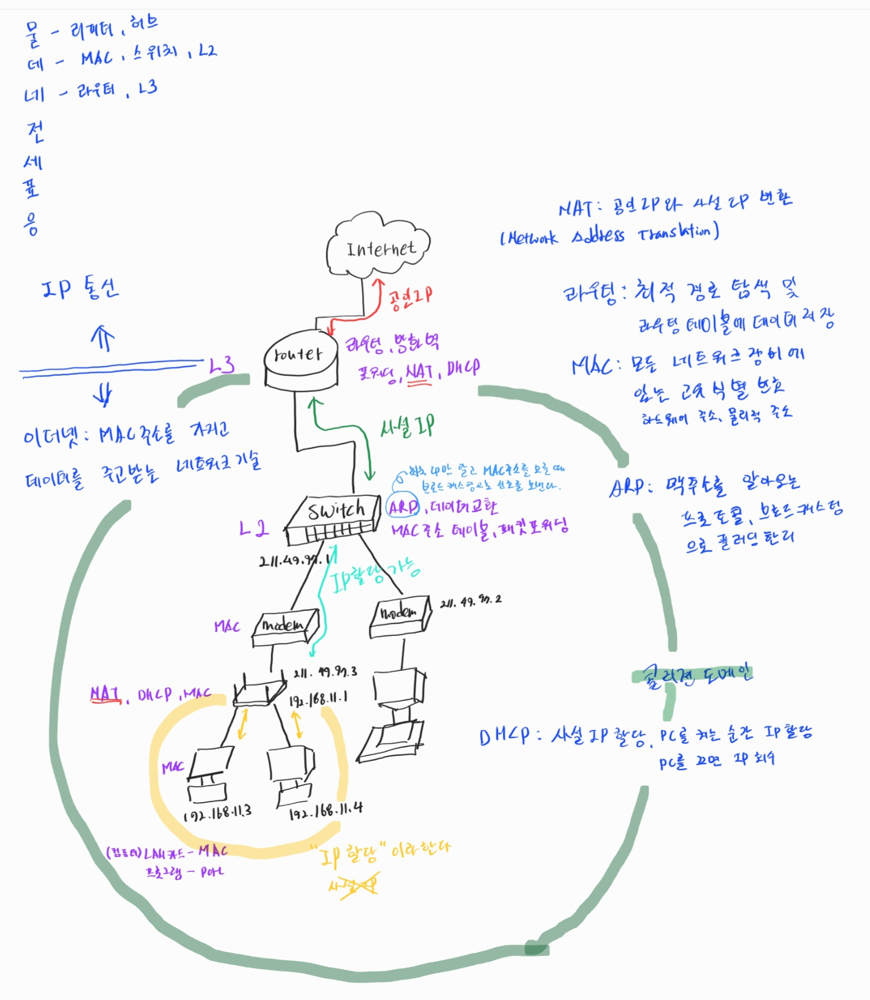

1. # 네트워크란?
   노드들이 데이터를 공유할 수 있게 하는 디지털 전기통신망의 하나입니다. 즉, 분산되어 있는 컴퓨터를 통신망으로 연결한 것을 말합니다. 네트워크에서 여러 장치들은 노드 간 연결을 사용하여 서로에게 데이터를 교환합니다.   

   *노드 : 네트워크에 속한 컴퓨터 또는 통신 장비   

   - 인터넷이란?   
   문서, 그림, 영상과 같은 여러가지 데이터를 공유하도록 구성된 세상에서 가장 큰 전세계를 연결하는 네트워크입니다. 흔히 www를 인터넷으로 착하는 경우가 많은데 www는 인터넷을 통해 웹과 관련된 데이터를 공유하는 것을 말합니다.   

1. # 네트워크의 분류
   - LAN(Local Area Network, 근거리 통신망)   
   근접한 거리에서 이루어지는 통신방식 : 집, 회사,..   
   방식 : Ethernet, Token Ring, FDDI   

   - MAN(Metropolitan Area Network)   
   LAN보다는 큰 규모지만 WAN보다는 지리적으로 작은 규모 : 도시, 지역 사회,...   
   종류 : DQDB   

   - WAN(Wide Area Netrowk, 원거리 통신망)   
   광범위한 거리를 연결하는 네트워크 : 국가 간, 대륙 간,...   
   방식 : HDLC, PPP / X.25, Frame-relay, ATM   

   - LAN토폴로지   
   성형(Star형) : 중앙 장비에 모든 노드가 연결   
   망형(Mesh형) : 모든 노드가 서로 일대일로 연결   
   버스형(Bus형) : 하나의 통신회선에 여러 컴퓨터를 연결해서 전송   
   트리형(Tree형) : 버스형과 성형 토폴로지의 확장 형태   
   링형(Ring형) : 각 노드가 좌우의 인접한 노드와 연결되어 원형을 이룬 상태      

   * 토폴로지 : 호스트 및 장비들의 물리적인 배치 형태   

1. # 네트워크의 통신 방식 

   - 유니 캐스트   
   특정 대상과만 1:1 통신하는 방식   

   - 브로드 캐스트   
   같은 네트워크 상에 있는 모든 대상과 통신   

   - 멀티 캐스트   
   특정 다수와 1:N으로 통신하는 방식   

1. # 네트워크 프로토콜
   가까운 곳과 연락할 때 : Ethernet프로토콜(MAC주소)   
   멀리 있는 곳과 연락할 때 : ICMP, IPv4, ARP(IP주소)   
   여러가지 프로그램으로 연락할 때 : TCP, UDP(포트번호)   

1. # 전체 네트워크 정리
    

