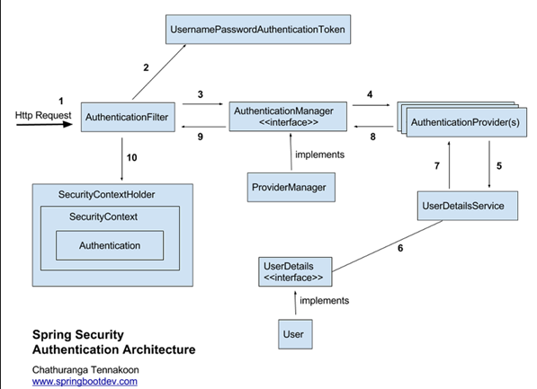
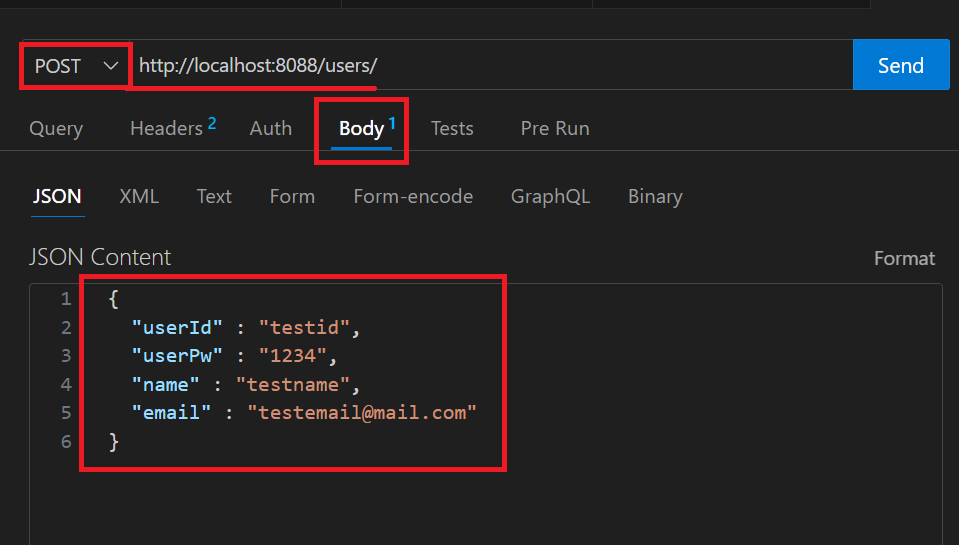
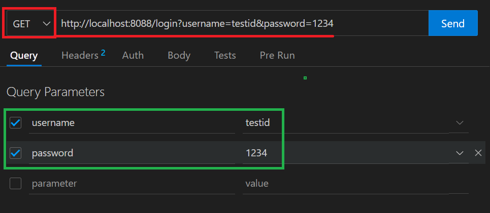
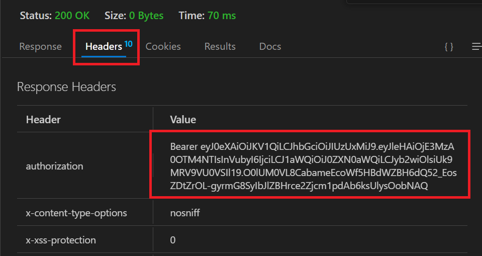
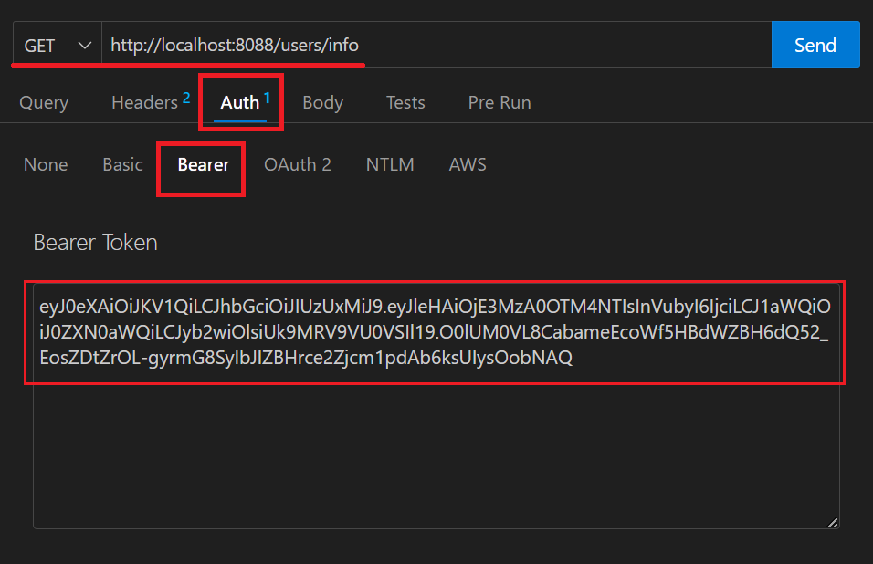
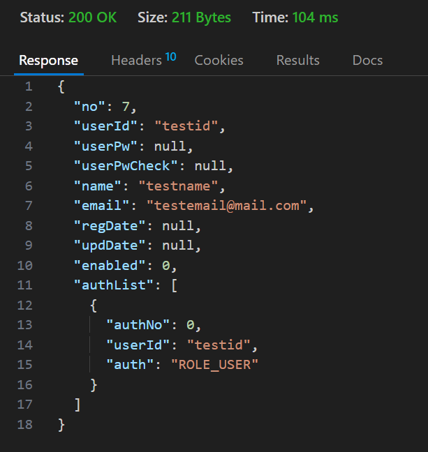
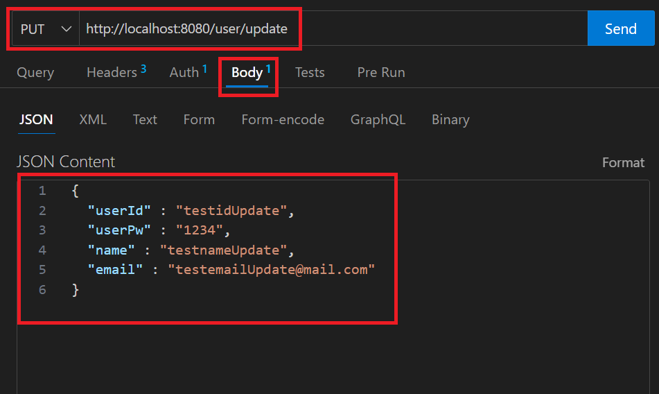
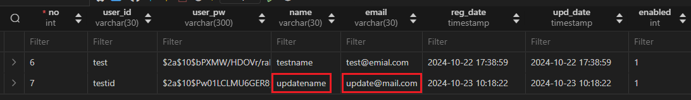

---
layout: single
title: Spring Security 정리
categories: PROJECT
tag: []
author_profile: false
---   

1. # Spring Security

   스프링 스큐리티는 다양한 인증방식과 권한 기반 접근 제어, 역할 기반 접근 제어를 가능하게 하고 CSRF(Cross Site Request Forgery)방지, 클릭재킹 방징, XSS(Cross Site Scripting)공격을 방어하며 다양한 인터페이스와 이벤트를 제공하여 커스터마이징 할 수 있는 강력하고 유연한 프레임워크입니다.   

   ● 인증(Authentication) - 로그인, 회원가입을 해서 id와 pw로 본인임을 나타내고 로그인을 허락받는 것   
   ● 인가(Ahthorization) - 허가, 로그인 후 접근할 수 있는 권한, 게시판을 삭제한다든지 회원을 강제 탈퇴시킬 수 있는 등의 권한을 부여받는고 받지 않는 것   
   ● Principal : 스프링 시큐리티에서 인증된 사용자(주체)를 나타내는 개념입니다. 즉, 시스템에 접근하여 권한을 행사하는 실체를 의미합니다. 더 간단히 말해, 로그인한 사용자라고 생각하면 됩니다.   
   로그인시 사용되는 JwtAuthenticationFilter에서 사용자 정보를 가져오기 위해 사용됩니다.   

1. # Filter Chain
   스프링 시큐리티 진행 과정   
   httpRequest -> filter -> Dispatcher Sevlet -> interceptor -> Controller   

   순으로 이루어지게됩니다. filter가 Spring Security의 주요 기능이 됩니다. 필터는 스프링 MVC와 따로 분리된 환경에서 실행되며 다양한 filterChain을 거친 후 인증과 인가를 받은 후 MVC의 Dispatcher Sevlet에 접근 할 수 있습니다.   

   스프링 시큐리티는 filter로 이루어진 보안 프레임워크라고 볼 수 있을만큼 많은 필터가 존재하며 이들이 사슬처럼 연결되어 연쇄적으로 실행되기 때문에 이를 Filter Chain이라고 합니다.   

      

   따로 설정하지 않아도 실행되는 기본 필터체인들은 다음과 같습니다.   
   ```
      1. ChannelProcessingFilter: 요청의 보안 채널을 확인합니다. (예: HTTP와 HTTPS 간의 전환)
      2. SecurityContextPersistenceFilter: SecurityContext를 저장하거나 로드합니다.
      3. HeaderWriterFilter: HTTP 응답 헤더에 보안 관련 정보를 추가합니다.
      4. CsrfFilter: CSRF 공격을 방지하기 위한 필터입니다.
      5. LogoutFilter: 로그아웃 요청을 처리합니다.
      6. UsernamePasswordAuthenticationFilter: 기본적인 사용자 이름/비밀번호 인증을 처리합니다.
      7. BasicAuthenticationFilter: 기본 인증 헤더를 확인하고 인증을 수행합니다.
      8. RequestCacheAwareFilter: 요청 캐시를 처리하여 이전 요청으로 리다이렉션할 수 있도록 합니다.
      9. SecurityContextHolderAwareRequestFilter: SecurityContext에 따라 요청을 감쌉니다.
      10.AnonymousAuthenticationFilter: 익명 사용자를 인증합니다.
      11.SessionManagementFilter: 세션 관리를 처리합니다.
      12.ExceptionTranslationFilter: 발생한 예외를 처리하고, 필요한 경우 로그인 페이지로 리다이렉션합니다.
      13.FilterSecurityInterceptor: 요청에 대한 권한 검사를 수행합니다.
   ```

1. # 주요 모듈

      

   __Authentication__ 🎈   
   사용자가 시스템에 접근하려 할 때, 해당 사용자의 신원을 확인하고 인증하는 과정을 의미합니다. 즉, "당신이 누구인가?" 라는 질문에 대한 답을 찾는 과정이라고 할 수 있습니다.   
   스프링 시큐리티의 Authentication은 사용자의 신원을 확인하는 과정을 의미합니다. 
   ```java
      //UsernamePasswordAuthenticationFilter를 상속받아서 사용합니다.   
      public class JwtAuthenticationFilter extends UsernamePasswordAuthenticationFilter{}

      //구현 메소드 attemptAuthentication : 인증 시도 시 실행되는 메소드
      @Override
      public Authentication attemptAuthentication(HttpServletRequest request, HttpServletResponse response)
         throws AuthenticationException {}

      //구현 메소드 successfulAuthentication : 인증이 성공 됐을 때 실행될 메소드
      @Override
      protected void successfulAuthentication(HttpServletRequest request, HttpServletResponse response, FilterChain chain,
         Authentication authentication) throws IOException, ServletException {
         ...
         String jwt = jwtTokenProvider.createToken(userNo, userId, roles);
         ...
         }
   ```
   successfulAuthentication에서 인증이 성공되면 jwt토큰을 생성하게 됩니다.

   • UsernamePasswordAuthenticationFilter : 폼 기반 인증을 처리하는 필터입니다. 즉, 사용자가 로그인 페이지에서 입력한 사용자 이름과 비밀번호를 받아 인증 처리를 수행하는 역할을 합니다.   

   다른 예제)   
   ```java   
      Authentication authentication = authenticationManager.authenticate(token);

      log.info("인증 여부 : " + authentication.isAuthenticated());
   ```   
   위에 코드는 스프링 시큐리티에서 인증 처리를 수행하는 핵심적인 부분입니다.   
   사용자 정보가 담긴 token을 받아서 authenticationManager 객체의 authenticate 메소드를 실행해 인증 로직을 실행 후 인증을 성공하면 인증된 사용자 정보를 담은 Authentication 객체를 반환하고, 실패하면 예외를 발생시킵니다.   

   __SecurityContext__🎈   
   인증된 사용자 정보, 권한 정보 등을 담고 있는 객체입니다.   
   • 생성 : 인증이 성공하면 SecurityContextHolder에 SecurityContext 객체를 저장합니다.   
   • 가져오기 : SecurityContextHolder.getContext()를 호출하여 현재 스레드의 SecurityContext를 가져옵니다.   
   • 추출: SecurityContext에서 getAuthentication() 메서드를 호출하여 Authentication 객체를 가져오고, getPrincipal() 메서드를 호출하여 인증된 사용자 정보를 추출할 수 있습니다.   

   -JwtRequestFilter-
   ```java   
      if( jwtTokenProvider.validateToken(jwt) ) {
         SecurityContextHolder.getContext().setAuthentication(authentication);
      }
   ```
   JwtRequestFilter에서 토큰 검증이 끝난 후 사용자 정보를 가져오기 위해 사용

   __SecurityContextHolder__🎈    
   현재 실행 중인 스레드의 보안 컨텍스트를 저장하는 객체입니다. 인증된 사용자 정보, 권한 정보 등을 담고 있어 애플리케이션의 다양한 부분에서 사용자 정보를 참조할 수 있도록 합니다.
   
   __UsernamePasswordAuthenticationToken__ 🎈   
   사용자 이름과 비밀번호를 포함하는 Authentication의 구체적인 구현입니다. 주로 폼 기반 로그인에서 사용됩니다.
   
   __AuthenticationManager__🎈   
   실제로 사용자를 인증하는 인터페이스입니다. 주어진 Authentication 객체를 기반으로 사용자를 인증하고 Authentication 객체를 반환합니다.
   
   __ProviderManager__🎈   
   AuthenticationManager 구현 중 하나로, 여러 개의 AuthenticationProvider를 관리하고 이를 사용하여 사용자를 인증합니다.
   
   __AuthenticationProvider__🎈   
   실제로 인증을 수행하는 객체입니다. 사용자가 제출한 자격 증명을 검증하고 Authentication 객체를 반환합니다. Spring Security는 다양한 인증 프로바이더를 지원하며, 대표적으로 DaoAuthenticationProvider, LdapAuthenticationProvider, OpenIDAuthenticationProvider 등이 있습니다.
   
   __UserDetailsService__🎈   
   UserDetailsService는 사용자 정보를 로드하는 인터페이스입니다. 사용자의 식별자(일반적으로 사용자 이름)를 기반으로 사용자 정보를 가져옵니다.
   
   __UserDetails__🎈   
   UserDetails는 사용자의 정보를 담는 인터페이스로, 사용자 이름, 비밀번호, 권한 등의 정보를 포함합니다. 사용자 정보를 UserDetailsService로부터 로드할 때 사용됩니다.
   
   __User__🎈   
   User는 Spring Security에서 기본적으로 제공하는 UserDetails의 구현 클래스 중 하나입니다. 사용자의 기본 정보를 저장하며, 사용자 이름, 비밀번호, 권한을 포함합니다.
   
   __SecurityContextHolder__🎈   
   현재 사용자의 SecurityContext를 관리하는 유틸리티 클래스입니다. 현재 사용자의 Authentication 객체를 저장하고 관리합니다.
   
   __SecurityContext__🎈   
   현재 사용자의 보안 정보를 저장하는 컨테이너입니다. SecurityContextHolder를 사용하여 현재 사용자의 SecurityContext를 설정하고 얻을 수 있습니다.
   
   __Authentication__🎈   
   Spring Security에서 사용자의 인증 정보와 권한 정보를 포함하는 클래스입니다. Authentication 객체를 통해 현재 사용자의 인증 상태 및 권한을 확인할 수 있습니다.


1. # 스프링 시큐리티 요청 흐름   
   1.사용자가 웹 애플리케이션에 로그인을 시도합니다.   

   2.로그인 폼에서 사용자가 사용자 이름과 비밀번호를 제출하면, 이 정보는 Spring Security AuthenticationFilter로 전달됩니다.   

   3.AuthenticationFilter는 UsernamePasswordAuthenticationToken을 생성하고, 사용자 이름과 비밀번호를 이 토큰에 포함시킵니다.   

   4.이 토큰은 AuthenticationManager로 전달됩니다. AuthenticationManager는 ProviderManager를 포함하며, 다양한 AuthenticationProvider를 관리합니다.   

   5.ProviderManager는 등록된 AuthenticationProvider들을 순회하면서 토큰을 검증하는 시도를 합니다. 각 AuthenticationProvider는 다양한 방식으로 사용자를 인증할 수 있습니다. 일반적으로 사용자 이름/비밀번호를 검증하는 DaoAuthenticationProvider를 사용합니다.   

   6.DaoAuthenticationProvider는 사용자 이름을 기반으로 데이터베이스 또는 다른 저장소에서 사용자 정보를 가져오고, 비밀번호 검증을 수행합니다. 만약 사용자가 유효하면 Authentication 객체를 생성하고 반환합니다.   

   7.AuthenticationManager는 검증된 Authentication 객체를 다시 AuthenticationFilter로 반환합니다.   

   8.AuthenticationFilter는 사용자의 Authentication 객체를 SecurityContextHolder에 저장합니다. 이렇게 하면 현재 사용자의 보안 컨텍스트가 설정됩니다.   

   9.사용자가 인증된 후, Spring Security는 요청을 계속 진행시킵니다. 사용자는 해당 리소스에 대한 권한이 있는지 확인하기 위해 권한 부여(Authorization) 단계로 이동하게 됩니다.   

   10.요청된 리소스에 액세스할 때, Spring Security는 @PreAuthorize, @PostAuthorize, @Secured 등과 같은 애노테이션을 사용하여 메서드 레벨에서 권한을 확인하고, 사용자에게 액세스 권한이 있는지 확인합니다.   

   11.요청된 작업이 사용자에게 허용된 경우, 리소스에 대한 요청은 성공하고 응답이 클라이언트에게 반환됩니다.   

   12.만약 권한이 없는 경우, 액세스가 거부되며, 클라이언트는 적절한 오류 메시지나 리디렉션을 받게 됩니다.   

1. # url 소스 위치
   회원 가입, 회원정보 조회, 회원정보 수정, 회원 탈퇴는 UserController.java에서 설정   
   로그인 경우에만 JWT토큰 인증을해야 하기 때문에 JwtAuthenticationFilter.java에서 설정   
   ```java
      JwtAuthenticationFilter의 생성자의
      setFilterProcessesUrl(JwtConstants.AUTH_LOGIN_URL); 에서 설정
   ```

   JwtAuthenticationFilter에서 인증 실패 시 401 메세지 리턴, 인증 성공 시 200 메세지 리턴   


1. # 실제 프로그램 

1. # 회원가입시

   ```
      http://localhost:8088/users/join
   ```
   
   Body에 JSON 입력   
   ```
      {
         "userId" : "testid",
         "userPw" : "1234",
         "name" : "testname",
         "email" : "testemail@mail.com"
      }
   ```   

   __POST__ 방식으로 진행해야 합니다.   
      

   SecurityConfig.java의 PasswordEncoder 메소드   
   SecurityConfig.java의 authenticationManager 메소드   
   JwtRequestFilter.java의 생성자   
   JwtAuthenticationFilter.java의 생성자   
   DispatcherServlet    
   JwtRequestFilter.java의 doFilterInternal 메소드   
   UserController.java - join 주소 /
   UserServiceImpl.java의 insert 메소드   
   HikariDataSource       : HikariPool-1 - Starting...   
   HikariPool-1 - Added connection com.mysql.cj.jdbc.ConnectionImpl@17b0e21b   
   UserController     : 회원 가입 성공! - SUCCESS   
   
   회원가입을 하고나면 DB에 user_id, user_pw, name, email, reg_date, upd_date, enabled = 1 다음과 같은 데이터가 입력되고, user_pw같은 경우는 암호화 된 상태로 DB에 저장됨   

   DB 회원가입 결과 :   
   ```
      no	7
      user_id	testid
      user_pw	$2a$10$czxhHCRwDNY4Y42jaX5TZuc7VrdxKdtcjL4yuG1/eBaG6or89Q916
      name	testname
      email	testemail@mail.com
      reg_date	2024-10-22 22:04:53
      upd_date	2024-10-22 22:04:53
      enabled	1   
   ```

1. # 로그인

   ```
      http://localhost:8088/login?username=testid&password=1234
   ```   

   __GET__ 방식으로 진행해야 합니다.   
      

   로그인이 성공하면 Header탭에 토큰이 생성된다. 서버측에서 클라이언트에게 보내기 위해 만들어진 Header입니다.   

      

   로그인 성공 시 👍   
   클라이언트가 로그인 요청을 서버로 보냅니다.   
   서버는 클라이언트의 인증 정보를 검증하고, 인증이 성공하면 JWT 토큰을 생성합니다.   
   생성된 JWT 토큰은 일반적으로 HTTP 응답 헤더의 Authorization 필드에 담겨 클라이언트로 전송됩니다.   
   클라이언트의 역할👌   
   클라이언트는 서버로부터 받은 JWT 토큰을 Authorization 헤더에 포함시켜 후속 요청에 함께 보냅니다.   
   서버는 클라이언트가 보낸 요청 헤더에서 JWT 토큰을 추출하여 유효성을 검증하고, 인증된 사용자인지 확인합니다.   

   *헤더는 메모리에 임시적으로 저장되었다 

1. # 회원 정보 조회
   Bearer을 제외하고 토큰을 복사합니다.   

   ```
      http://localhost:8088/users/info
   ```

   __GET__ 방식으로 진행해야 합니다.   

      

   조회를 하면 다음과 같이 회원 정보를 가져옵니다.   


      

1. # 회원 정보 수정

   ```
      http://localhost:8088/users/update
   ```
   
   __PUT__ 방식으로 요청을 해야하고, Auth의 Bearer에 토큰을 입력합니다.   

      

   userId와 userPw는 일치해야 하기 때문에 그대로 합니다.   

   ```
     {
      "userId" : "testid",
      "userPw" : "1234",
      "name" : "updatename",
      "email" : "update@mail.com"
      }
   ```

   Body의 JSON에 수정할 내용을 입력합니다.   
      

   name과 email이 변경 되었습니다.   
      


1. # 실제 프로그램 실행 순서

   ```java
      //Starting
      2024-10-23T11:44:20.161+09:00  INFO 22160 --- [server] [  restartedMain] com.hjcompany.server.ServerApplication   : Starting ServerApplication using Java 17.0.9 with ...
      2024-10-23T11:44:21.501+09:00  INFO 22160 --- [server] [  restartedMain] o.s.b.w.embedded.tomcat.TomcatWebServer  : Tomcat initialized with port 8088 (http)
      2024-10-23T11:44:21.573+09:00  INFO 22160 --- [server] [  restartedMain] w.s.c.ServletWebServerApplicationContext : Root WebApplicationContext: initialization completed in 1354 ms

      //SecurityConfig
      2024-10-23T11:44:21.873+09:00  INFO 22160 --- [server] [  restartedMain] c.h.server.config.SecurityConfig         : SecurityConfig.java의 PasswordEncoder 메소드
      2024-10-23T11:44:21.890+09:00  INFO 22160 --- [server] [  restartedMain] c.h.server.config.SecurityConfig         : SecurityConfig.java의 authenticationManager 메소드
      2024-10-23T11:44:22.217+09:00  INFO 22160 --- [server] [  restartedMain] c.h.server.config.SecurityConfig         : SecurityConfig.java securityFilerChain 메소드
      
      ///Filter
      2024-10-23T11:44:22.227+09:00  INFO 22160 --- [server] [  restartedMain] c.h.s.s.j.f.JwtAuthenticationFilter      : JwtAuthenticationFilter.java의 생성자
      2024-10-23T11:44:22.229+09:00  INFO 22160 --- [server] [  restartedMain] c.h.s.s.jwt.filter.JwtRequestFilter      : JwtRequestFilter.java의 생성자

      //DispatcherServlet
      2024-10-23T11:44:22.534+09:00  INFO 22160 --- [server] [  restartedMain] com.hjcompany.server.ServerApplication   : Started ServerApplication in 2.747 seconds (process running for 3.352)
      2024-10-23T11:44:33.676+09:00  INFO 22160 --- [server] [nio-8088-exec-1] o.a.c.c.C.[Tomcat].[localhost].[/]       : Initializing Spring DispatcherServlet 'dispatcherServlet'
      2024-10-23T11:44:33.677+09:00  INFO 22160 --- [server] [nio-8088-exec-1] o.s.web.servlet.DispatcherServlet        : Initializing Servlet 'dispatcherServlet'
      2024-10-23T11:44:33.678+09:00  INFO 22160 --- [server] [nio-8088-exec-1] o.s.web.servlet.DispatcherServlet        : Completed initialization in 1 ms`
   ```

   1.__SecurityConfig클래스__ - 시큐리티 설정하는 부분과 AuthenticationManager 빈 등록   

   2.   
      1)login 요청 시 : __JwtAuthenticationFilter클래스__ - 아이디외 패스워드 일치 확인   
      
         인증 시도 시 실행 : __attemptAuthentication메소드__    
         __CustomUserDetailService클래스__ 에서 사용자 정보를 읽어 들임   

         1-1)인증 성공 시 __successfulAuthentication메소드__ 실행 - 토큰 생성 : __JwtTokenProvider클래스__ 호출   

         1-2)인증 실패 - 알림창으로 알림   

      2)그외 경로 : __JwtRequestFilter클래스__ - 클라이언트에 의해 애플리케이션의 모든 HTTP 요청이 들어올 때마다 자동으로 실행됩니다.   
      
         __doFilterInternal메소드__ : http헤더에서 토큰 추출 검증   
         2-1)토큰이 없거나 유효하지 않다 - 다음 필터로 이동   
         2-2)토큰이 유효하다 - Authentication에 사용자 인증 정보 등록이후 다음 필터로 이동   

   3.DispatcherServlet 실행   
   
   4.UserController - 컨트롤러   

   5.UserServiceImpl - login, select, update   

   6.mapper로 DB에 데이터 CRUD   

1. # http://localhost:8088/users/info에 토큰 입력 후 실행 과정   
   
   __-JwtRequestFilter.java 에서 실행-__   
   1)filter.JwtRequestFilter의 doFilterInternal 메소드 호출   

   2)Http헤더에서 토큰을 가져옴   

   3)Http에서 가져온 토큰을 jwtTokenProvider의 getAuthentication 메소드를 호출하여 파싱 후 사용자 정보를
   UsernamePasswordAuthenticationToken 형태로 반환하면 Authentication이 이를 받게됨   
         
      `Authentication authentication = jwtTokenProvider.getAuthentication(jwt)`   

   3)Authentication객체 생성 후 jwtTokenProvider에서 UsernamePasswordAuthenticationToken 형태로 보낸 사용자 정보를 SecurityContextHolder의 Authentication에 저장   

      `SecurityContextHolder.getContext().setAuthentication(authentication)`   

      3-1)__-jwtTokenProvider.java에서 실행되는 내용-__   
         헤더에서 토큰을 추출 후 파싱   
         -jwtTokenProvider.java-   
         `Jws<Claims> parsedToken = Jwts.parser()...`   

         파싱된 토큰 정보에서 사용자 정보를 축출 후 UserDetails에 담기   
         -jwtTokenProvider.java-   
         `UserDetails userDetails = new CustomUser(user)`   

         userDetails를 UsernamePasswordAuthenticationToken형태로 돌려주면 위에서 말한 Authentication객체가 받음   
   
   4)사용자 정보를 받고 이번에는 토큰 유효기간 체크   

   5)다음 필터로 이동,   
   
   프레임워크의 자체 필터를 모두 통과 된다면   

   6)UserController.java 실행   
   
   `public ResponseEntity<?> userInfo(@AuthenticationPrincipal CustomUser customUser){ ... }`   
   프레임워크로부터 CustomUser 정보를 받음   

   7)프레임워크로부터 받음 사용자 정보를 ResponseEntity형태로 리턴   
   
   =>DB로 가지않고 토큰에서 바로 정보를 추출해서 리턴하는 루틴이였습니다.🔮   
   


