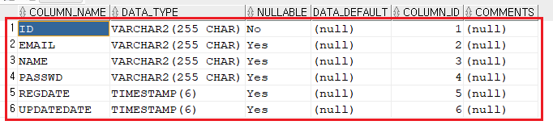

---
layout: single
title: Security 실행 순서
categories: PROJECT
tag: []
author_profile: false
---   

1. # 실행 순서

   Initializing Servlet 'dispatcherServlet'   
   JwtRequestFilter.java의 doFilterInternal 메소드   
   JwtAuthenticationFilter.java의 attemptAuthentication 메소드   
   CustomUserDetailService.java의 loadUserByUsername 메소드   
 
   1. 클라이언트 요청: 클라이언트가 인증된 상태로 시스템의 자원에 접근하려고 요청을 보냅니다.   
   1. Initializing Servlet 'dispatcherServlet'   
   1. JwtRequestFilter   
   1. JwtAuthenticationFilter 실행: 요청이 들어오면 스프링 시큐리티 필터 체인에서 JwtAuthenticationFilter가 가장 먼저 실행됩니다.   
   1. JWT 토큰 검증: JwtAuthenticationFilter는 요청 헤더에서 JWT 토큰을 추출하고 유효성을 검증합니다.
   1. 토큰 유효성 확인   

      유효한 경우:   
      1. Authentication 객체를 생성하여 SecurityContext에 설정하고, 후속 요청에 대한 권한 검사를 진행합니다.   
      
      유효하지 않은 경우:   
      1. UserDetailsService를 호출하여 사용자 정보를 다시 조회하고, 새로운 토큰을 발급하는 등의 처리를 수행합니다.   
      1. UserDetailsService 실행 (필요한 경우): JwtAuthenticationFilter에서 토큰 검증에 실패하거나, 새로운 토큰을 발급해야 할 경우 UserDetailsService가 호출되어 사용자 정보를 조회하고 UserDetails 객체를 생성합니다.   

1. # 인증 관련 절차
   
   __회원가입__ : 인증과정 X   
   아직 인증된 사용자가 아니기 때문에, JWT를 이용한 인증 과정을 거치지 않습니다. 일반적으로 회원가입 요청은 인증이 필요하지 않은 요청이므로, 인증 관련 필터(예: UsernamePasswordAuthenticationFilter, JwtAuthenticationFilter)는 건너뛰게 됩니다.   

   __로그인__ : 인증과정 O   
   아이디와 패스워드 사용   


   인증을 성공하면 -> 토큰 생성


   토큰 검증


   ========================================

   엔티티 클래스란 무엇일까요?
   엔티티 클래스는 객체 지향 프로그래밍에서 데이터베이스의 테이블과 일대일로 매핑되는 클래스를 의미합니다. 즉, **실제 데이터베이스의 행(row)**을 객체로 표현한 것이라고 생각하면 됩니다.

   Entity 클래스의 어노테이션   
   @NoArgsConstructor : 파라미터가 없는 기본 생성자를 만들어준다.   
   @AllArgsConstructor : 모든 필드를 파라미터로 가진 생성자만 만들어준다.   
   @Setter : setter 메소드 생성   
   @Getter : getter 메소드 생성   
   @Data : getter, setter 메소드 생성   
   @Entity : 해당 클래스를 Entity 클래스로 설정   
   @Table(name=“members”) : members 테이블 생성   
   @Id : 기본키 설정   
   @GeneratedValue(strategy = GenerationType.AUTO) : JPA구현체(Hibernate)가 자동으로 생성 방식을 결정
   hibernate_sequence가 자동으로 생성된다.   
   @Column(length = 500, nullable = false) : 크기 500Byte, not null제약조건   


   ```java
      @Data
      @Entity
      @Table(name = "membersjpa")					// members 테이블 생성	
      public class Member {

         @Id										// 기본키 설정
         private String id;
         private String passwd;
         private String name;
         private String email;
         
         @CreationTimestamp						// 회원가입 시간
         private Timestamp regdate;
         
         @UpdateTimestamp						// 회원수정 시간
         private Timestamp updatedate;
      }
   ```

   

   repository  - interface

   ▪ Repository : 최상위 Repository로서 아무런 기능이 없기 때문에 잘 사용하지 않는다.

   ▪ CrudRepository : 기본적인 CRUD 기능을 제공해주는 Repository이다.   

   ▪ PagingAndSortingRepository : CrudRepository 인터페이스 기능에 페이징 및
   정렬 기능이 추가된 인터페이스 이다.   

   ▪ JpaRepository : PagingAndSortingRepository 인터페이스 기능뿐만 아니라 JPA에
   특화된 기능까지 추가된 인터페이스 이다.   

   어떤 인터페이스를 상속받는지에 따라 기능이 결정된다.   

   ```java
      //인터페이스 끼리의 상속은 extends 사용
      @Repository
      public interface MemberRepository extends JpaRepository<Member, String>{
      public Member save(Member member);               // 회원가입, 정보수정
      public Optional<Member> findById(String id);     // 로그인, 수정폼
      public void delete(Member member);     			 // 회원탈퇴
      }
   ```
   상속 받은 메소드 save, findById, delete를 이용해서 CRUD를 수행

   따로 쿼리문이 필요없고 메소드를 호출하므로써 CRUD 가능   

   save : insert기능 수행   
   findById : 한명에 대한 정보를 검색해서 리턴   

   *Optional 패턴: Optional은 Java 8에서 도입된 기능으로, 값이 있을 수도 있고 없을 수도 있는 경우를 나타내는 클래스입니다. Optional을 사용하면 null 체크 로직을 명확하게 표현하고, 다양한 유용한 메소드를 활용하여 코드를 더욱 기능적으로 만들 수 있습니다.
