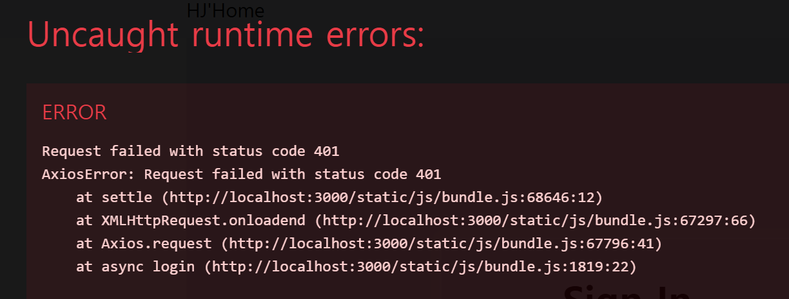
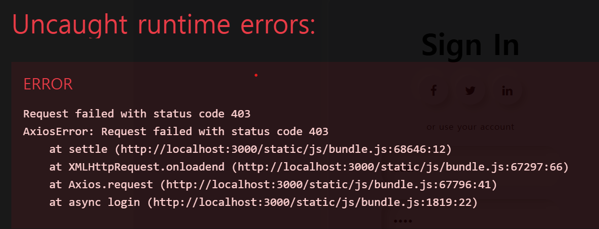
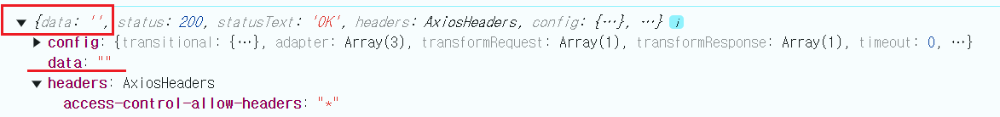
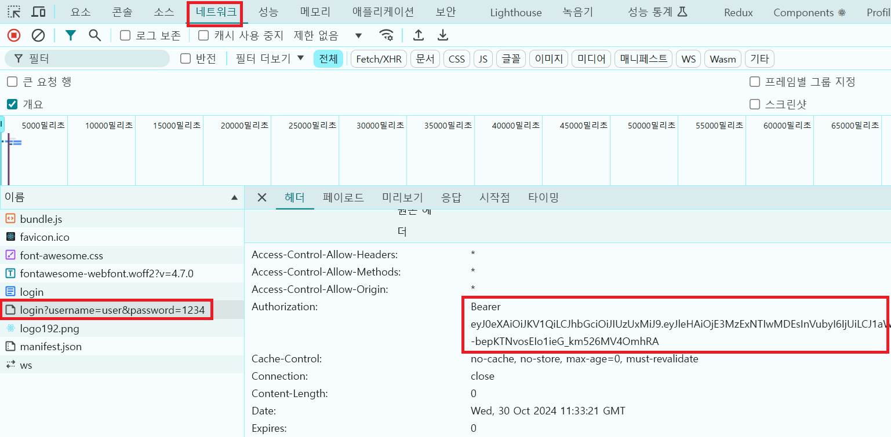
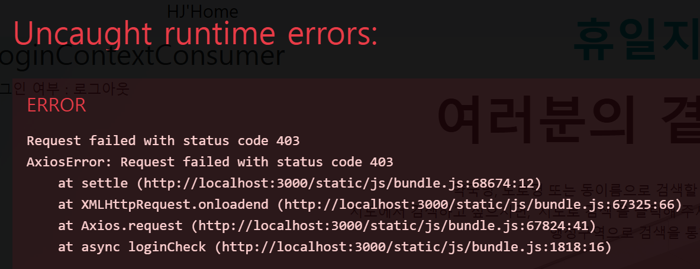

---
layout: single
title: 이슈 정리
categories: PROJECT
tag: []
author_profile: false
---   

1. # 에러 번호
   401 Unauthorized - 인증 실패   
   403 Forbidden - 접근 거부(권한 없음)   
   404 Not Found   

1. # 부트스트랩의 href를 link로 변경

1. # 자바스크립트 사용하기

   ```
      Cannot read properties of null (reading 'addEventListener')
      TypeError: Cannot read properties of null (reading 'addEventListener')
         at __webpack_modules__../src/LoginForm.js.window.onload (http://localhost:3000/static/js/bundle.js:214:13)
   ```

   css의 class를 className으로 변경   
   css앞에 전부 loginformjs 붙이기    
   const container = document.querySelector(".loginformjs .container");
   "container" 값이 헤더의 container값을 가져왔다   

   

   window.onload 사용
   ```
      window.onload = function(){

      const signUpBtn = document.getElementById("signUp");
      const signInBtn = document.getElementById("signIn");
      const container = document.querySelector(".container");

         signUpBtn.addEventListener("click", () => {
            alert("df");
         container.classList.add("right-panel-active");
         
         });
         
         signInBtn.addEventListener("click", () => {
         alert("geg");
         container.classList.remove("right-panel-active");
         });
      } 
   ```

   script async로 삽입
   ```
      <div id="root"></div>
    <!-- js파일 삽입-->
    <!-- <script async src="assets/js/LoginForm.js"></script> -->

   ```

   이벤트는 3가지의 중심 요소가 존재한다.  어떤 이벤트를 발생시킬 것인지의 이벤트event, 이벤트가 발생하면 실행되게 할 함수 event handler, 그리고 이벤트와 함수를 연결하는 addEventListener가 있다 addEventListener(event, handler, useCapture); addEventListener는 이벤트와 핸들러를 연결짓는 함수이다
   *useCapture: (선택 사항) 이벤트 버블링과 캡처링 중 어떤 방식으로 이벤트를 처리할지 결정하는 boolean 값

   1. # 클라이언트의 username과 password가 null이 뜬다

      1)처음 연결 오류 poroxy 설정   
         
      클라이언트와 서버의 포트 번호 설정이 이루어지지 않았다 proxy에 대해서 조사해서 쓰기   

      package.json   
      ```json
            "development": [
            "last 1 chrome version",
            "last 1 firefox version",
            "last 1 safari version"
         ]
      },
      "proxy": "http://localhost:8088" //추가
      }
       ```   

      2)오류   
      클라이언트 오류 표시   
           

      ```
         2024-10-30T19:29:50.222+09:00  INFO 26064 --- [server] [nio-8088-exec-4] c.h.s.s.j.f.JwtAuthenticationFilter      : JwtAuthenticationFilter username : null
         2024-10-30T19:29:50.223+09:00  INFO 26064 --- [server] [nio-8088-exec-4] c.h.s.s.j.f.JwtAuthenticationFilter      : JwtAuthenticationFilter password : null
      ```
      클라이언트와 서버를 하나의 vscode에서 같이 실행 시키니깐 값은 받아온다   

      3)
      클라이언트 오류 표시   
      ```
         headers.replace is not a function
         TypeError: headers.replace is not a function
            at login (http://localhost:3000/static/js/bundle.js:1827:33)
      ```   
          

         

      ```java
         const data = response.data;   
         const status = response.status;  
         const headers = response.headers; 
         
         const authorization = headers.authorization;  //headers의 authorization
         const accessToken = authorization.replace("Bearer ", ""); //authorization에서 replace, Bearer 다음 한칸 뛰오고 
      ```   

1. # axios오류

       

   async로 요청을 보냈는데 받는 과정에서 error 발생   
   server는 정상 가동 중   
   ```javascript
      response = await auth.info(); //await로 받는 과정에서 에러발생

      console창에 오류 메세지:
      GET http://localhost:3000/users/info 403 (Forbidden)
      AxiosError {message: 'Request failed with status code 403', name: 'AxiosError', code: 'ERR_BAD_REQUEST', config: {…}, request: XMLHttpRequest, …}
      */
   ```

   1)CORS로 접근

   2)다시 에러 문구 분석 
   403 (Forbidden) 에러에 대한 설명
   403 (Forbidden) 에러는 웹 서버가 사용자의 요청을 이해했지만, 해당 리소스에 대한 접근 권한이 없다고 알려주는 HTTP 상태 코드입니다. 마치 문이 잠겨 있어 들어갈 수 없다는 뜻과 같습니다.   
   ```java
      //@Secured("ROLE_USER") //USER 권한 설정 <-- 권한을 변경해봤다
      @GetMapping("/info")
      public ResponseEntity<?> userInfo(@AuthenticationPrincipal CustomUser customUser) { ... }
   ```
   클라이언트에서 id와 pass입력 후 login버튼 클릭 -> 서버 측에서 id와 pass 확인 후 토큰 생성 -> 토큰에 사용자 정보를 담아서 클라이언트에 전송 -> 클라이언트가 받는 건 암호화된 토큰 -> info요청시 이 토큰을 다시 서버측에 전달 -> 서버에서 비밀키를 이용해서 토큰 디코딩 해석 후 아이디와 권한 등 정보를 활용.   
   즉, 클라이언트 측이 가지고 있는 토큰으로는 권한 정보를 확인 불가능.   
   서버측에서 토큰을 받아서 해석한 값에 권한을 확인해봐야함   


   UserAuth.java에서 map형태로 id와 권한 설정   
   UserServiceImpl.java의 insert에서 권한 등록   
   JwtTokenProvider.java의 createToken에서 토큰 생성   
   login시 받은 토큰을 해석하여 권한을 확인   
   CustomerUser.java의 getAuthorities에서 권한을 가져온다

   데이터베이스에 ROLE_USER가 USER로 등록되어있는 걸 발견   


1. # CORS   
   교차 출처 리소스 공유 (Cross-origin Resource Sharing, Cors)는 추가 HTTP헤더를 사용하여, 한 출처에서 실행 중인 웹 애플리케이션이 다른 출처의 선택한 자원에 접근할 수 있는 권한을 부여하도록 브라우저에 알려주는 체제이다. 
   쉽게 말해서 도메인,프로토콜,포트번호가 하나라도 다를 경우에 출처가 다른 교차
   출처(Cross Origin)라고 판단되며 브라우저에서는 보안 때문에 Cross-Origin HTTP 
   요청을 제한한다. 권한을 부여 받기 위한 Cross-Origin 요청은 서버에서 허가를
   받아야 한다.

   교차 출처 리소스 공유 (Cross-origin Resource Sharing, Cors)는 추가 HTTP헤더를
사용하여, 한 출처에서 실행 중인 웹 애플리케이션이 다른 출처의 선택한 자원에
접근할 수 있는 권한을 부여하도록 브라우저에 알려주는 체제이다. 
쉽게 말해서 도메인,프로토콜,포트번호가 하나라도 다를 경우에 출처가 다른 교차
출처(Cross Origin)라고 판단되며 브라우저에서는 보안 때문에 Cross-Origin HTTP 
요청을 제한한다. 권한을 부여 받기 위한 Cross-Origin 요청은 서버에서 허가를
받아야 한다.

 1)React CORS문제 해결하기 :   
   클래스나 메소드 위에 @CrossOrigin 어노테이션을 추가한다.   
   ```java
      @RestController
      @CrossOrigin("*")  //<-- 추가
      public class HomeController {
         @RequestMapping("/sample")
         
         public SampleVo sample() {
            SampleVo sv = new SampleVo();
            sv.setMno(23);
            sv.setFirstName("홍");
            sv.setLastName("길동");
            return sv;
         }
      }
   ```

   2)React CORS문제 해결하기 : 
   WebConfig 클래스 생성해서 react의 3000번 포트허용
   ```java
      @Configuration
      public class WebConfig implements WebMvcConfigurer{
      
      @Override
      public void addCorsMappings(CorsRegistry registry) {
         registry.addMapping("/**") // react의 3000번 포트 허용
         .allowedOrigins("http://localhost:3000") 
         .allowedMethods("GET", "POST", "PUT","DELETE")
         .allowedHeaders("*")
         .maxAge(3600);
      }
   }
   ```
         