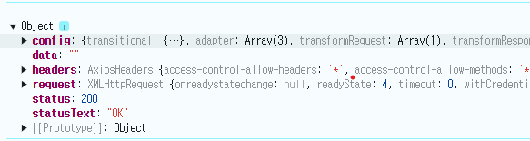

---
layout: single
title: 클라이언트 부분 실행 순서
categories: PROJECT
tag: []
author_profile: false
---   

1. # async 메소드 위치
   apis에서 api.js와 auth.js가 있는데 api.js에서 axios를 생성한다. axios 한번의 생성으로 회원가입 부분 다 처리.   
   auth.js에서 직접 서버로 요청하는 post, get, put을 처리한다.   

   auth.js
   ```javascript
      //로그인
      export const login = (username, password) => api.post(`/login?username=${username}&password=${password}`);

      //사용자 정보
      export const info = () => api.get(`/users/info`); 

      //회원가입
      export const join = (data) => api.post(`/users/join`, data)

      //회원정보 수정
      export const update = (data) => api.put(`users/update`, data);

      //회원탈퇴
      export const remove = (userId) => api.delete(`/users/${userId}`)
   ```
   axios를 사용하는 __함수__ 로만 이루어진 파일   

   LoginContextProvider.js
   ```javascript
      1)const login = async(username, password) => {
         ...
         response = await auth.info();
         ...
      }   

      2)const loginCheck = async () => {
         ...
         const response = await auth.login(username, password);
         ...
      }
   ```

1. #  LoginContextProvider의 실행 순서

   로그인버튼을 클릭

   1)const login = async(username, password) => {...}   

   2)const loginCheck = async () => { ... }

   3)const loginSetting = (userData, accessToken) => { ... }

   4)const logoutSetting = () => { ... }

1. # const login = async(username, password) => {...}

   __토큰을 쿠키에 저장__   

   아이디와 패스워드를 입력 후 서버쪽에서 인증이 되면 jwt토큰을 생성하여 await의 위치로 돌려줌 여기서부터 시작 =>   

   토큰을 잘라내서 쿠키에 저장 이후 loginCheck 호출   

   ```javascript
      const response = await auth.login(username, password);
   ```
       
   response에는 data, status, headers 등의 값을 가지고 있다   
   headers에서 토큰을 잘라낸다   
   status가 200이면 성공적으로 데이터를 받은 것이 된다.   

   status가 200이면 잘라낸 jwt를 쿠키에 저장한다   

   loginCheck()로 넘어간다

1. # const loginCheck = async () => { ... }
   
   __토큰을 서버로 보내 클라이언트 정보 가져오기__   

   클라이언트이 토큰을 http header부분에 실어서 다시 서버로 보내고, 서버에서는 해당 사용자의 정보를 받아온다

   헤더에 토큰 저장
   ```javascript
      api.defaults.headers.common.Authorization = `Bearer ${accessToken}`
   ```

   서버로부터 값 가져오기   
   ```javascript
      let response = await auth.info();
      console.log(response);
      
      let data = response.data;
      console.log(data);
   ```

   response 응답 값  
   ```json
      Object
      config : {transitional: {…}, adapter: Array(3), transformRequest: Array(1), transformResponse: Array(1), timeout: 0, …}
      data : {no: 8, userId: 'user', userPw: null, userPwCheck: null, name: 'testname', …}
      headers : AxiosHeaders {access-control-allow-headers: '*', access-control-allow-methods: '*', access-control-allow-origin: '*', cache-control: 'no-cache, no-store, max-age=0, must-revalidate', connection: 'close', …}
      request : XMLHttpRequest {onreadystatechange: null, readyState: 4, timeout: 0, withCredentials: false, upload: XMLHttpRequestUpload, …}
      status : 200
      statusText : "OK"
      [[Prototype]] : Object
   ```

   data 응답 값   
   ```json
      Object
      authList : Array(2)
      0 : {authNo: 0, userId: 'user', auth: 'ROLE_USER'}
      1 : {authNo: 0, userId: 'user', auth: 'USER'}
      length : 2 
      [[Prototype]] : Array(0)
      email : "testemail@mail.com"
      enabled : 0
      name : "testname"
      no : 8
      regDate : null
      updDate : null
      userId : "user"
      userPw : null
      userPwCheck : null
      [[Prototype]] : Object
   ```

1. #  const loginSetting = (userData, accessToken) => { ... }

   __사용자 정보를 전부 state에 저장__   

   ```javascript
      api.defaults.headers.common.Authorization = `Bearer ${accessToken}`;

      setLogin(true);

      const updateUserInfo = {no, userId, roleList};
      setUserInfo(updateUserInfo);

      const updateRoles = {isUser : false, isAdmin : false}

      roleList.forEach((role) => {
         if(role === 'ROLE_USER') updateRoles.isUser = true;
         if(role === 'ROLE_ADMIN') updateRoles.isAdmin = true; 
      });

      setRoles(updateRoles);
   ```
   토큰을 헤더에 저장   
   로그인 유무   
   유저 정보 세팅   
   권한 정보 세팅   


   
