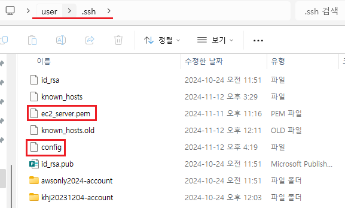
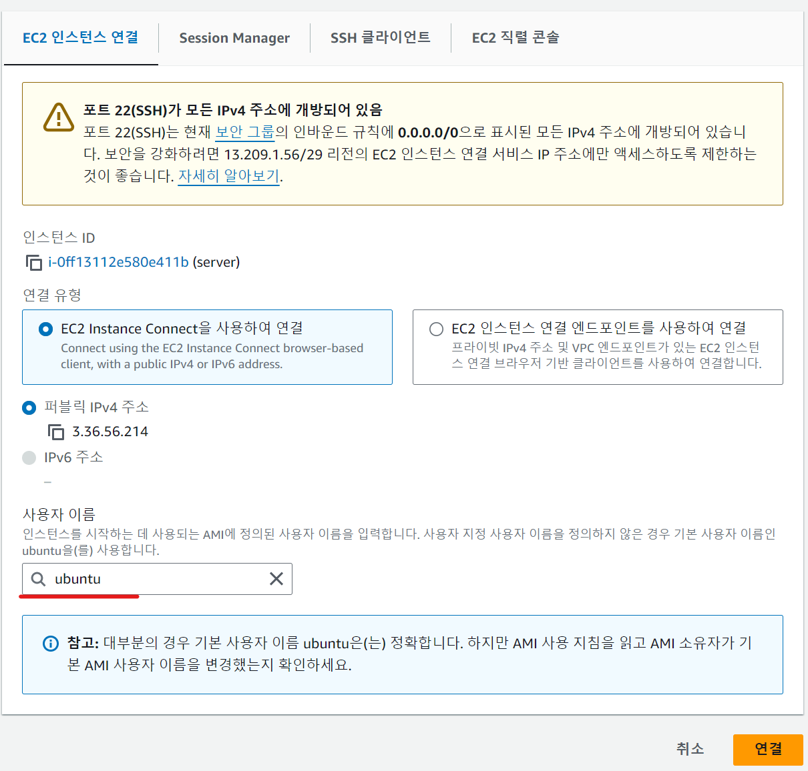

1. # vscode 콘솔 창에서 ssh접속

   SSH클라이언트 접속   
      

   ```yml
      #pem파일 위치로 이동
      # cd users/user/.ssh
      #pem파일이 있는 경로에서 명령어 실행

      user@a MINGW64 /c/users/user/.ssh
      $ ssh -i ec2_server.pem ubuntu@ec2-13-124-90-221.ap-northeast-2.compute.amazonaws.com 
   ```
      
   
   users/user/.ssh 폴더에 pem파일과 config설정 파일이 함께 있습니다. config파일이 없으면 새로 생성합니다. 

   ec2_server.pem : 인스턴스 생성 시 다운받은 pem파일로 pem파일이 있는 위치에서 위에 명령어 실행   

   ubuntu : EC2에서 ubuntu를 설치할 경우 자동으로 설정해주는 계정 이름. 인스턴스 생성 후 바로 접속하면 ubuntu계정이름으로 접속됩니다.   
      

   ec2-13-124-90-221.ap-northeast-2.compute.amazonaws.com : 퍼블릭 DNS   

   1.첫번째 오류
   ```yml
      $ ssh -i ec2_server.pem ubuntu@ec2-13-124-90-221.ap-northeast-2.compute.amazonaws.com
      Warning: Identity file ec2_server.pem not accessible: No such file or directory.
      ubuntu@ec2-13-124-90-221.ap-northeast-2.compute.amazonaws.com: Permission denied (publickey).
   ```

   config파일에 `UserKnownHostsFile ~/.ssh/known_hosts` 추가   

   1-1.첫번째 오류 해결 :   
   ```yml
   Host ec2_server  # host이름 - 임의대로 지정
      HostName 13.124.90.221 # EC2 퍼블릭IP4
      user ubuntu  # 인스턴스 우분투 계정 아이디
      IdentityFile ~/.ssh/ec2_server.pem # pem파일 위치  
      UserKnownHostsFile ~/.ssh/known_hosts # 추가  
   ```

1. # mysql 워크밴치로 접속

      