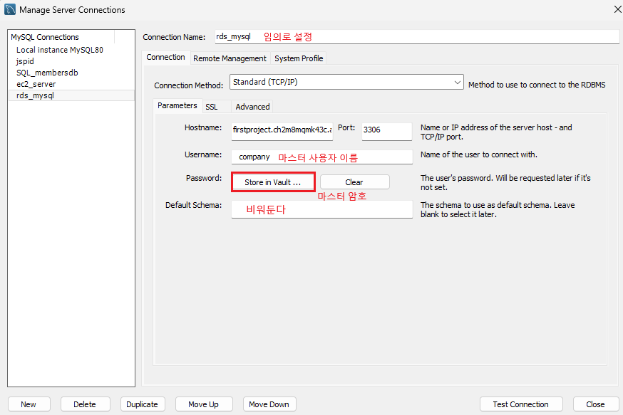

1. # 접속

   RDS에서 DB를 생성하면 root계정으로는 접속을 못 합니다. 접속을 하기위해서는 비밀번호가 있어야 하는데 root는 비밀번호가 없기 때문입니다.   
         

   RDS 인스턴스 생성시 설정한 "마스터 사용자 이름"과 "마스터 암호"를 이용해서 접속합니다.   
         


    ```sql
      show databases;
      create database firstproject;
      use firstproject;

      -- RDS를 생성시 마스터 사용자 이름과 마스터 암호를 할 때 이미 사용자에 권한이 부여되므로 밑에 명령어는 사용하지 않아도됨
      create database firstproject;
      create user hjcompany@'%' identified by 'hjpass';  
      grant all privileges on firstproject.* to hjcompany@'%' with grant option;  
      flush privileges;  
    ```

   