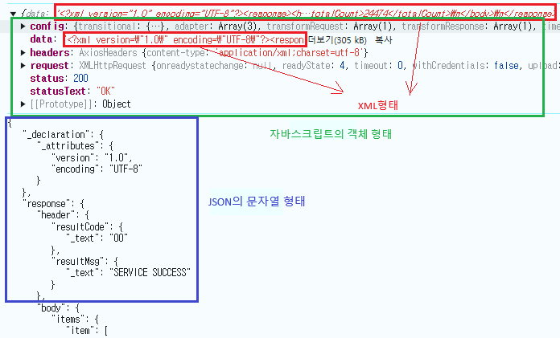

1. # 데이터 전송 
   클라이언트에서 서버로 데이터를 전송할 때는 JSON.stringify를 이용하여 자바스크립트 객체를 JSON으로 문자열화 합니다. 문자화한다는 것은 `" "`(따옴표)를 붙여야한다는 것을 뜻합니다. __JSON은 데이터를 텍스트 형식으로 표현__ 하고 데이터 전송/저장에 적합한 표준 형식입니다. 이후 서버에서 데이터를 받아서 사용을 할 때는 객체화 해야하기 때문에 `" "`(따옴표)를 없애줘야 합니다.    

   javascript객체   
   ```js
      let obj = {
         a : "값",
         b : 23,
         c : function(){return "example"; }
      }
   ```   

   JSON형태 : `""`가 붙은 문자열 형태   
   ```
      {
         "name": "John",
         "age": 30,
         "city": "New York"
      }
   ```

   JSON -> parse -> javascript객체   
   javascript객체 -> stringify -> JSON   

1. # JSON

   데이터를 저장하고 전송하기 위한 경량 데이터 형식입니다. 사람이 읽기 쉽고, 기계가 빠르게 분석하고 생성할 수 있도록 설계되었습니다. JSON은 주로 웹 애플리케이션에서 서버와 클라이언트 간 데이터를 교환하는 데 사용됩니다. 키-값 쌍을 기반으로 이루어져 있습니다. JSON은 오직 데이터(문자열, 숫자, 배열, 객체 등)만 포함합니다.   

   1. 숫자(Number): 정수 또는 부동소수점 숫자     
      예: 30, 3.14   

   1. 문자열(String): 큰따옴표(")로 감싼 텍스트     
      예: "Hello, World!"   
   
   1. Boolean: 참(true) 또는 거짓(false)   
      예: true, false   
      
   1. 객체(Object): 중괄호 {}로 감싸고, 키-값 쌍으로 구성   
      예: {"name": "John", "age": "30" }   

   1. 배열(Array): 대괄호 []로 감싸고, 값의 목록을 포함   
      예: [1, 2, 3], ["a", "b", "c"]   

   1. null: 비어 있음을 나타내는 값   
      예: null   

   Stringify한 형태
   ```javascript
      "키" : "값"
   ```
   `" "`를 사용하여 전부 문자열화합니다.    

1. # JSON VS 자바스크립트 객체

   자바스크립트 객체를 JSON형태의 문자열로 변환시 JSON.strinify를 이용합니다.   
   ```
      const obj = JSON.stringify(jsonfile);
   ```

   JSON파일   
   ```
      [
         { 
            "name": "kaiser,
            "age" : "21"
         },
         {
            "name": "kaiser,
            "age" : "25"
         }
      ]
   ```

   parse한 형태
   ```javascript
      "키" : "문자열",
      키 : "문자열",
      "키" : 숫자,
      키 : 숫자,
   ```
   JavaScript 객체는 키에 쌍따옴표를 사용할 수도 있고, 생략할 수도 있습니다. (단, 키에 공백이나 특수 문자가 포함되면 쌍따옴표가 필요합니다). 숫자 값은 `" "`를 사용하지 않습니다.  코드 내에서 사용하는 동적 데이터 구조로, 실행 가능하며 __함수나 메서드를 포함__ 할 수 있습니다.   

   위에 JSON파일을 parse한 형태   
   ```javascript
      const obj = { 
            "name": "kaiser",
            "age" : 21
         },
         /*또는 밑에 처럼 키에 " " 없어도 됨*/
         {
            name: "kaiser",
            age : 5
         }
   ```

1. # XML

   데이터를 저장하고 구조화하기 위한 마크업 언어입니다. 태그 때문에 크기가 큼니다.   

   ```html
      <bookstore>
         <book>
            <title>XML Fundamentals</title>
            <author>John Doe</author>
            <price currency="USD">29.99</price>
         </book>
         <book>
            <title>Learning JavaScript</title>
            <author>Jane Smith</author>
            <price currency="USD">39.99</price>
         </book>
      </bookstore>
   ```

1. # 예시

     


1. # XML -> JSON -> 자바스크립트 객체

   먼저, xml을 JSON으로 변화시키 위해서 xml-js라이브러리를 이용했습니다.   

   xml-js 설치   
   ```js
      npm install xml-js request
   ```   

   예제 소스
   ```js
      const convert = require('xml-js');

      let testUrl = encodeURI(`http://safemap.go.kr/openApiService/data/getPharmacyData.do?serviceKeyAH80S7N7P3&pageNo=2&numOfRows=300&type=JSON`);
      let response = await api.get(testUrl); //api로 데이터를 받아옴

      const jsonResult = convert.xml2json(response.data, {compact:true, spaces:3});  //response.data가 XML형태로 이루어져있음, JSON으로 변형, compact : JSON으로 변형, spaces : JSON으로 변형시 띄어쓰기 간격

      const dataObj = JSON.parse(jsonResult); //JSON파일을 parse하여 자바스크립트 객체로 변환   

      console.log(jsonfile.response.body.items); //객체이기 때문에 . 연산자로 원하는 요소에 접근 가능   
   ```
