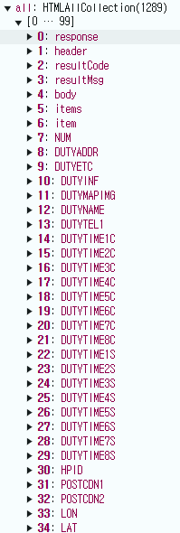

1. # 대용량 api
   <a href="https://safemap.go.kr/opna/data/dataView.do?objtId=127">https://safemap.go.kr/opna/data/dataView.do?objtId=127</a>   
   전국 약국 데이터를 가져왔는데 데이터 건 수가 25만개 입니다.   

1. # pageNo와 numOfRows 구성
   http://safemap.go.kr/openApiService/data/getPharmacyData.do?serviceKey=AH80S7N7P3&pageNo=2&numOfRows=300&type=JSON   

   해당 api의 주소로 pageNo와 numOfRows를 요청합니다.   

   이때 페이지 값과 row값은 어떻게 설정하느냐에 따라 가져오는 값이 달라집니다.   

   page=1, row=200 : 200


1. # item으로 가져오기

   ```javascript
           
      let testUrl = encodeURI(`http://safemap.go.kr/openApiService/data/getPharmacyData.do?serviceKey=AH80S7N7P3&pageNo=2&numOfRows=300&type=JSON`);
      let response = await api.get(testUrl);

      console.log(response) 
      //결과 값 : {data: '<?xml version="1.0" encoding="UTF-8"?><response><h…totalCount>24474</totalCount>\n</body>\n</response>', status: 200, statusText: 'OK', headers: AxiosHeaders, config: {…}, …}
   ```
   encodeURI :  주소에 사용할 수 없는 공백이나 특수문자를 url형태로 변형해 줍니다.   

   response의 결과값으로 data, status, statusText, headers, config ,... 등이 있습니다.   
   우리가 필요한 것은 data와 status입니다. status를 통해 if문으로 정상적으로 데이터를 받아왔는지, 오류가 있었는지의 조건을 사용합니다. status가 200이면 정상입니다.   
   xml형식이란 data 전체를 얘기합니다. xml형태 전체 `<?xml version="1.0" encoding="UTF-8"?>` 이 부분이 포함된 전체를 json형태로 변형 시켜야 제대로 인식을 합니다.   

1. # xml -> jsion
   ```javascript

   ```


   1. 세부 내용으로 가져오기   

   ```javascript
      let testUrl = encodeURI(`http://safemap.go.kr/openApiService/data/getPharmacyData.do?serviceKey=AH80S7N7-AH80-AH80-AH80-AH80S7N7P3&pageNo=1&numOfRows=40&type=JSON`);
      let response = await api.get(testUrl.toString());
   ```
   data -> request -> responseXML -> all   

      
   6:item ~ 37:DUTYWEEKENDAT 까지가 하나의 약국 정보입니다. 
   그리고   
   38:item ~ 69:DUTYWEEKENDAT 까지가 또 하나의 약국 정보입니다.   

   6~37, 38~69, 70~101, ... 31개 데이터 단위로 다음 약국 정보를 가지고 있습니다. 

   총 row값은 8110번까지로 25,9529개의 row값을 가지고 있습니다.   

   전체 데이터를 불러오는데 너무 많은 delay가 발생해서 어떻게 할까 생각 중 xml파일을 db에 넣는 것을 gpt가 알려주었습니다.👌   

   1. page와 row   
   page가 1이면


1. # xml2js 라이브러리를 사용

   xml파일의 값을 불러오기 위해서는 json으로 변경을 해야합니다.   

   xml2js 설치   
   ```javascript
      npm install axios xml2js
   ```   

   xml2js 사용   
   ```javascript

      const xml2js = require('xml2js');
      //import가 아니라 require로 라이브러리 등록

      let testUrl = encodeURI(`http://safemap.go.kr/openApiService/data/getPharmacyData.do?serviceKey=AH80S7N7-AH80-AH80-AH80-AH80S7N7P3&pageNo=1&numOfRows=8110&type=JSON`);
      let response = await api.get(testUrl.toString());
      const xmlData = response.request.responseXML.all[5].innerHTML;
      
      //explicitArray 옵션은 XML 요소가 배열로 변환될지 여부를 지정합니다. 기본값은 true
      const parse = new xml2js.Parser({explicitArray: false});
      const jsonData = await parse.parseStringPromise(xmlData);

      console.log(jsonData.item.DUTYADDR); //대전광역시 동구 계족로 362, 성남약국 1층 (성남동)
      console.log(jsonData.item.DUTYNAME); //성남약국
   ```
