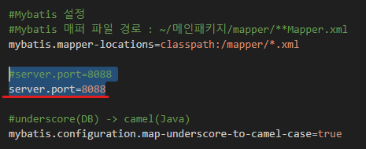

---
layout: single
title: 배포하기
categories: PROJECT
tag: []
author_profile: false
---   

1. # 서버 쪽 - 도커 이미지 생성
1. # 배포 관계
   1)나의 로컬 저장소에 있는 프로젝트를 빌드
   3)도커 이미지 생성   
   2)도커 허브에 도커 이미지를 업로드   
   3)EC2에 도커를 설치 후 도커 허브에서 이미지를 다운 받음   

1. # 빌드 수행

   프로젝트의 서버 폴더에서 빌드를 수행   
   ```
      C:\Project\firstproject\server 
   ```   
   server폴더 내용   
      

   위의 주소에서 빌드 명령어를 수행합니다.   
      
   ```
      gradlew clean build
   ```

   C:\Project\firstproject\server\build\libs에 server-0.0.1-SNAPSHOT.war 파일이 생성됩니다.   
      

1. # gradle환경을 war에서 jar로 변경하기

   build.gradle파일   
   ```yml
      plugins {
         id 'java'
         # id 'war' <- 파일 삭제
         id 'org.springframework.boot' version '3.2.10'
         id 'io.spring.dependency-management' version '1.1.6'
      }

      dependencies { 
         ...
         # providedRuntime 'org.springframework.boot:spring-boot-starter-tomcat' <- 외장 톰캣, 이 한 줄 삭제
         ...
         implementation 'org.springframework.boot:spring-boot-starter-web' #<- 내장되어 있는 톰캣으로 실행
      }
   ```
   jar는 내장 톰캣으로 실행이 되기 때문에 외부톰캣으로 실행되는 부분을 삭제   

1. # 도커 이미지 생성   
   server폴더 안에 도커 이미지를 생성합니다.   

   먼저 Dockerfile이란 이름의 파일을 만듭니다.

      

   *error   
      
   윈도우에서 Dokcer Desktop이 실행되지 않아서 도커를 실행할 수 없다. Docker Desktop을 실행하고 해당 명령어를 실행한다.   

   밑에 내용을 Dockerfile안에 복사해서 붙여넣습니다.   
   ```yml
      FROM amazoncorretto:17
      CMD ["./mvnw", "clean", "package"] # mvnw:메이븐 실행, clean:기존프로젝트 삭제, package: 패키지 실행
      ARG JAR_FILE_=target/*.jar # ARG 변수 선언, JAR_FILE란 변수 선언
      COPY ./build/libs/*.jar app.jar # app.jar을 ./buid/libs/*로 복사
      ENTRYPOINT ["java", "-jar", "app.jar"] # jar 실행
   ```

   Dockerfile이 있는 폴더 위치에서 도커 빌드를 수행   
   ```yml
     docker build -f Dockerfile -t firstproject_server .
   ```   

      

   docker images 명령어로 생성한 이미지 확인   
   ```
      docker images
   ```   
      

   docker 이미지 실행   
   ```
      docker run -d -p 80:80 firstproject_server
   ```   
      


   컨테이너 정지   
   ```
      docker stop 컨테이너id
   ```

   컨테이너 삭제   
   ```
      docker rm 컨테이너id   
   ```
      


1. # 클라이언트 쪽 - 리액트 빌드
   client 폴더로 이동합니다.   

   npm run build 실행
   ```javascript   
      C:\Project\firstproject\client> npm run build //빌드

      C:\Project\firstproject\client> npm install -g serve  //서버 설치

      C:\Project\firstproject\client> serve -s build //빌드한 어플리케이션 실행
   ```

      

   로컬로 접속하면 기존에 개발하던 익숙한 메인화면이 나타납니다.   
      

1. # docker hub에 이미지 올리기

   docker login하기   
      

   docker image에 태그를 붙여 새로운 docker image 생성   
   docker tag 원본이미지명 사용자명/이미지명   
   ```
      docker tag firstproject_server natista99/firstproject_server
   ```   
   
   *natista99가 아니라 natista만 하면 docker hub에 push할 때 
   ```
      - 에러 메세지 -
      push access denied, repository does not exist or may require authorization: server message: insufficient_scope: authorization failed
   ```
   다음과 같은 에러 발생   

   생성한 이미지를 docker hub에 push   
   ```
      docker push natista99/firstproject_server
   ```   
      

   docker hub 사이트에서 이미지 확인   
      

1. # EC2에 접속해서 배포하기
   -EC2에 도커가 설치되어 있는 상태-   

   도커에 로그인 합니다.   
   sudo docker login -u natista99   
   ```javascript
      buntu@ip-172-31-6-81:~$ sudo docker login -u natista99
   ```

   도커를 이미지를 가져옵니다.   
   docker pull natista99/firstproject_server
   ```javascript
      ubuntu@ip-172-31-6-81:~$ sudo docker pull natista99/firstproject_server
   ```

   도커 이미지를 확인합니다
   ```javascript
      ubuntu@ip-172-31-6-81:~$ sudo docker images
      809526343d9ce4c649580
   ```

   도커 이미지 실행
   ```javascript
      ubuntu@ip-172-31-6-81:~$ sudo docker run -d -p 80:80 natista99/firstproject_server
   ```

   도커 컨테이너 실행 목록 확인
   ```javascript
      ubuntu@ip-172-31-6-81:~$ sudo docker ps
   ```

      

1. # 실행하기
   리액트 부분 ploxy서버를 AWS 인스턴스 ip로 변경   

   리액트 ploxy 변경   
      

   AWS 인스턴스 IP주소   
      

   결과 화면   
      
   접속이 잘 된다..   

      
   데이터가 잘 불러와 진다

1. # Client와 Server 연결 부분

   Client부분의 package.json파일에서 proxy서버의 포트 번호와   
       

   Server부분의 application.properties파일에서 server.port부분을 일치 시킨다.   
       
