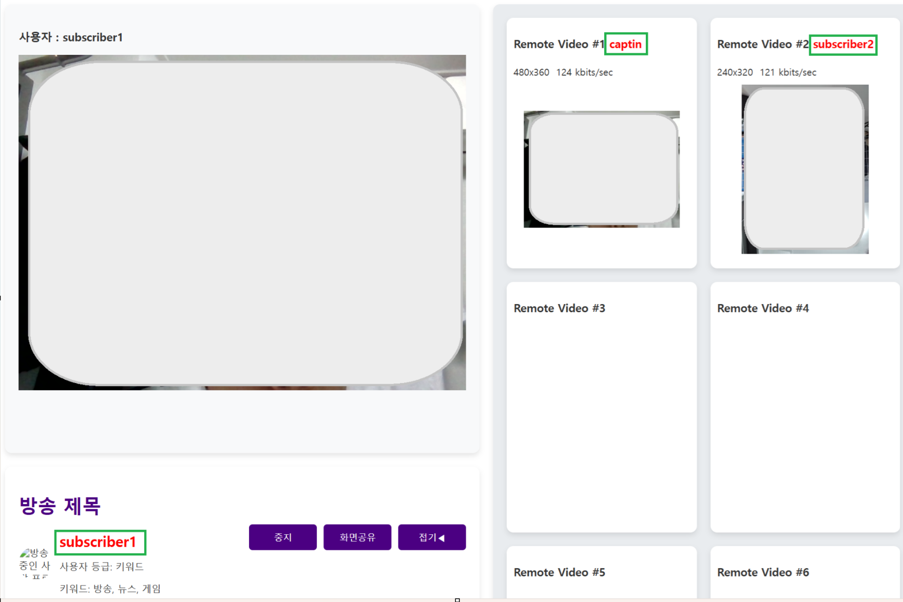

1. # mentor

      

   mentor 순서를 가장 앞에 오게 -> join으로 인식 나머지 event로 값을 받는다 어떻게 해결?

   mentor가 가장 먼저 join한 경우의 msg
   ```javascript   
      Object =>
         description : "test"
         id : 6019592257267288 //mentor 자신의 정보
         private_id : 2096999191
         publishers : Array(0) //기존 방에 있는 사람들의 정보
            length : 0
            [[Prototype]] : Array(0)
         room : 4545612
         videoroom : "joined"
            [[Prototype]] : Object

   ```
   publishers는 기존에 있는 사람들 정보고 여기 display에 username이 있다. join한 당사자는 그 페이지로 접속한 당사자이기 때문에 username이 초기 설정한 아이디

   subscriber가 join한 경우의 msg   
   ```javascript
      Object =>
         description : "test" 
         id : 1801972384065663  //subscriber의 정보
         private_id : 364008349  
         publishers : Array(1)  //기존 방에 있는 사람들의 정보
            0 : {id: 6019592257267288, display: 'mentor', audio_codec: 'opus', video_codec: 'vp8', streams: Array(2), …}   
            length : 1
            [[Prototype]] : Array(0)
         room : 4545612 
         videoroom : "joined"
         [[Prototype]] : Object
   ```

   publishers의 display가 아이디

   "mentor"인 경우만 publishOwnFeed()으로 화면을 켬


1. # 브라우저가 바뀌면 화면을 불러오지 못 한다
   세션 문제? 원격 스트림 문제, http요소 문제, 비디오 코덱 문제, 방화벽 문제, cors, 브라우저 호환성 다 아니다

   내 컴퓨터에서 최초 방을 만든 브라우저로 실행하면 다 된다. 그런데 브라우저를 옮기거나 다른 localhost로 접속한 컴퓨터에선 화면을 못 불러온다

   => 웹호스팅(github page)로 로딩해서 실행


1. # 변수 타입변환은 전역으로

   ```javascript
      var room = myroom

      function f1(){
          var data = {
            room : Number(room),
            //또는 
            room : ParseInt(room)
          }
      }
   ```   
   만약 room값이 해당 f1 함수 안에서만 사용하는 것이라면 함수 안에서 형변환 하여 사용해도 무방하지만,   
   만약 다른 곳에서도 room 변수를 사용한다면 전역으로 타입변환을 해야한다. room이 사용된 함수마다 다른게 인식할 수 있기 때문이다.   
   __눈에 보이는 결과가 같다고 컴퓨터가 모든 결과를 같다고 인식하지 않는다.__   

   ```javascript
      //전역으로 타입 변환
      var room = Number(myroom);  
      //또는 
      var room = parseInt(myroom);

      function f1(){
         var data = {
            room : room //여기 room 값과
         }
      }

      function f1(){
         var data2 = {
            room2 : room //여기 room 값이 일치
         } 
      }

   ```

1. # One To Many 구성

   join일 때와 event일 때 구독과 출판을 각각 조건에 맞게 입력

   publisher는 화면과 음성을 송출하고 subscriber는 화면과 음성을 수신만합니다 이 설정 부분이    
   ```javascript
      function publishOwnFeed(useAudio) {

      $('#publish').attr('disabled', true).unbind('click');
      
      var mediaset = null;
      var publishset = null;
      if(usermode === "1"){ //판매자
         mediaset = {
            audioRecv : false,
            videoRecv : false,
            audioSend : true,
            videoSend : true
         },

         publishset = {
            request : "configure",
            audio : true,
            video : true
         }			
      }else{ //구매자
         mediaset = {
            audioRecv : true,
            videoRecv : true,
            audioSend : false,
            videoSend : false
         },

         publishset = {
            request : "configure",
            audio : false,
            video : false
         }	
      }
   ```   
   이 부분입니다.   

   mentor가 방에 있는 경우 참가자들이 들어오거나 나가면 event가 발생하고, 참가자들이 방에 있는 경우 mentor가 들어오거나 나가면 event가 발생합니다.   
   이때마다 서로 구독을 해줘야 합니다. 구독이란 각각의 참가자 마다 webrtc로부터 접속이 성공하면 handler를 받아 이벤트를 연결하는 것입니다.   

   if(evnet === 'joined') 는 자신이 방에 입장하는 경우 자신에게 발생하는 이벤트로 기존 방에 있던 사람들을 구독하는 부분을 포함합니다.   
   ```javascript
      /* mentor가 방을 나갔다가 들어온 경우 기존 방에 참가자들을 mentor가 구독*/
      if(usermode === "1"){
         newRemoteFeed(id, display, audio, video);
      }

      /* 구독자들이 방을 최초 들어온 경우 mentor만 구독 */
      if(display === "mentor"){
         newRemoteFeed(id, display, audio, video);
      }
   ```

    else if(event === "event")는 자신이 방에 있는 경우 자기 이외의 사람들이 입장하거나 나가는 경우 발생하는 이벤트입니다.    
    ```javascript
      /* mentor가 방에 있는 경우 참가자들 구독 */
      if(usermode === "1"){ 
         newRemoteFeed(id, display, audio, video)
      };

      /* mentor가 방을 나갔다가 들어온 경우 참여자들이 mentor를 구독 */
      if(display === "mentor"){
         newRemoteFeed(id, display, audio, video)
      }
    ```

    방을 입장하거나 퇴장하는 것을 mentor 입장과 mentee 입장에서 각각 생각해줘야 합니다.   

1. # M to M
   기존 소스는 M to M에서 한 사람에게 집중하기에 큰 문제점이 있습니다. 입장하는 사람이 중심이 되어 sfutest = pluginHandle, webrtc로 부터 pluginHandle을 받아서 이벤트 요청을 수행하게 됩니다. 이후 입장하는 자신 이외의 사람들은 newRemoteFeed() 함수로 id를 넘겨주고 해당 함수에서 remoteFeed = pluginHandle, webrtc로 부터 pluginHandle을 받아서 이벤트 요청을 수행하게 됩니다. 다 대 다로 일반 회의 방식인 경우에는 입장하는 개인마다 이벤트 핸들러를 받아 요청에 따른 이벤트를 수행하는 것이 맞지만 현재 프로젝트와 같이 mentor 한 사람이 중심이되고 mentee는 모두 newRemoteFeed()에서 처리하기에는 무리가 있습니다.    
   화면 구성을 mentor는 항상 메인 화면으로 고정을 하고 mentee는 오른쪽 사이트 화면에 고정을 해야하는데 그럴려면 우선 mentor를 특정 할 수 있어야 하고 이후 화면 출력 부분에서 mentor만 myvideo란 id를 가진 div에 출력해야하는데 현재 소스는 입장하는 자신이 기준이 되어 myvideo에 mentor든 mentee든 자신의 화면을 출력하게 되고 자신 이외의 사람들은 feeds의 배열 값으로 저장되어 removevideo에 출력하게 됩니다. 이 부분을 변경하게 되면 위쪽의 sfutest 핸들러 부분과 아랫쪽의 remoteFeed 핸들러 부분이 뒤죽박죽이 돼 버리기 때문에 우회적인 방법으로 설계를 해야 했습니다.   

   1)js 파일은 수정이 부분적으로만 가능하기 때문에 html부분에서 출력 위치를 변경하는 방식으로 진행   
   ```html
      <div class="panel-body" id="videolocal"></div>
      <div class="panel panel-default">
         <div class="panel-heading">
         <h3 class="panel-title">Remote Video #1 <span class="label label-info hide" id="remote1"></span></h3>
         </div>
         <div class="panel-body relative" id="videoremote1"></div>
      </div>
   </div>
   ```   
   videolocal 부분이 입장한 사람의 메인 출력 부분이고, videoremote1 부터 videoremote6까지가 자신 이외에 입장한 사람의 화면 출력 부분입니다. 이 부분을  
   ```html
      <div id="mentor"></div>

      ...

      <div class="participant-view">
         <div id="videolocal"></div>
      </div>
      
      <div class="participant-view">
         <div class="videoremote" id="videoremote1"></div>
      </div>
   ```  
   상단에 mentor란 태그를 두고 자신이 입장하든 다른 사람이 입장하든 mentor를 찾아 mentor에 해당하면 id='mentor'인 div에 append 시키는 방식으로 구현했습니다.   

   => 문제점 : mentor가 방을 나가는 경우 다른 사람이 들어오면 이미 만들어진 videoretmote값에 입장하기 때문에 mentor가 나간 후 그 다음 입장한 사람이 mentor화면 출력됨  

   : 화면이 출력될 때 현재 feedindex 값과 기존 mentor div에 만들어진 videoremote number값이 다르면 mentor div에 있는 태그 삭제 

   => 문제점 : append 후 삭제를 했기 때문에 기존 위치에 있어야할 videoremote1 ~ videoremote6 까지 중 몇 개가 삭제 되어서 이후에 입장하는 사람들을 못 불러오는 현상 발생

   : videoremtote의 class에 1 ~ 6번까지 번호를 지정한 후 뒤에 태그가 없다면 그 위치에 태그를 생성 후 append를 해줌


