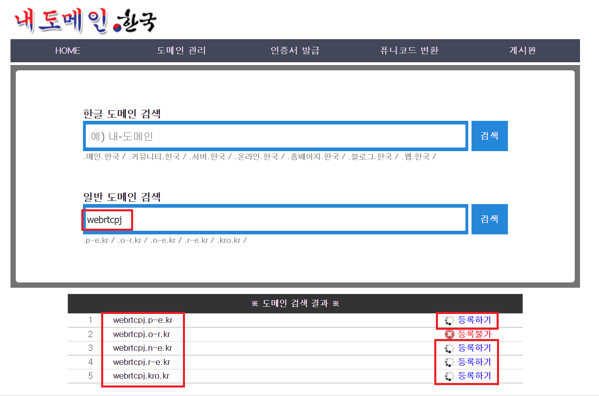
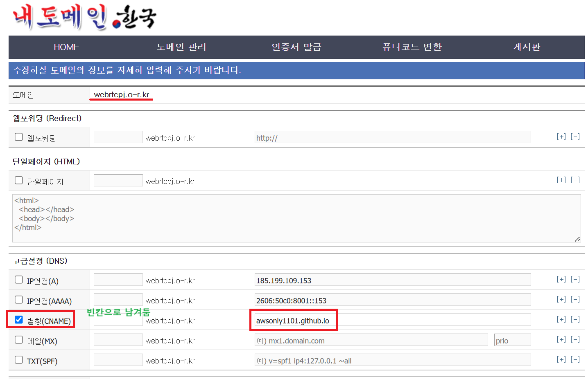
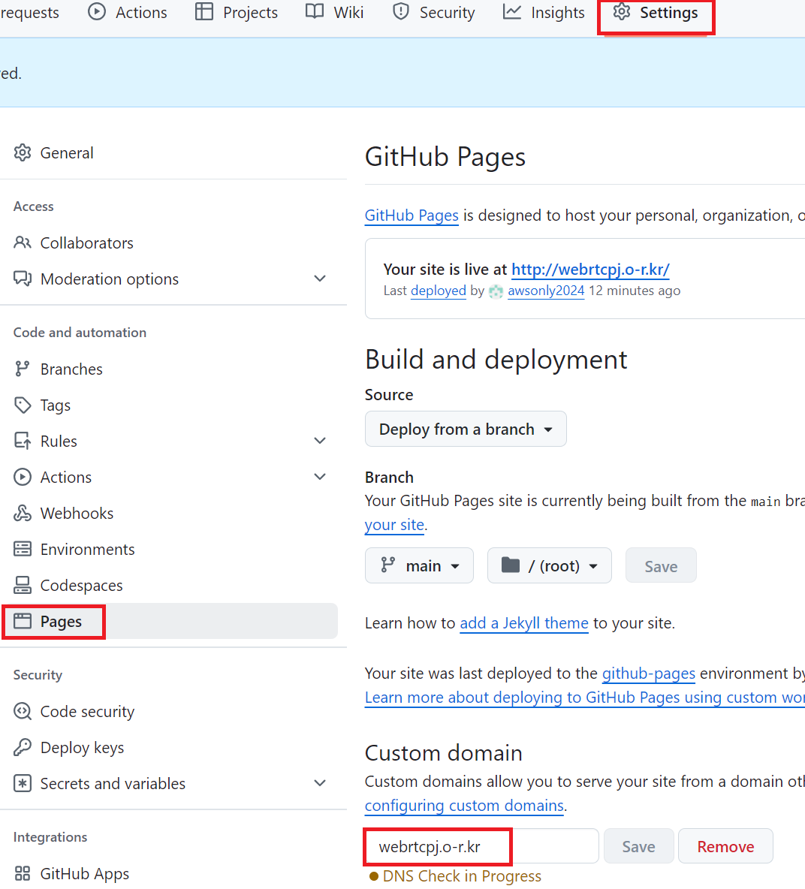
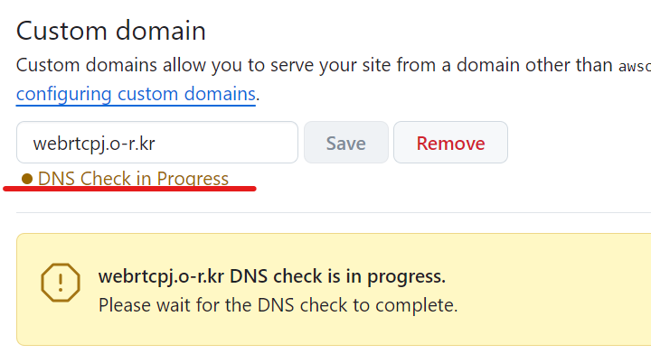
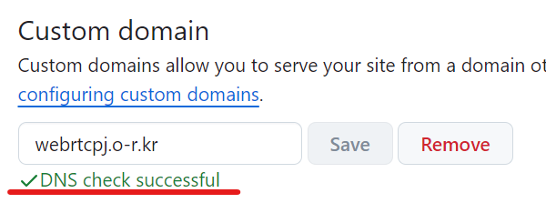
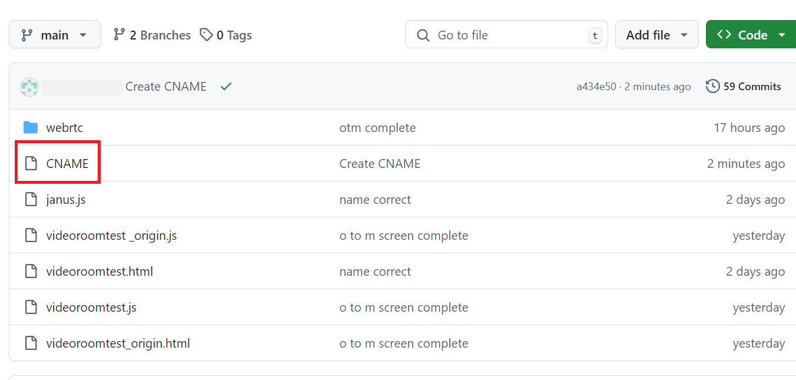

   github.io 페이지에 webrtc파일을 올려 웹스팅 방식으로 사용하기로 했습니다. 자바 프레임워크와 완전 따로 떨어진 독립적인 방식으로 운영이돼야 하기 때문에 github.io 페이지를 사용해야 했고 주소창에 깃허브 주소가 그대로 노출이 되었습니다. 주소창에 깃허브 페이지 주소가 그대로 노출되는 것이 보기에 좋지 않아 무료 도메인을 찾아 보던 중 "내 도메인.한국"이란 사이트에서 무료로 발급 가능하다는 것을 알고 깃허브 주소에 적용했습니다.

   회원가입 후 메인 페이지에서 원하는 도메인을 검색합니다.   
      

   도메인 관리로 들어가 cname을 설정합니다. github 페이지는 서브 도메인 방식으로 cname을 설정하는 것만으로 간단히 도메인을 맵핑할 수 있습니다.   
      
   .webrtc.o-r.kr 앞 부분은 빈칸으로 비워둡니다.    

   깃 허브 사이트 -> Settings -> Pages -> Custom domain   
      
   내 도메인.한국 사이트에서 생성한 도메인을 입력합니다.   

   checking 중...   
      
   
   successful!   
      
   도메인이 유효한지 확인 후 성공을 하게되면 메인 폴더에 CNAME이라는 파일이 자동 생성됩니다.   

   cname이 생성 됨   
       
   이 파일 안에는 도메인 .webrtc.o-r.kr 이 입력되어 있습니다.   