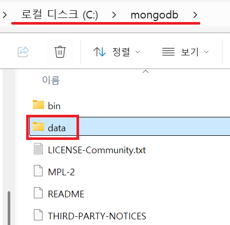

1. # DB 다운 받기
   <a href="https://www.mongodb.com/try/download/community">DB 다운</a>   
   해당 링크에서 version, os, package 종류를 선택 후 다운 받습니다. zip파일은 압축파일이고, msi파일은 설치파일입니다   

   저는 압축 파일을 다운 받아 C:/mongodb 에 압축을 풀었습니다. 그리고 data폴더를 하나 생성해 여기에 data 파일들을 입력할 것 입니다.   
      

   실행창에서 sysdm.cpl을 입력하고 환경변수 설청 창으로 이동합니다.   
      
   몽고디비가 설치된 bin파일의 경로를 적어둡니다.   

   *mongod.exe --dbpath C:\mongodb\data   
   mongod.exe:   
   MongoDB의 데이터베이스 서버를 실행하는 실행 파일입니다. 이 파일을 실행하면 MongoDB 서버가 시작되고, 클라이언트가 데이터베이스에 접근할 수 있게 됩니다.   
   --dbpath C:\mongodb\data:   
   --dbpath는 MongoDB 데이터베이스가 데이터를 저장할 디렉토리를 지정하는 옵션입니다. 여기서는 C:\mongodb\data 디렉토리를 지정하여 MongoDB가 데이터를 data폴더에 저장하도록 설정하고 있습니다. 실제 서버가 실행되면 data 폴더에 파일이 생성됩니다.   

   해당 명령어만 실행해도 data파일에 파일이 생성되면서 서버가 실행됩니다.   
      

   localhost:27017을 입력해서 다음과 같은 화면이 나오면 설치 성공입니다.   
      
   실행 중지 : ctrl + c   

1. # 쉘 설치
   서버는 실행이 되었지만 version 확인이나 쿼리문, crud를 사용하기 위해서는 compass(GUI)나 Shell(CLI) 가 필요합니다.
      

   mongod --version   
      
