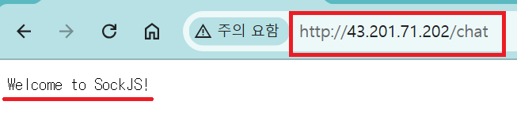
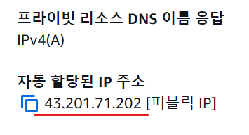
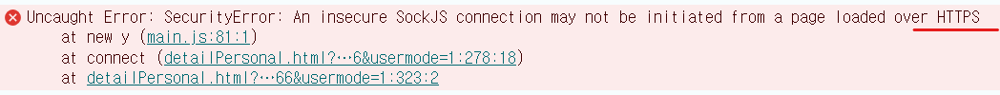
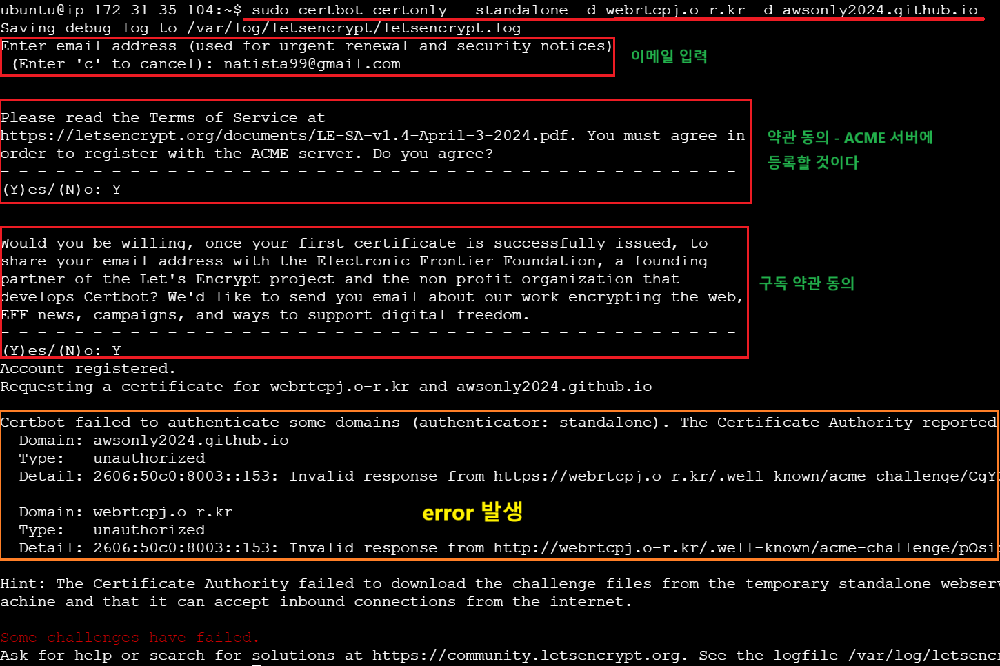
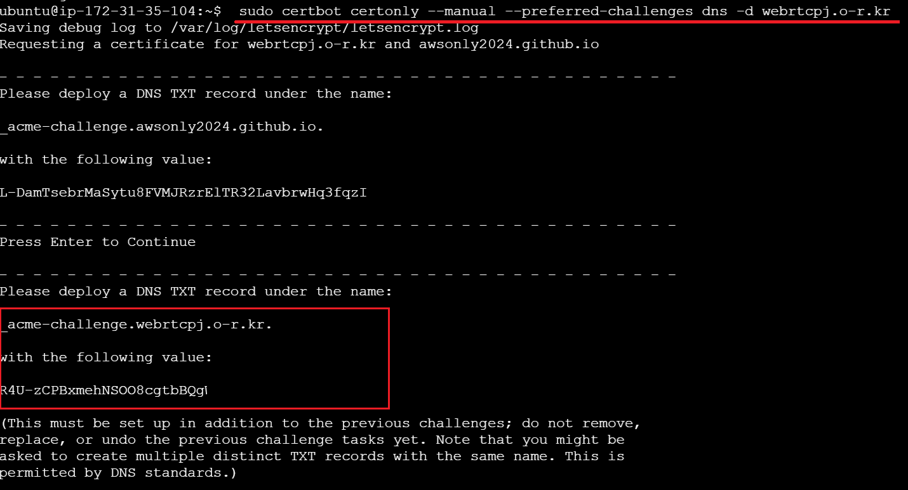
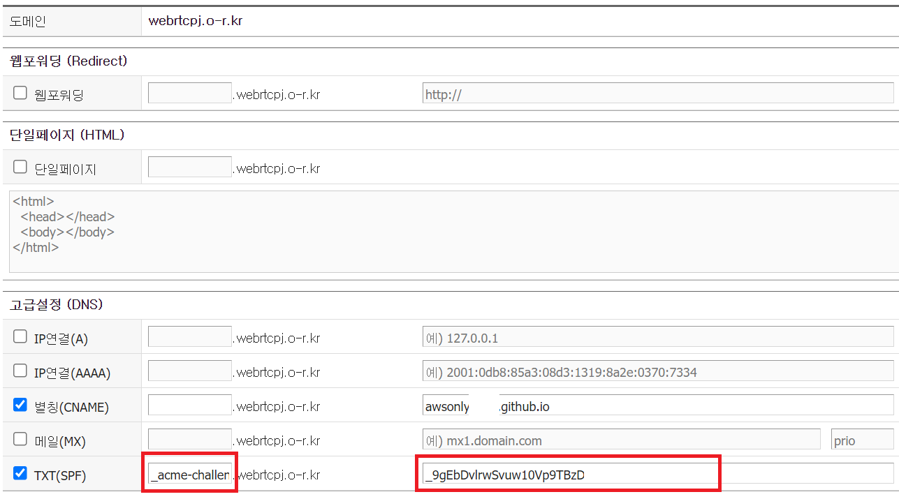
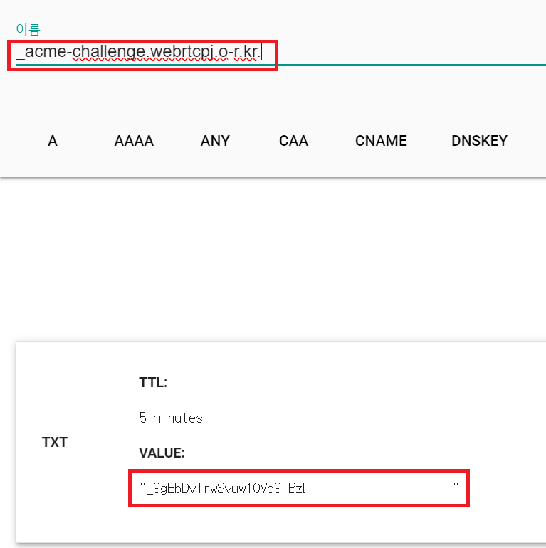
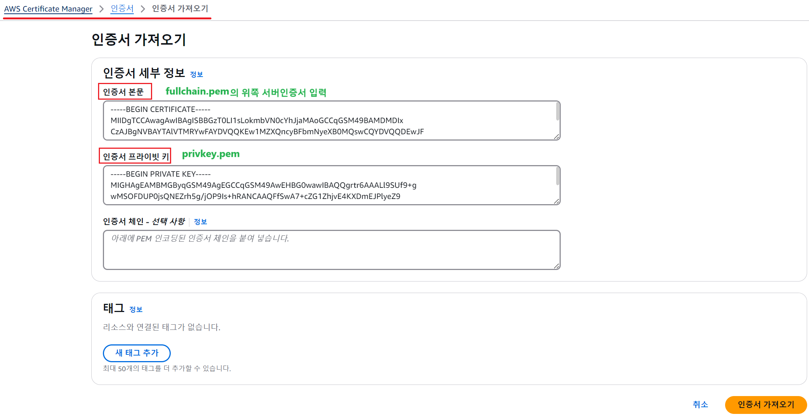
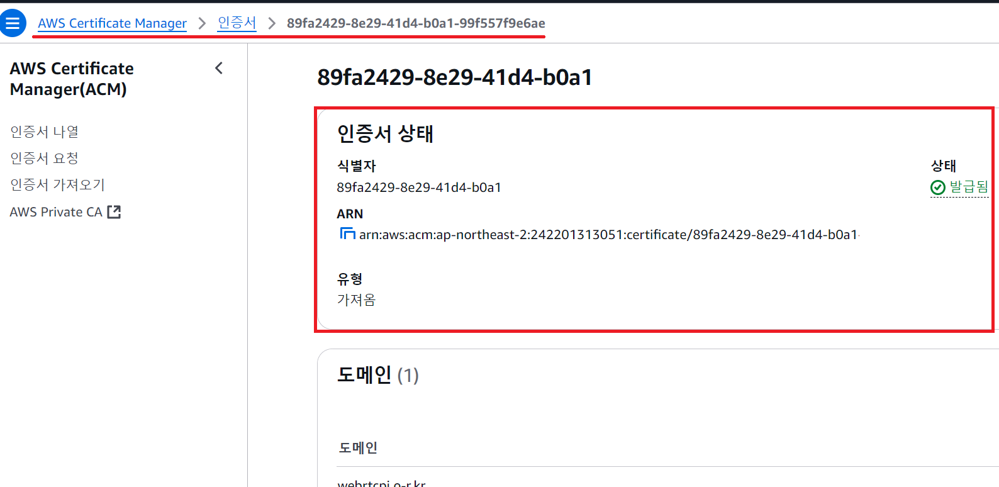
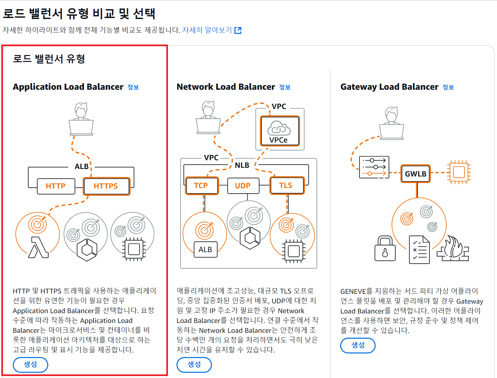

1. # HTTP로 요청시 오류

   1)채팅 서버는 HTTP트랙픽으로 작업을 수행    
   2)하지만 EC2에서 보안상(금전상?) HTTP트래픽을 허용하지 않음   
   3)HTTP로 요청시 HTTPS로 요청하란 오류가 뜸   
   HTTPS로 요청시 채팅 서버에 제대로 접속이 되지 않음   

   자바 스프링 부트로 챗팅 서버를 만들고 도커 이미지를 생성한 후 EC2로 배포를 하였습니다. EC2에서 URL을 받을 때는 HTTPS만 허용이 되는데 배포된 SockJS는 HTTP로 URL을 받기 때문에 EC2인스턴스로 HTTPS요청을 하게 되면 내부 네트워크에서 에러가 발생합니다.   

   http://43.201.71.202로 요청을 한 경우 EC2의 내부 채팅 서버에 정상적으로 접속이 됩니다.   
       
   43.201.71.202는 현재 EC2에서 제공하는 public IP입니다.   
     
   자바 스프링으로 구현된 Socket Server가 EC2에서 실행되고 있고, chat는 이 채팅 서버의 endpoint입니다. EC2에서 실행되는 서버는 HTTP로 입력받고 있습니다.   

   하지만    

   클라이언트 javascript에서 채팅 서버에 접속하기 위해서 다음과 같이이 SockJS주소를 http로 하게 되면,
   ```javascript
      const socket = new SockJS("http://43.201.71.202/chat"); 
   ```   

   HTTPS를 사용하라는 에러 메세지가 출력됩니다.   
     
   => 웹 페이지가 HTTPS로 로드된 경우, 해당 페이지에서 WebSocket 연결을 HTTP로 시도했을 때 발생합니다. 이는 브라우저 보안 정책에 의해 HTTPS로 로드된 페이지가 보안되지 않은 HTTP 연결을 차단하기 때문입니다.    

   따라서, HTTPS로 SockJS로 접속 후 EC2 내부에서 실행되고 있는 채팅 서버로는 HTTP로 접속해야하기 때문에 HTTPS -> HTTP로 변경하는 접근 방법이 필요했습니다.   

   HTTPS를 HTTP로 변환하는 것을 SSL Termination이나 TLS Termination이라고 합니다.    
   HTTPS트래픽을 수신해서 암호화를 복호화하여 내부 네트워크로 HTTP트래픽을을 다시 전달하는 방식입니다.   
   이 방식을 사용하기 위해서는 AWS의 로드 밸런스를 이용하는 방법과 NginX를 설치하여 프록시 서버 기능을 이용해 백엔드 서버로 HTTP트래픽을 전달하는 방법 2가지가 있습니다. 저는 AWS의 로드 밸런스를 사용했습니다. AWS는 IP당 요금이 과금되는데 public IP만 프리티어로 무료이이고 이후 추가되는 IP는 요금이 과금되기 때문에 이를 생각해서 SSL방식을 적용해야합니다. 저는 프로젝트 기간에 짧게 1주일 정도만 이용할 것이기 때문에 비교적 간단한 AWS에서 로드 밸런스를 설정하는 것으로 SSL을 적용할 것입니다.   

   __1.클라이언트 -> 로드 밸런서(HTTPS)__   
   클라이언트는 HTTPS요청을 로드 밸런서에게 보냅니다.   
   로드 밸런서는 SSL/TLS 인증서를 사용해서 암호화된 요청을 복화합니다.   

   __2.로드 밸런서 -> 서버(HTTP)__   
   복호화된 HTTP 트래픽을 내부 서버(EC2 인스턴스)로 전달   
   => 내부 네트워크는 일반적으로 신뢰할 수 있는 환경으로 간주되기 때문에 암호화 되지 않는 HTTP를 사용하는 경우가 많습니다.   

   *반대 과정 HTTP -> HTTPS 로 전송하는 방식을 __HTTP to HTTPS Redirection__ 이라고 합니다.   
   리다이렉션은 HTTP로 요청을 보냈을 때 암호화하여 HTTPS로 전송하는 방식입니다. 이 과정 역시 ALB에서 설정할 수 있습니다.   

1. # SSL 인증서 발급
   1. ## Let's Encrypt 인증서 발급   
      Let's Encrpyt는 HTTPS의 활성화를 위해 무료로 SSL/TLS 인증서를 제공하는 비영리 조직입니다.   
      Let's Encrypt에서 도메인 검증을 받기 위해서는 Webroot, web Server, StandAlone 3가지 방식이 있는데  Webroot, web Server는 nginx나 Apache같은 웹서버가 필요하지만 StandAlone는 서버 없이 검증받을 수 있기 때문에 AWS의 ALB에 사용하기에 적합합니다.   

      1.Webroot : 도메인의 웹 서버의 특정 디렉토리(기본적으로 .well-known/acme-challenge/)에 검증 파일을 생성하고 이를 통해 도메인 소유권을 확인하는 방식입니다. 웹 서버(예: Apache, Nginx)가 실행 중이어야 합니다.   
      ```yml
         # 예시 
         certbot certonly --webroot -w /var/www/html -d example.com  # --webroot 사용용
      ```

      2.web Server : Certbot이 직접 웹 서버를 제어하고, HTTP-01 검증에 필요한 파일을 자동으로 배치 및 제공하도록 설정합니다. Certbot은 Apache 또는 Nginx의 설정 파일을 수정하여 .well-known/acme-challenge/ 경로를 처리하는 임시 구성 파일을 만듭니다.   
      ```yml
         # 예시 
         certbot --apache  # --apache 옵션 사용 또는 --nginx 옵션 사용
      ```

      3.StandAlone : Standalone 방식은 Certbot이 자체적으로 간단한 HTTP 또는 HTTPS 서버를 실행하여 도메인 검증을 수행하는 방식입니다. 이 방식은 기존 웹 서버가 없는 환경에서 주로 사용됩니다.   
      ```yml
         # 예시 
         certbot certonly --standalone -d example.com  # stanalone 옵션 사용
      ```

      4.DNS: 도메인의 TXT레코드를 통해서 인증을 받습니다. 도메인 와일드 카드(*.sample.com) 방식으로 인증 가능하며 인증서를 갱신할 때마다 TXT레코드를 변경해야한다. TXT레코드 변경은 자동화가 가능합니다.   
      ```yml
         # 예시
          sudo certbot certonly --manual --preferred-challenges dns -d example.com -d www.example.com  # --manual 옵션 사용
      ```

      __1.1 Certbot 설치__   
      EC2 인스턴스에서 Certbot을 설치합니다.   

      ```yml
         -Red hat-
         sudo yum install -y epel-release
         sudo yum install -y certbot
      ```

      ```yml
         -Debian-
         sudo apt update
         sudo apt install certbot -y # 만약 설치가 안되면
         sudo apt-get install letsencrypt # 이걸로 설치
      ```   
      install certbot로 설치 시 error가 많이 발생한다고 합니다. letsencrypt를 설치하면 여기에 certbot가 포함되어 있기 때문에 letsencrypt를 설치하면 됩니다.   

         

      __1.2 SSL 인증서 발급__   

         __1.standalone : HTTP-01 인증 방식__   
         ```yml
            sudo certbot certonly --standalone -d example.com -d www.example.com
         ```   
         certbot 명령어를 실행하여 Standalone 모드로 인증서 발급을 합니다. Standalone 모드는 80번 포트에서 HTTP 요청을 처리합니다. 따라서 80번 포트가 비어 있어야 합니다. (다른 프로세스가 사용 중이라면 종료해야 합니다.)   

         -d 옵션 뒤에 ALB에서 사용할 도메인 이름을 입력합니다.   
         
         *하나의 인증서에 여러 도메인(예: example.com과 www.example.com)을 포함시킬 수 있기 때문에, -d 옵션을 여러 번 사용하여 여러 도메인을 지정할 수 있습니다.   
         example.com과 www.example.com 두 도메인에 대해 하나의 인증서를 발급받기 위해 Certbot을 실행합니다. 이렇게 하면 두 도메인에 대해 별도로 인증서를 발급받는 대신, 하나의 인증서로 두 도메인을 모두 커버할 수 있습니다.   

         Certbot은 자동으로 Let's Encrypt 서버와 통신하여 인증서를 발급받습니다.   
         
         발급된 인증서 확인 발급된 인증서는 기본적으로 다음 경로에 저장됩니다.   
         인증서: /etc/letsencrypt/live/example.com/fullchain.pem   
         프라이빗 키: /etc/letsencrypt/live/example.com/privkey.pem   

            
         https://webrtcpj.o-r.kr/은 cname으로 https://awsonly2024.github.io/를 가리키고 있습니다. 여기서 awsonly2024는 github pages에 웹 호스팅된 도메인 주소입니다. gitHub Pages에서 호스팅하는 도메인에 대해 SSL 인증서를 발급받는 것은 불가능합니다.!!   
         certbot certonly --standalone은 Certbot이 __로컬 서버__ 에서 http 요청을 처리할 수 있을 때만 동작합니다. 처음 Certbot는 webrtcpj로 접근하고 webrtcpj가 가리키는 cname의 awsonly2024로 요청을 보냅니다. 하지만 github pages는 로컬 서버도 아니고  HTTP-01 인증 요청을 보내도, GitHub Pages는 해당 요청을 처리할 능력이 없기 때문에 인증 실패가 발생합니다.    

         => 해결 방법 : manual옵션을 사용한 DNS-01 인증 방식 사용   

         __2.manual : DNS-01 인증 방식__   
         로드 밸런서를 통해 트래픽을 처리할 것이므로, Certbot이 HTTP 요청을 직접 처리하지 못합니다. 대신 DNS 검증을 사용합니다.   
         ```yml
           sudo certbot certonly --manual --preferred-challenges dns -d webrtcpj.o-r.kr  # --manual
         ```   
         수동 모드로 진행합니다. 이 모드에서는 Certbot이 자동으로 인증을 처리하지 않고, 사용자가 특정 작업을 직접 수행해야 합니다. 실행 중 Certbot이 TXT 레코드를 추가하라고 지시합니다. 이를 AWS Route 53에 추가해야 합니다. 수동으로 DNS 레코드 추가가 필요하고 DNS를 직접 관리할 수 있어야 합니다.   
         => DNS TXT 레코드 추가   
         AWS Management Console로 이동 -> Route 53 -> 호스팅 영역(Hosted Zone) -> 도메인 선택 -> Certbot에서 제공한 TXT 레코드를 도메인의 TXT 레코드로 추가(1~2분 소요)   

         위에 standalone 방식으로 error가 나서 manual 방식으로 실행.   
         ```yml
            sudo certbot certonly --manual --preferred-challenges dns -d webrtcpj.o-r.kr  # awsonly2024없이 webrtcpj만 입력합니다.
         ```   
            
          webrtcpj.o-r.kr가 CNAME으로 다른 도메인(awsonly2024.github.io)을 가리키고 있어도 DNS 레코드를 추가하면 인증이 가능하므로, webrtcpj.o-r.kr 도메인의 DNS 설정에 TXT 레코드를 추가하는 방법을 사용해야 합니다.  --manual dns는 도메인을 따라가기 때문에 awsonly2024가 아니라 webrtcpj가 중심이 되어 요청을 받게 됩니다. 

         해당 한국 도메인에서 위에 나온 결과 값들을 입력합니다.   
            
         _acme-challenge.webrtcpj.o-r.kr. : txt :  _9gEbDvlrwSvuw10Vp9TB   
         *해당 도메인 사이트는 webrtcpj의 TXT 값만 입력이 가능. awsonly2024 부분은 입력란 자체가 없음. cname을 awsonly2024로 해도 dns 중심으로 webrtcpj만 입력하면 됨   

         <a href="https://toolbox.googleapps.com/apps/dig/#TXT/_acme-challenge.sample.com">여기</a> 사이트에서 DNS값이 제대로 등록 되었는지 확인합니다.(2~3분 소요)   
            

         인증서가 정상적으로 발급됨(전체 화면)   
             

      __1.2.3 인증서 발급__   
      Certbot이 DNS 검증에 성공하면 인증서를 발급합니다.   
      발급된 인증서는 일반적으로 /etc/letsencrypt/live/example.com/ 디렉터리에 저장됩니다.   

      인증서 파일:  /etc/letsencrypt/live/webrtcpj.o-r.kr/fullchain.pem 
      개인 키 파일: /etc/letsencrypt/live/webrtcpj.o-r.kr/privkey.pem

1. # SSL인증서를 ACM에 업로드   
      AWS Application Load Balancer는 SSL 인증서를 직접 관리하지 않습니다. 대신, AWS Certificate Manager(ACM)를 통해 SSL 인증서를 관리합니다.   

      __2.1 인증서 변환__   
      Certbot에서 발급받은 .pem 형식 인증서를 .pem 형식 그대로 사용 가능하지만, 인증서를 ACM에 업로드하려면 분리된 파일을 사용해야 합니다.   

      인증서: fullchain.pem   
      개인 키: privkey.pem   
      ```bash
         cat /etc/letsencrypt/live/example.com/fullchain.pem
         cat /etc/letsencrypt/live/example.com/privkey.pem
      ```
      이 내용을 복사해둡니다.

      __2.2 ALB에 인증서 업로드__   
      PEM 파일을 하나의 파일로 결합 AWS Certificate Manager(ACM)에 인증서를 업로드하려면 인증서와 프라이빗 키를 준비해야 합니다. 필요한 파일을 하나로 결합합니다:

      ```yml
         cat /etc/letsencrypt/live/example.com/fullchain.pem /etc/letsencrypt/live/example.com/privkey.pem > combined.pem
      ```   

      AWS Certificate Manager(ACM)에 업로드
      AWS Management Console에서 Certificate Manager로 이동 -> "Certificate import"를 선택 -> 결합된 인증서를 업로드하거나 다음 항목을 개별적으로 업로드

      Certificate body: fullchain.pem 내용   
      Private key: privkey.pem 내용   

      *fullchain.pem : 본문 내용이 2개인 이유   
      위쪽 - 서버 인증서 (도메인에 대한 SSL 인증서)   
      아래쪽 - 중간 인증서 (인증서 발급 기관의 인증서, CA 인증서)   
      fullchain.pem 파일은 서버 인증서와 중간 인증서를 하나의 파일로 합친 것입니다. 중간 인증서는 인증서를 발급한 **인증기관(CA)**의 인증서입니다.   

         
      인증서 본문에는 fullchain.pem의 서버 인증서(도메인 인증서) 입력   
      인증서 프라이빗 키에는 privkey.pem 입력력

      인증서 정상 연결   
         

1. # 로드 밸런서에 ACM 적용
      이제 발급받은 ssl을 alb에 적용하여 https의 요청을 ec2 내부에서 http의 요청으로 변경할 것입니다.   

      전체 순서 :   
      1.ACM에서 발급받은 SSL 인증서를 ALB의 HTTPS 리스너에 연결합니다.   
      2.ALB가 HTTPS 요청을 SSL 종료 후 HTTP로 EC2에 전달하도록 설정합니다.   
      3.대상 그룹에서 HTTP 프로토콜을 사용하여 EC2 인스턴스를 등록합니다.   
      4.ALB와 EC2 인스턴스 간의 보안 그룹 규칙을 설정하여 트래픽이 허용되도록 합니다.   
      5.Route 53에서 도메인 이름을 ALB의 DNS로 매핑하여 HTTPS로 접속할 수 있도록 합니다.   

      1. ALB에 SSL 인증서 연결   
      ACM(AWS Certificate Manager)에서 발급받은 SSL 인증서를 ALB(애플리케이션 로드 밸런서)에 연결   
     
      1.1. SSL 인증서 준비
      **ACM(AWS Certificate Manager)**에서 SSL 인증서를 발급받았다면, ALB에서 이 인증서를 사용할 수 있도록 준비합니다.
      1.2. ALB 리스너 설정
      AWS Management Console에 로그인하고 EC2 서비스로 이동합니다.

      왼쪽 메뉴에서 Load Balancers를 선택하고, ALB를 생성합니다.   
         


      ALB의 Listeners 탭을 클릭한 후, HTTPS 리스너를 추가합니다.


      HTTPS 리스너는 포트 443을 사용합니다.
      리스너 설정에서 SSL 인증서를 ACM에서 발급받은 인증서로 설정합니다.
      설정 예시:

      HTTP 리스너: 포트 80
      HTTPS 리스너: 포트 443 (ACM에서 발급한 인증서 사용)
      HTTPS 리스너 설정에서 SSL 인증서를 선택합니다.

      ACM에서 발급받은 인증서를 선택하고 저장합니다.

      2. HTTPS 요청을 HTTP로 변환
      ALB는 기본적으로 SSL 종료(SSL termination)를 지원합니다. 즉, ALB가 클라이언트로부터 받은 HTTPS 요청을 처리하고, 이를 HTTP로 EC2 인스턴스로 전달합니다.

      2.1. 리스너 규칙 설정
      HTTPS 리스너에서 EC2 인스턴스로 트래픽을 전달하는 규칙을 설정합니다.

      ALB는 HTTPS 요청을 받아서, 백엔드 EC2 인스턴스로 HTTP로 요청을 전달합니다.
      이를 위해 타겟 그룹을 설정하여, ALB가 트래픽을 HTTP로 EC2로 전달할 수 있게 합니다.
      **대상 그룹(Target Group)**을 생성하거나 기존의 대상 그룹을 사용합니다.

      대상 그룹에 EC2 인스턴스를 등록합니다.
      이 대상 그룹은 HTTP 프로토콜을 사용하여 EC2 인스턴스로 트래픽을 전달하게 됩니다.
      2.2. HTTP 리스너
      ALB에서 HTTPS 리스너를 사용하여 외부에서 받은 트래픽을 SSL 종료 후 HTTP로 EC2로 전달하려면, HTTP 리스너(포트 80)는 별도로 설정하지 않아도 됩니다. ALB가 SSL을 종료하고 HTTP로 전달하기 때문에 HTTP 리스너를 추가할 필요는 없습니다.

      3. 보안 그룹 및 EC2 인스턴스 설정
      ALB가 EC2 인스턴스에 HTTP 요청을 전달하려면, 보안 그룹 설정을 적절히 구성해야 합니다.

      3.1. ALB 보안 그룹
      ALB 보안 그룹에서 포트 443 (HTTPS)을 허용해야 합니다.

      3.2. EC2 보안 그룹
      EC2 인스턴스의 보안 그룹에서 ALB가 HTTP 트래픽을 전달할 수 있도록 포트 80을 허용해야 합니다.

      EC2 인스턴스 보안 그룹에 다음과 같은 규칙을 추가합니다:
      프로토콜: TCP
      포트 범위: 80
      출처: ALB가 속한 보안 그룹
      4. Route 53에서 DNS 설정
      만약 ALB를 사용하여 SSL을 종료하고 있다면, Route 53에서 도메인 이름을 ALB의 DNS로 매핑해야 합니다. 이를 통해 클라이언트가 HTTPS로 접속하면, ALB가 이를 처리하고 EC2 인스턴스로 HTTP 요청을 전달합니다.

      Route 53에서 A 레코드를 생성합니다.
      Alias로 ALB의 DNS 이름을 선택하여 도메인을 ALB로 라우팅합니다.
      5. 결과 확인
      설정이 완료되면, 브라우저에서 HTTPS로 도메인에 접속하여 ALB가 SSL을 종료하고 EC2 인스턴스로 HTTP 요청을 전달하는지 확인합니다.

      HTTPS 요청이 ALB에 도달하고, ALB는 이를 HTTP로 EC2에 전달합니다.
      EC2 인스턴스는 HTTP 요청을 받아 처리합니다
1. # 인증서 자동 갱신   
      Let's Encrypt 인증서는 90일 동안 유효합니다. 갱신을 자동화하려면 다음을 설정합니다.   

      __4.1 Certbot 자동 갱신__   
      Certbot의 갱신 명령어를 사용하여 인증서를 갱신합니다.   

      ```yml
         sudo certbot renew --manual
      ```

      __4.2 ACM에 새 인증서 업로드 자동화__   
      갱신된 인증서를 ACM에 업로드하는 스크립트를 작성합니다.   

      ```yml   
         #!/bin/bash

         DOMAIN="example.com"
         CERT_PATH="/etc/letsencrypt/live/$DOMAIN"

         aws acm import-certificate \
         --certificate file://$CERT_PATH/fullchain.pem \
         --private-key file://$CERT_PATH/privkey.pem \
         --region us-east-1
      ```   
      
      크론탭으로 갱신 자동화   
      ```yml   
         crontab -e
      ```
      
      매달 1일에 자동 갱신 및 업로드 실행   
      ```
         0 0 1 * * /path/to/renew-and-upload.sh
      ```   
      Let's Encrypt에서 무료 SSL 인증서를 발급받고, AWS ACM에 업로드합니다. AWS ALB에 HTTPS 리스너를 추가하고, HTTP -> HTTPS 리다이렉트를 설정합니다. 인증서 갱신은 Certbot과 AWS CLI를 활용해 자동화합니다.   
