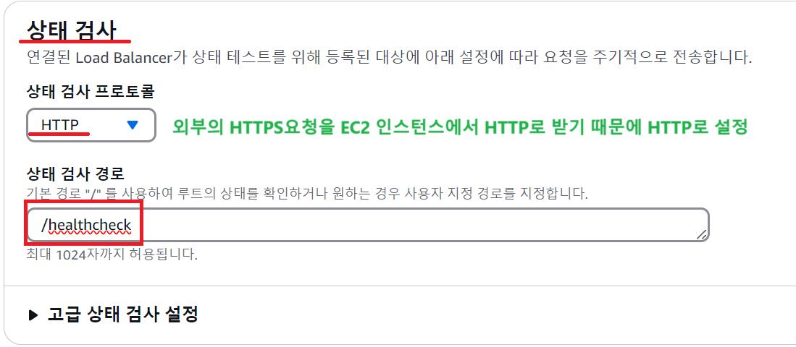
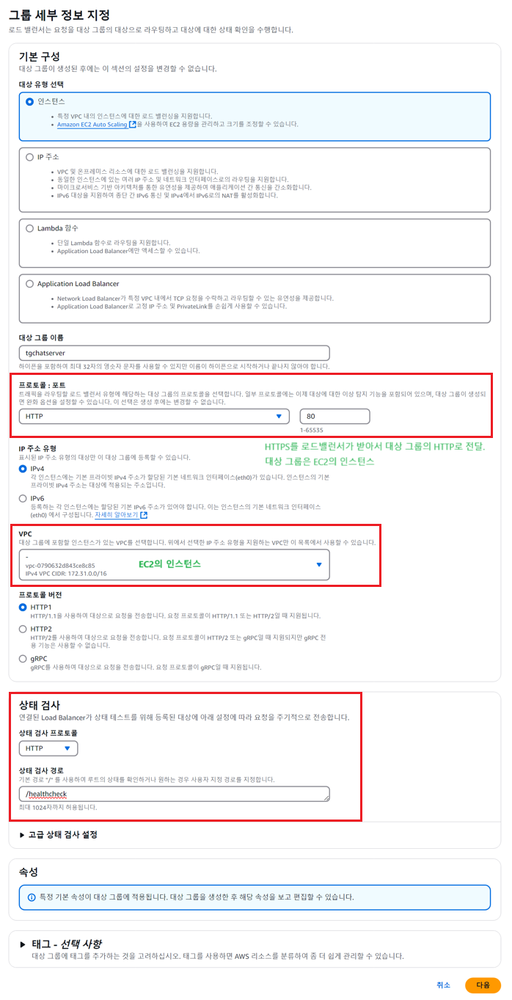
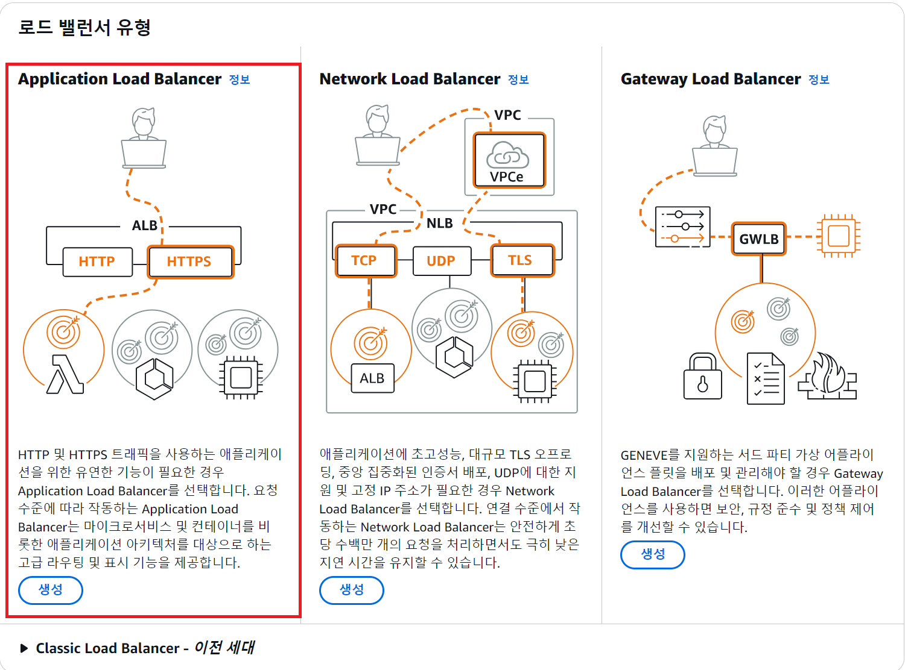
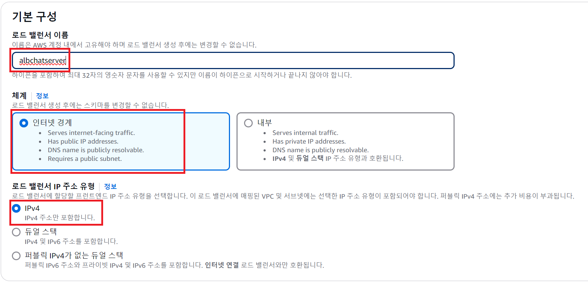
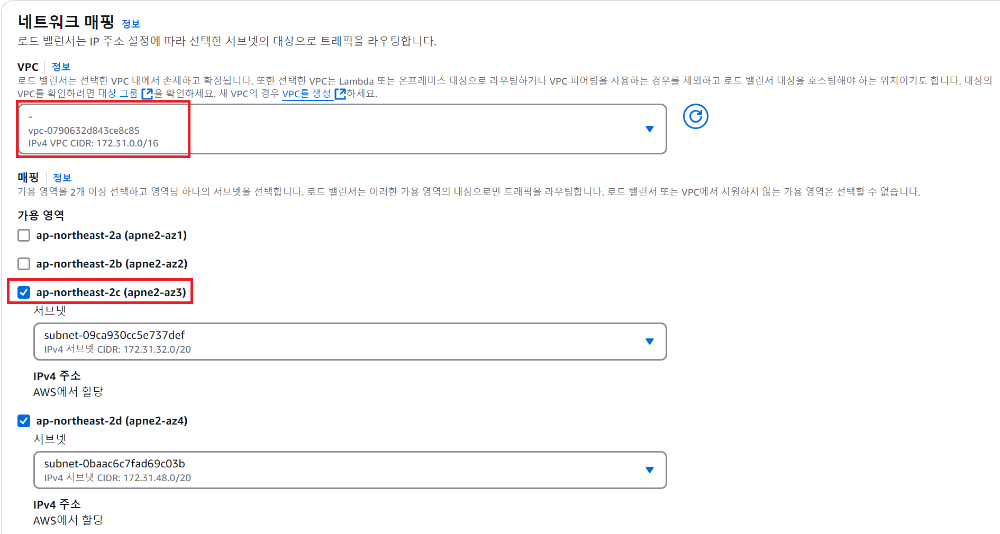
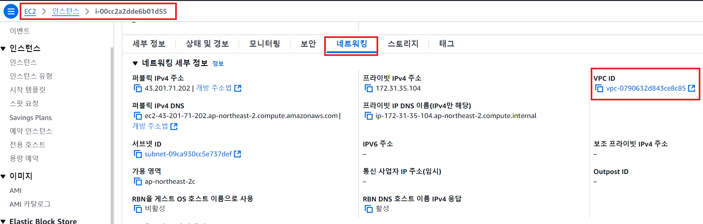
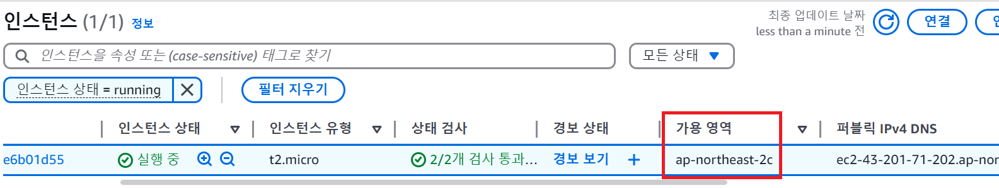
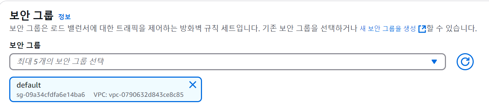
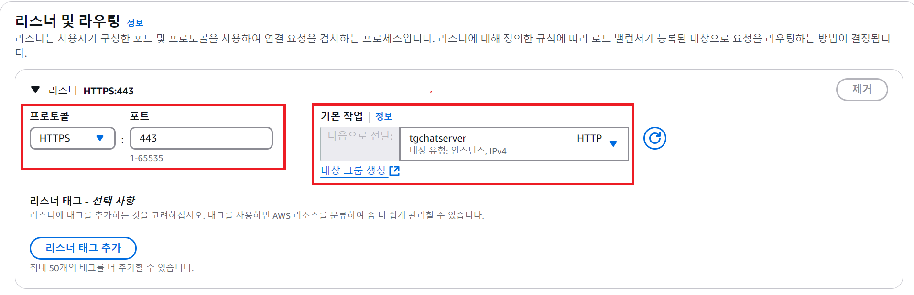
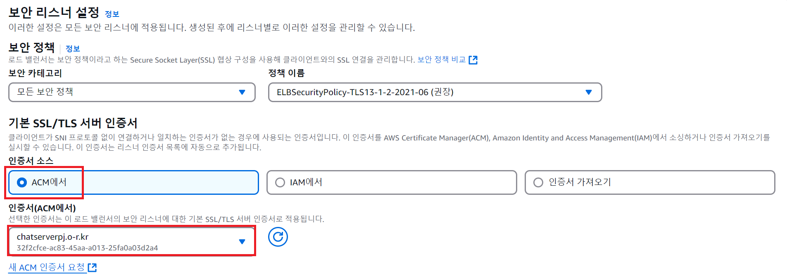

1. # HTTP로 요청시 오류

   1)채팅 서버는 HTTP트랙픽으로 작업을 수행    
   2)하지만 EC2에서 보안상(금전상?) HTTP트래픽을 허용하지 않음   
   3)HTTP로 요청시 HTTPS로 요청하란 오류가 뜸   
   HTTPS로 요청시 채팅 서버에 제대로 접속이 되지 않음   

   자바 스프링 부트로 챗팅 서버를 만들고 도커 이미지를 생성한 후 EC2로 배포를 하였습니다. EC2에서 URL을 받을 때는 HTTPS만 허용이 되는데 배포된 SockJS는 HTTP로 URL을 받기 때문에 EC2인스턴스로 HTTPS요청을 하게 되면 내부 네트워크에서 에러가 발생합니다.   

   http://43.201.71.202로 요청을 한 경우 EC2의 내부 채팅 서버에 정상적으로 접속이 됩니다.   
       
   43.201.71.202는 현재 EC2에서 제공하는 public IP입니다.   
     
   자바 스프링으로 구현된 Socket Server가 EC2에서 실행되고 있고, chat는 이 채팅 서버의 endpoint입니다. EC2에서 실행되는 서버는 HTTP로 입력받고 있습니다.   

   하지만    

   클라이언트 javascript에서 채팅 서버에 접속하기 위해서 다음과 같이이 SockJS주소를 http로 하게 되면,
   ```javascript
      const socket = new SockJS("http://43.201.71.202/chat"); 
   ```   

   HTTPS를 사용하라는 에러 메세지가 출력됩니다.   
     
   => 웹 페이지가 HTTPS로 로드된 경우, 해당 페이지에서 WebSocket 연결을 HTTP로 시도했을 때 발생합니다. 이는 브라우저 보안 정책에 의해 HTTPS로 로드된 페이지가 보안되지 않은 HTTP 연결을 차단하기 때문입니다.    

   따라서, HTTPS로 SockJS로 접속 후 EC2 내부에서 실행되고 있는 채팅 서버로는 HTTP로 접속해야하기 때문에 HTTPS -> HTTP로 변경하는 접근 방법이 필요했습니다.   

   HTTPS를 HTTP로 변환하는 것을 SSL Termination이나 TLS Termination이라고 합니다.    
   HTTPS트래픽을 수신해서 암호화를 복호화하여 내부 네트워크로 HTTP트래픽을을 다시 전달하는 방식입니다.   
   이 방식을 사용하기 위해서는 AWS의 로드 밸런스를 이용하는 방법과 NginX를 설치하여 프록시 서버 기능을 이용해 백엔드 서버로 HTTP트래픽을 전달하는 방법 2가지가 있습니다. 저는 AWS의 로드 밸런스를 사용했습니다. AWS는 IP당 요금이 과금되는데 public IP만 프리티어로 무료이이고 이후 추가되는 IP는 요금이 과금되기 때문에 이를 생각해서 SSL방식을 적용해야합니다. 저는 프로젝트 기간에 짧게 1주일 정도만 이용할 것이기 때문에 비교적 간단한 AWS에서 로드 밸런스를 설정하는 것으로 SSL을 적용할 것입니다.   

   __1.클라이언트 -> 로드 밸런서(HTTPS)__   
   클라이언트는 HTTPS요청을 로드 밸런서에게 보냅니다.   
   로드 밸런서는 SSL/TLS 인증서를 사용해서 암호화된 요청을 복화합니다.   

   __2.로드 밸런서 -> 서버(HTTP)__   
   복호화된 HTTP 트래픽을 내부 서버(EC2 인스턴스)로 전달   
   => 내부 네트워크는 일반적으로 신뢰할 수 있는 환경으로 간주되기 때문에 암호화 되지 않는 HTTP를 사용하는 경우가 많습니다.   

   *반대 과정 HTTP -> HTTPS 로 전송하는 방식을 __HTTP to HTTPS Redirection__ 이라고 합니다.   
   리다이렉션은 HTTP로 요청을 보냈을 때 암호화하여 HTTPS로 전송하는 방식입니다. 이 과정 역시 ALB에서 설정할 수 있습니다.   

1. # 전체 순서
   SSL 인증서 발급 받아서 준비 => ACM에 업로드 -> 로드 밸런스에 적용하기 위한 대상 그룹 생성 -> 로드 밸런스 생성 -> Route 53에 도메인 적용

1. # SSL인증서를 ACM에 업로드   
   AWS Application Load Balancer는 SSL 인증서를 직접 관리하지 않습니다. 대신, AWS Certificate Manager(ACM)를 통해 SSL 인증서를 관리합니다.   

   __2.1 인증서 변환__   
   Certbot에서 발급받은 .pem 형식 인증서를 .pem 형식 그대로 사용 가능하지만, 인증서를 ACM에 업로드하려면 분리된 파일을 사용해야 합니다.   

   인증서: fullchain.pem   
   개인 키: privkey.pem   
   ```bash
      cat /etc/letsencrypt/live/example.com/fullchain.pem
      cat /etc/letsencrypt/live/example.com/privkey.pem
   ```
   이 내용을 복사해둡니다.

   __2.2 ALB에 인증서 업로드__   
   AWS Certificate Manager(ACM)에 업로드
   AWS Management Console에서 Certificate Manager로 이동 -> "Certificate import"를 선택 -> 결합된 인증서를 업로드하거나 다음 항목을 개별적으로 업로드

   Certificate body: fullchain.pem 내용   
   Private key: privkey.pem 내용   

   *fullchain.pem : 본문 내용이 2개인 이유   
   위쪽 - 서버 인증서 (도메인에 대한 SSL 인증서)   
   아래쪽 - 중간 인증서 (인증서 발급 기관의 인증서, CA 인증서)   
   fullchain.pem 파일은 서버 인증서와 중간 인증서를 하나의 파일로 합친 것입니다. 중간 인증서는 인증서를 발급한 인증기관(CA)의 인증서입니다.   

      
   인증서 본문에는 fullchain.pem의 서버 인증서(도메인 인증서) 입력   
   인증서 프라이빗 키에는 privkey.pem 입력력

   인증서 정상 연결   
      

1. # 대상 그룹 생성
   대상 그룹은 현재 존재하는 EC2의 인스턴스 값이 됩니다. 외부에서 http나 https로 접근 시 로드밸런서로 접속하게 될 EC2가 됩니다. 대상 그룹 생성시 중요한 부분이 적용된 인스턴스의 healthy값을 받아오는 것입니다. 적용된 EC2의 인스턴스가 제대로 작동하고 있는지 확인하기 위해서 대상 그룹 체크를 하게 되는데 그 부분이 상태 검사가 됩니다.   

      

   저는 자바로 챗팅 서버를 만들었기 때문에 자바의 healty 리콜 부분은 다음과 같습니다.   
   ```java
      @RestController
      @RequestMapping("/healthcheck")
      public class WebRtcHealthCheck {

         @GetMapping  // -> error 이 부분은 제대로 함수값을 리턴하지 않음음
         public ResponseEntity<String> getMethodName() {
            return new ResponseEntity<>("success",HttpStatus.OK); //리턴 값이 status 200이 아님
         }

         @GetMapping  // -> 정상 작동. status 200을 리턴함
         public ResponseEntity<String> healthCheck() {
            return ResponseEntity.ok("Healthy");
         }
      }
   ```
   
      

   다음을 클릭하면 대상 등록 화면이 뜹니다. 여러 인스턴스 항목 중 HTTPS를 받아서 HTTP로 처리할 인스턴스를 선택합니다.   

   HTTPS -> 로드 밸런서 -> 대상 등록 -> HTTP   

   왼쪽 버튼을 선택하면 "아래에 보류 중인 것으로 포함" 버튼을 클릭합니다. 그러면 대상 보기에 선택한 인스턴스 항목이 나타나고 아래에 대상 그룹 생성을 클릭합니다.   

   대상 그룹을 생성하면 이 대상 그룹을 로드 밸런서와 연결합니다.   

1. # 로드 밸런서 생성
      Appliation Load Balancer를 선택합니다.   
         

      로드 밸런서 이름을 입력하고 인터넷 경계, IPv4를 선택합니다.   
         

      VPC와 가용 영역 설정   
         

      VPC :   
      VPC는 가상 클라우드로 사용자 정의 네트워크를 설정합니다. IP주소 범위, 서브넷, 라우팅 테이블 등울 설정하게 됩니다. VPC값들은 이미 EC2의 인스턴스에 설정되어 있어서 인스턴스를 적용만 하면 됩니다.   
         
      네트워킹에 VPC ID가 있습니다.   

      가용영역 :   
      AWS 리전(Region) 내에 물리적으로 분리된 데이터 센터 그룹입니다. 각 가용 영역은 독립된 전력, 네트워크, 냉각 시스템을 갖추고 있어 하나의 AZ에 장애가 발생해도 다른 AZ는 영향을 받지 않도록 설계되었습니다. 예를 들어, 서울 리전(ap-northeast-2)에는 3개의 AZ가 있습니다: ap-northeast-2a, ap-northeast-2b, ap-northeast-2c. 한 가용 영역에서 장애가 발생하더라도 다른 가용 영역에서 트래픽을 처리할 수 있도록 설계합니다. 이를 통해 서비스 중단을 방지하고 애플리케이션의 가용성을 높입니다.   

      __내가 속한 리전의 가용 영역은 필수로 선택__ 해야 합니다.   

         
      현재 인스턴스의 가용 영역은 2c가 됩니다.   

      보안 그룹을 선택합니다. 보안 그룹은 로드 밸런서와 EC2에서 설정합니다.   
         
      외부에서 HTTPS의 요청이 오면 로드 밸런서가 먼저 HTTPS를 받아서 HTTP로 바꿔서 내부적으로 요청을 보내게 됩니다.   
      
      클라이언트(HTTPS 요청) -> 로드 밸런서(HTTP로 변환) -> EC2   

      HTTPS를 로드 밸런서 보안 그룹에 추가합니다.   
      HTTP를 EC2 보안 그룹에 추가합니다.   

      보안 그룹과 밑에 리스너가 있습니다. 보안 그룹은 로드 밸런서에 접근을 허용하는 프로토콜이고 접근한 프로토콜 중 HTTP로 변환할 프로토콜을 리슨하게 됩니다.   

      리스너 설정를 HTTPS 443 로 설정합니다.   

      요약 =>   
      로드 밸런서 보안 그룹 : HTTPS 443 허용   
      EC2 보안 그룹 : HTTP 80 허용   
      로드 밸런서 리스너 : HTTPS 443   

      대상 그룹에 앞에서 설정한 대상을 선택합니다. 리스너는 HTTPS, 대상 그룹은 HTTP   
         

      ACM에 추가한 인증서를 선택합니다.   
         
    
      로드 밸런서 생성   
   
1. # 인증서 자동 갱신   
      Let's Encrypt 인증서는 90일 동안 유효합니다. 갱신을 자동화하려면 다음을 설정합니다.   

      __4.1 Certbot 자동 갱신__   
      Certbot의 갱신 명령어를 사용하여 인증서를 갱신합니다.   

      ```yml
         sudo certbot renew --manual
      ```

      __4.2 ACM에 새 인증서 업로드 자동화__   
      갱신된 인증서를 ACM에 업로드하는 스크립트를 작성합니다.   

      ```yml   
         #!/bin/bash

         DOMAIN="example.com"
         CERT_PATH="/etc/letsencrypt/live/$DOMAIN"

         aws acm import-certificate \
         --certificate file://$CERT_PATH/fullchain.pem \
         --private-key file://$CERT_PATH/privkey.pem \
         --region us-east-1
      ```   
      
      크론탭으로 갱신 자동화   
      ```yml   
         crontab -e
      ```
      
      매달 1일에 자동 갱신 및 업로드 실행   
      ```
         0 0 1 * * /path/to/renew-and-upload.sh
      ```   
      Let's Encrypt에서 무료 SSL 인증서를 발급받고, AWS ACM에 업로드합니다. AWS ALB에 HTTPS 리스너를 추가하고, HTTP -> HTTPS 리다이렉트를 설정합니다. 인증서 갱신은 Certbot과 AWS CLI를 활용해 자동화합니다.   
