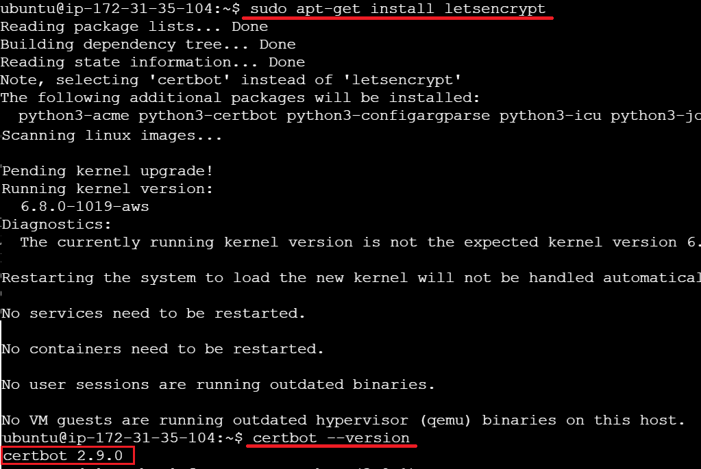
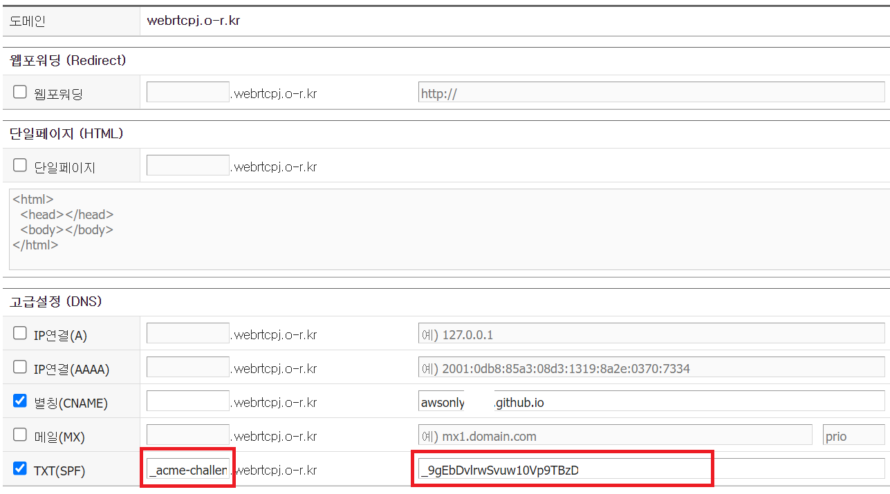
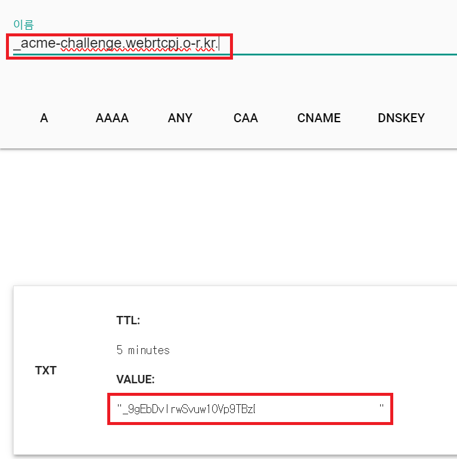
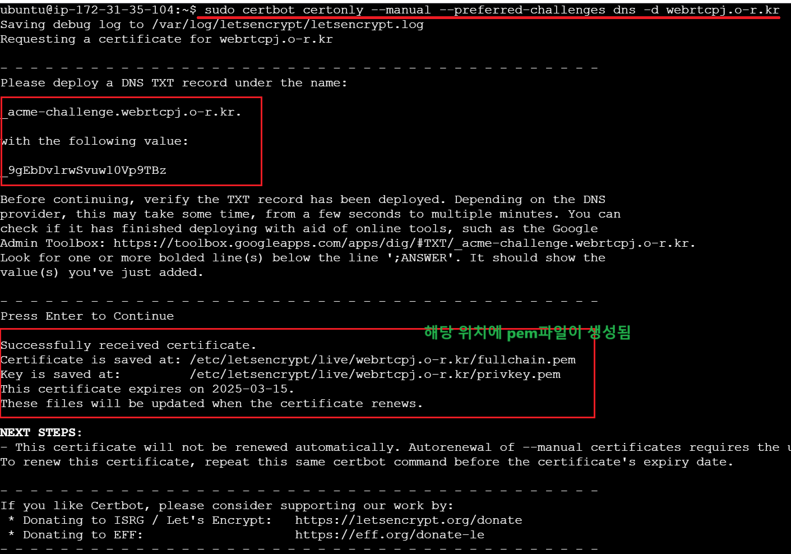

1. # SSL이란
   Secure Sockets Layer Certificate는 웹사이트와 사용자 간에 데이터를 안전하게 __암호화__ 하기 위해 사용되는 __디지털 인증서__ 입니다. TSL의 상위 버전이 SSL입니다.   
   CA(Certificate Authority)라는 인증서를 발급해주는 기관이 있습니다.  DigiCert, GlobalSign, Sectigo, Let's Encrypt등, 여러 기관이 있는데 영리 단체와 비영리 단체가 있습니다. Let's Encrypt가 비영리 단체로 무료 인증서를 발급 받을 수 있습니다.   

1. # ## Let's Encrypt 인증서 발급   
   Let's Encrpyt는 HTTPS의 활성화를 위해 무료로 SSL/TLS 인증서를 제공하는 비영리 조직입니다.   
   Let's Encrypt에서 도메인 검증을 받기 위해서는 Webroot, web Server, StandAlone 3가지 방식이 있는데  Webroot, web Server는 nginx나 Apache같은 웹서버가 필요하지만 StandAlone는 서버 없이 검증받을 수 있기 때문에 AWS의 ALB에 사용하기에 적합합니다.   

   __인증 방식__   
   1.Webroot : 도메인의 웹 서버의 특정 디렉토리(기본적으로 .well-known/acme-challenge/)에 검증 파일을 생성하고 이를 통해 도메인 소유권을 확인하는 방식입니다. 웹 서버(예: Apache, Nginx)가 실행 중이어야 합니다.   
   ```yml
      # 예시 
      certbot certonly --webroot -w /var/www/html -d example.com  # --webroot 사용용
   ```

   2.web Server : Certbot이 직접 웹 서버를 제어하고, HTTP-01 검증에 필요한 파일을 자동으로 배치 및 제공하도록 설정합니다. Certbot은 Apache 또는 Nginx의 설정 파일을 수정하여 .well-known/acme-challenge/ 경로를 처리하는 임시 구성 파일을 만듭니다.   
   ```yml
      # 예시 
      certbot --apache  # --apache 옵션 사용 또는 --nginx 옵션 사용
   ```

   3.StandAlone : Standalone 방식은 Certbot이 자체적으로 간단한 HTTP 또는 HTTPS 서버를 실행하여 도메인 검증을 수행하는 방식입니다. 이 방식은 기존 웹 서버가 없는 환경에서 주로 사용됩니다.   
   ```yml
      # 예시 
      certbot certonly --standalone -d example.com  # stanalone 옵션 사용
   ```

   4.DNS: 도메인의 TXT레코드를 통해서 인증을 받습니다. 도메인 와일드 카드(*.sample.com) 방식으로 인증 가능하며 인증서를 갱신할 때마다 TXT레코드를 변경해야한다. TXT레코드 변경은 자동화가 가능합니다.   
   ```yml
      # 예시
      sudo certbot certonly --manual --preferred-challenges dns -d example.com -d www.example.com  # --manual 옵션 사용
   ```

# 1. Certbot 설치   
   EC2 인스턴스에서 Certbot을 설치합니다.   

   ```yml
      -Red hat-
      sudo yum install -y epel-release
      sudo yum install -y certbot
   ```

   ```yml
      -Debian-
      sudo apt update
      sudo apt install certbot -y # 만약 설치가 안되면
      sudo apt-get install letsencrypt # 이걸로 설치
   ```   
   install certbot로 설치 시 error가 많이 발생한다고 합니다. letsencrypt를 설치하면 여기에 certbot가 포함되어 있기 때문에 letsencrypt를 설치하면 됩니다.   

      

1. # SSL 인증서 발급   

   __1.standalone : HTTP-01 인증 방식__   
   ```yml
      sudo certbot certonly --standalone -d example.com -d www.example.com
   ```   
   certbot 명령어를 실행하여 Standalone 모드로 인증서 발급을 합니다. Standalone 모드는 80번 포트에서 HTTP 요청을 처리합니다. 따라서 80번 포트가 비어 있어야 합니다. (다른 프로세스가 사용 중이라면 종료해야 합니다.)   

   -d 옵션 뒤에 ALB에서 사용할 도메인 이름을 입력합니다.   
   
   *하나의 인증서에 여러 도메인(예: example.com과 www.example.com)을 포함시킬 수 있기 때문에, -d 옵션을 여러 번 사용하여 여러 도메인을 지정할 수 있습니다.   
   example.com과 www.example.com 두 도메인에 대해 하나의 인증서를 발급받기 위해 Certbot을 실행합니다. 이렇게 하면 두 도메인에 대해 별도로 인증서를 발급받는 대신, 하나의 인증서로 두 도메인을 모두 커버할 수 있습니다.   

   Certbot은 자동으로 Let's Encrypt 서버와 통신하여 인증서를 발급받습니다.   
   
   발급된 인증서 확인 발급된 인증서는 기본적으로 다음 경로에 저장됩니다.   
   인증서: /etc/letsencrypt/live/example.com/fullchain.pem   
   프라이빗 키: /etc/letsencrypt/live/example.com/privkey.pem   

      
   https://webrtcpj.o-r.kr/은 cname으로 https://awsonly2024.github.io/를 가리키고 있습니다. 여기서 awsonly2024는 github pages에 웹 호스팅된 도메인 주소입니다. gitHub Pages에서 호스팅하는 도메인에 대해 SSL 인증서를 발급받는 것은 불가능합니다.!!   
   certbot certonly --standalone은 Certbot이 __로컬 서버__ 에서 http 요청을 처리할 수 있을 때만 동작합니다. 처음 Certbot는 webrtcpj로 접근하고 webrtcpj가 가리키는 cname의 awsonly2024로 요청을 보냅니다. 하지만 github pages는 로컬 서버도 아니고  HTTP-01 인증 요청을 보내도, GitHub Pages는 해당 요청을 처리할 능력이 없기 때문에 인증 실패가 발생합니다.    

   => 해결 방법 : manual옵션을 사용한 DNS-01 인증 방식 사용   

   __2.manual : DNS-01 인증 방식__   
   로드 밸런서를 통해 트래픽을 처리할 것이므로, Certbot이 HTTP 요청을 직접 처리하지 못합니다. 대신 DNS 검증을 사용합니다.   
   ```yml
      sudo certbot certonly --manual --preferred-challenges dns -d example.com  # --manual
   ```   
   수동 모드로 진행합니다. 이 모드에서는 Certbot이 자동으로 인증을 처리하지 않고, 사용자가 특정 작업을 직접 수행해야 합니다. 실행 중 Certbot이 TXT 레코드를 추가하라고 지시합니다. 이를 AWS Route 53에 추가해야 합니다. 수동으로 DNS 레코드 추가가 필요하고 DNS를 직접 관리할 수 있어야 합니다.   
   => DNS TXT 레코드 추가   
   AWS Management Console로 이동 -> Route 53 -> 호스팅 영역(Hosted Zone) -> 도메인 선택 -> Certbot에서 제공한 TXT 레코드를 도메인의 TXT 레코드로 추가(1~2분 소요)   

   현재 저의 상황은 awsonly2024.github.io 를 webrtcpj.o-r.kr로 DNS를 변경 후 webrtcpj.o-r.kr 도메인으로 EC2에 접근합니다. DNS-01 인증 방식은 DNS에 따라 인증을 발급받는 것이기 때문에 변경 전의 awsonly2024.github.io는 필요가 없고(실제 txt에 입력할 수 있는 부분이 없음), 현재 DNS webrtcpj.o-r.kr 부분이 중요합니다.   
   ```yml
      sudo certbot certonly --manual --preferred-challenges dns -d webrtcpj.o-r.kr  # awsonly2024없이 webrtcpj만 입력합니다.
   ```   
      
      webrtcpj.o-r.kr가 CNAME으로 다른 도메인(awsonly2024.github.io)을 가리키고 있어도 DNS 레코드를 추가하면 인증이 가능하므로, webrtcpj.o-r.kr 도메인의 DNS 설정에 TXT 레코드를 추가하는 방법을 사용해야 합니다.  --manual dns는 도메인을 따라가기 때문에 awsonly2024가 아니라 webrtcpj가 중심이 되어 요청을 받게 됩니다. 

   해당 한국 도메인에서 위에 나온 결과 값들을 입력합니다.   
      
   _acme-challenge.webrtcpj.o-r.kr. : txt :  _9gEbDvlrwSvuw10Vp9TB   
   *해당 도메인 사이트는 webrtcpj의 TXT 값만 입력이 가능. awsonly2024 부분은 입력란 자체가 없음. cname을 awsonly2024로 해도 dns 중심으로 webrtcpj만 입력하면 됨   

   <a href="https://toolbox.googleapps.com/apps/dig/#TXT/_acme-challenge.sample.com">여기</a> 사이트에서 DNS값이 제대로 등록 되었는지 확인합니다.(2~3분 소요)   
      

   인증서가 정상적으로 발급됨(전체 화면)   
         

1. # 인증서 발급   
   Certbot이 DNS 검증에 성공하면 인증서를 발급합니다.   
   발급된 인증서는 일반적으로 /etc/letsencrypt/live/example.com/ 디렉터리에 저장됩니다.   

   인증서 파일:  /etc/letsencrypt/live/webrtcpj.o-r.kr/fullchain.pem 
   개인 키 파일: /etc/letsencrypt/live/webrtcpj.o-r.kr/privkey.pem
