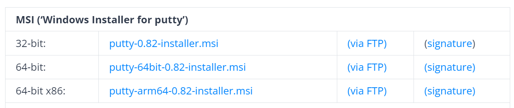
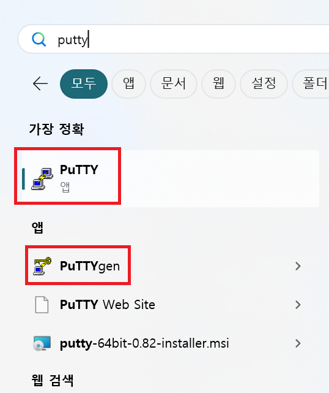
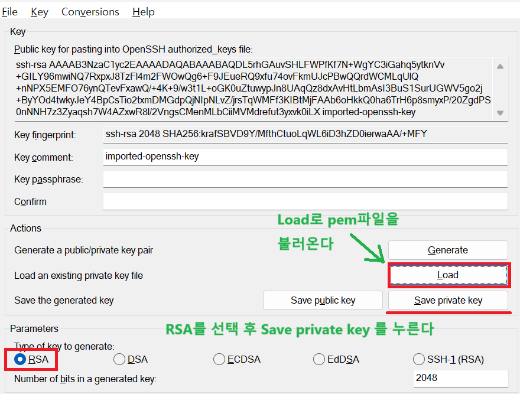
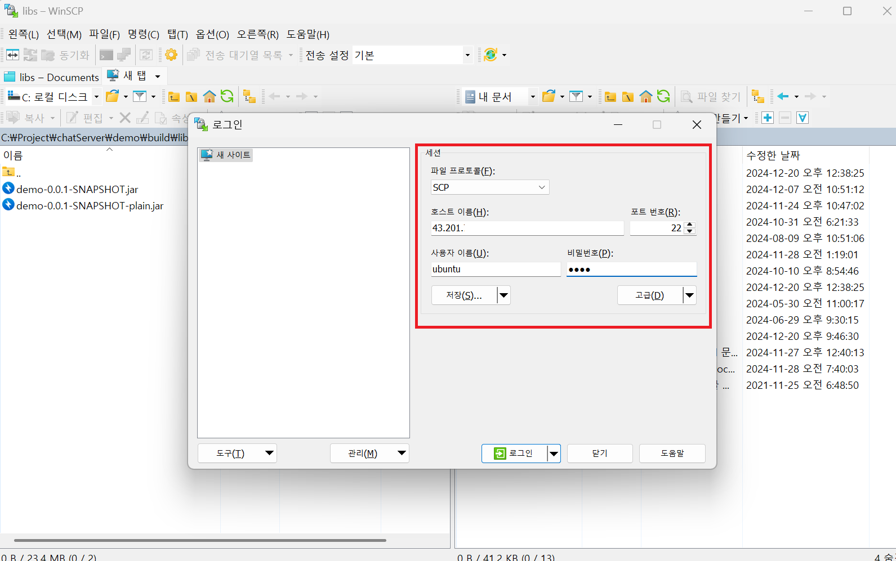
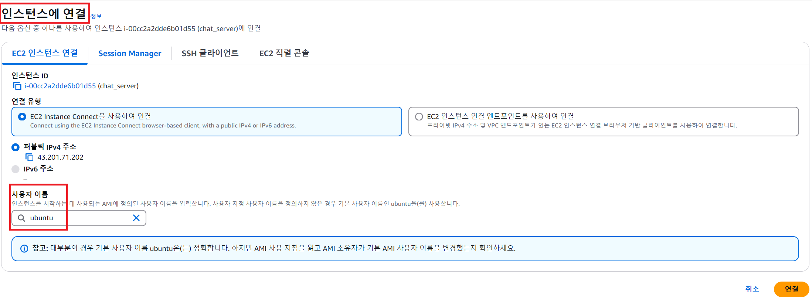
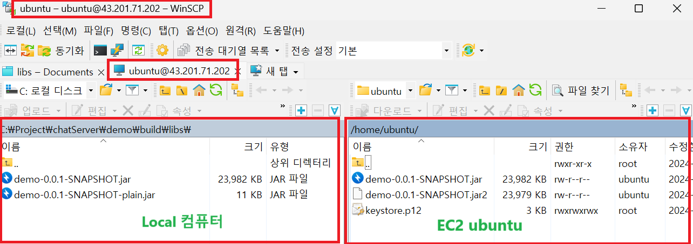

1. # WinSCP 
   EC2의 인스턴스를 리눅스 계열로 설치한 경우 리눅스에서 생성된 파일을 윈도우로 옮기거나 윈도우 파일을 리눅스로 옮길 때 SCP 명령어를 사용합니다. SCP란 Secure Copy Protocol로 프로토콜입니다. SCP는 SSH를 기반으로 동작합니다. SCP는 네트워크를 통해 파일을 복사하고 SSH를 통해 데이터가 암호화 되어 보안이 된 상태로 전송이 됩니다. SCP는 파일복사 후 SSH를 기반으로 파일 전송을 하는 프로토콜입니다.   

   ```
      scp C:\programming\blog\natista99 ubuntu-desk@192.168.111.130:/home/ubuntu-desk
   ```   
   CLI 방식으로 사용을 할 수 있습니다. 이를 윈도우 GUI 환경으로 사용할 수 있도록 만든 프로그램이 WinSCP입니다.   
   
1. # AWS의 우분투 EC2에서 WinSCP사용
   우분투 환경의 EC2 인스턴스에 있는 파일을 윈도우로 가져오거나 윈도우에서 인스턴스로 파일을 옮기기 위해서 WinSCP를 사용할 수 있습니다.   
   먼저, 인스턴스를 만들 때 생성한 pem 보안 파일이 있어야 합니다.   
   pem파일을 puttygen을 이용하여 ppk파일로 변환 후 ppk파일로 WinSCP를 통해 EC2에 접근하게 됩니다.   

   여기서 putty를 다운 받습니다.   
   <a href="https://www.puttygen.com/download-putty">putty</a>   

   putty설치 버전 msi버전을 자신에 맞게 찾아서 설치합니다.   
      

   putty를 설치하면 puttygen이 같이 설치됩니다.   
      

   Load를 선택해서 pem파일을 불러온 후 Save pirvate key를 선택해서 ppk파일을 생성합니다.   
      

1. # WinSCP 실행

   <a href="https://winscp.net/eng/download.php">https://winscp.net/eng/download.php</a> winscp를 다운 받습니다.   

      
   파일 프로토콜 : SCP   
   호스트 이름 : EC2 인스턴스 주소   
   포트 번호 : 22(SSH 또는 SCP)   
   사용자 이름 : ubuntu - 인스턴스 연결할 때 부여되는 이름   
      
   비밀번호 : root의 비밀번호   

   연결된 화면   
      


