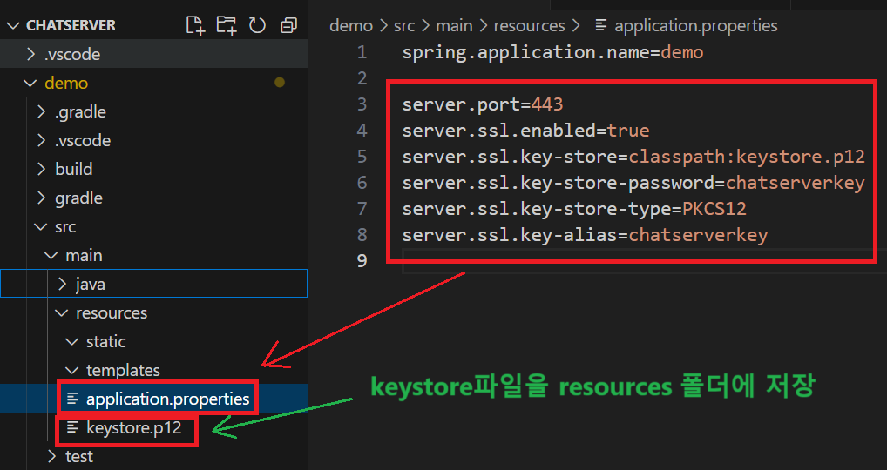

1. # HTTPS 사용하기
   2차 프로젝트에서는 채팅 서버를 자바 스프링으로 만든 후 EC2에 배포를 했고 클라이언트는 git pages 웹 호스팅을 했고 도메인을 webrtcpj.i-o.kr로 바꾼 상태였습니다.   
   도메인 webrtcpj.i-o.kr이 실행되면 자바스크립트로 구현한 클라이언트 측 내부에서 `SockJS("http://<EC2 주소>/webrtcpjs/test")`이 실행되면서 http로 EC2에 배포된 채팅 서버로 접속을 하게됩니다. 이때 AWS는 보안상 http의 접근을 막게 됩니다. https만 요구를 하는 상황에서 http의 접근은 오류가 발생하게됩니다. 만약  `SockJS("http://<EC2 주소>/webrtcpjs/test")`를 https로 변경하여 `SockJS("https://<EC2 주소>/webrtcpjs/test")`로 접근을 하게되면 트래픽이 서버까지 도달은 하지만 JAVA로 구현한 서버측에 https에 대한 어떤 처리과정도 없기 때문에 채팅에 대한 오류가 발생하게 됩니다.   

   이제 자바로 구현한 챗팅 서버 내부에서 https를 처리하도록 만들겠습니다. 먼저 http의 트래픽을 https로 바꾸기 위해서는 <a href="https://khj20231204.github.io/project/ssl">SSL 발급</a>을 해야합니다. SSL 파일을 이용해서 keystore를 만듭니다. keystore파일을 자바 서버의 resources 폴더에 저장 후 설정을 합니다. 이렇게 하면 https를 입력받아 처리를 할 수 있습니다.      

1. # keystore파일 생성
   JAVA와 Windows에서 인증 형식의 파일을 사용하기 위해서는 PKCS#12란 형식을 사용해야 합니다. PKCS#12는 공개키 암호화를 사용하기 위한 표준 형식입니다. 인증 받은 SSL인증서에서 인증서 부분과 개인 키를 keystore란 하나의 파일로 만드는데 이때 내가 설정한 암호를 이용하여 디코딩하게 됩니다. kyesotre12 키 생성하는 과정   

   ```js
      root@ip-172-31-35-104:/etc/letsencrypt/live/chatserverpj.o-r.kr# openssl pkcs12 -export \
        -in /etc/letsencrypt/live/chatserverpj.o-r.kr/fullchain.pem \
        -inkey /etc/letsencrypt/live/chatserverpj.o-r.kr/privkey.pem \
        -out keystore.p12 \
        -name chatserverkey \
        -password pass:chatserverkey
   ```
   openssl pkcs12 -export \ : pkcs12 파일을 생성하겠다   
   -in /etc/letsencrypt/live/chatserverpj.o-r.kr/fullchain.pem \  : fullchain.pem 가져오기   
   -inkey /etc/letsencrypt/live/chatserverpj.o-r.kr/privkey.pem \ : privkey.pem 가져오기기   
   -out keystore.p12 \ : funllchain과 privkey를 합쳐 keystore.p12 생성 후, 내보내기   
   -name chatserverkey \ : 닉내임   
   -password pass:chatserverkey : 디코딩 시 암호   

   생성된 파일 내용 확인   
   ```
      openssl pkcs12 -info -in keystore.p12
   ```   

   EC2 인스턴스의 CLI 창에서 위에 명령을 바로 실행하면 keystore.p12란 파일이 생성됩니다.   
   처음 생성된 keysotre.p12는 읽기, 쓰기, 실행이 금지된 상태입니다. chomod 777로 권한을 변경 후 WinSCP를 이용하여 Windows로 파일 가져옵니다.   
   ```
      chmod 777 keystore.p12
   ```   

1. # 자바에 적용
   application.properties에 밑에 내용을 추가합니다.   
   ```yml
      server.port=443
      server.ssl.enabled=true
      server.ssl.key-store=classpath:keystore.p12
      server.ssl.key-store-password=chatserverkey
      server.ssl.key-store-type=PKCS12
      server.ssl.key-alias=chatserverkey
   ```

   resources 폴더에 keysotre파일을 저장합니다.   

      
