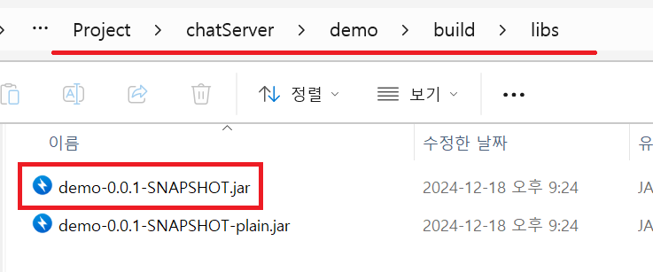

1. # EC2에서 JAVA 프로젝트 실행
   build 후 도커 이미를 생성 후 EC2에 배포를 할 수도 있지만 build한 jar파일을 EC2에 복사해서 바로 실행할 수도 있습니다. WAR파일은 외부 톰캣을 이용하기 때문에 톰캣을 설치해야 하지만 JAR파일은 내부 톰캣을 사용하기 때문에 EC2의 인스턴스로 복사 후 바로 실행할 수 있습니다.   

1. # 빌드 하기

   해당 프로젝트의 루트 경로에서 빌드를 수행합니다.   
   ```
      gradlew clean build
   ```

   build를 하고 나면 build란 폴더가 생성되고 build\libs란 폴더 안에 `.jar` 파일이 2개 생성됩니다.   
      
   *-SNAPSHOT.jar 과 *-SNAPSHOT-plain.jar 파일 중 SNAPSHOT.jar 파일을 EC2로 복사합니다.   

   파일을 옮기는 건 scp를 이용하던지 WinSCP를 이용하면 됩니다.   

1. # EC2에서 실행
   user의 home 디렉토리로 옮긴 후 다음 명령을 수행합니다.   
   ```
      java -jar your-application.jar
   ```