* windows의 경우 PowerShell 보다는 cmd창에서 작업하는 것을 권장합니다.
  PowerShell의 경우 Windows 기본 환경 값이 Restricted로 되어있어 스크립트의 직접 실행을 막아놨습니다. 그래서 PowerShell에서 밑에 명령어들을 실행하기 위해선 execution policy을 변경해야 됩니다.   
  
1. # node.js설치
   <a href="https://nodejs.org/en">https://nodejs.org/en</a>   
   LTS를 다운받으시면 됩니다.   
   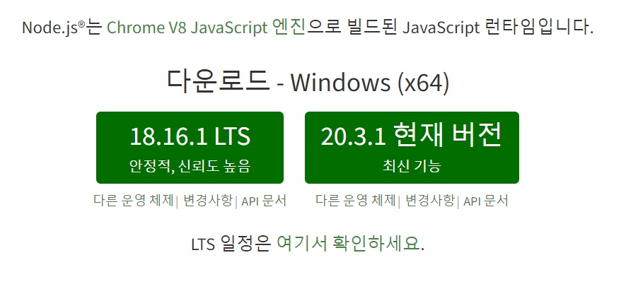

1. # react 폴더생성
   폴더를 생성 후 경로창에 바로 cmd를 입력해서 해당 경로를 가진 cmd를 실행합니다.   
   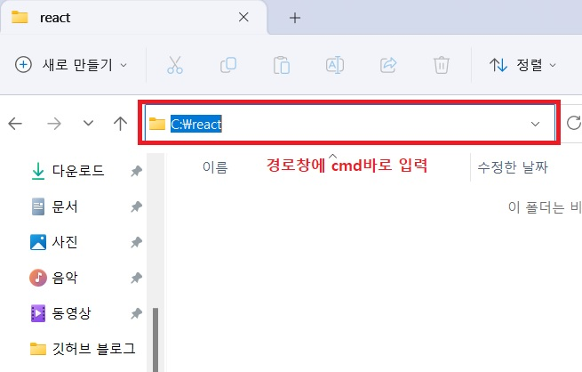   
   C:\react 폴더에서 cmd를 바로 입력합니다.   
   <br>
   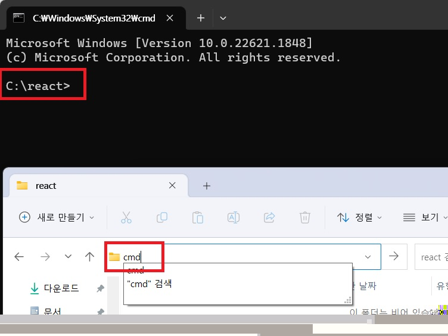   
   cmd창 경로가 C:\react>로 나타납니다.

1. # node 버전 확인
   node -v

1. # npx로 cra설치하기
   my-app이란 이름을 가진 프로젝트를 만들기위해 npx에서 cra라이브러리를 이용합니다.   
   npx create-react-app my-app    
   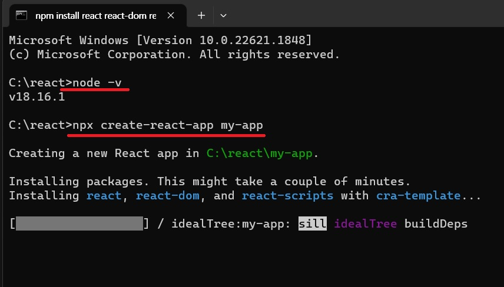   

   <h4>■다음과 같은 에러가 뜨는 경우..</h4>   
   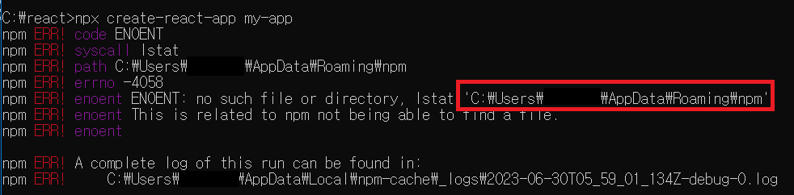   
   <h5>원인</h5>   

   `C:\Users\{사용자 폴더}\AppData\Roaming`에 npm 폴더가 없기 때문입니다.   
   
   <span style="font-size:16px;font-weight:bold">*AppData폴더란?<span>   
   <span style="font-size:16px;">윈도우 어플리케이션의 설정 파일들이나 임시 저장파일들, 동기화를 위한 데이터를 저장하는 곳입니다. 폴더는 Local, LocalLow, Roaming 3개로 구성되어 있습니다.<span>   

   <h5>해결책</h5>   
   npm install npm -g 입력 후 다시 설치   
   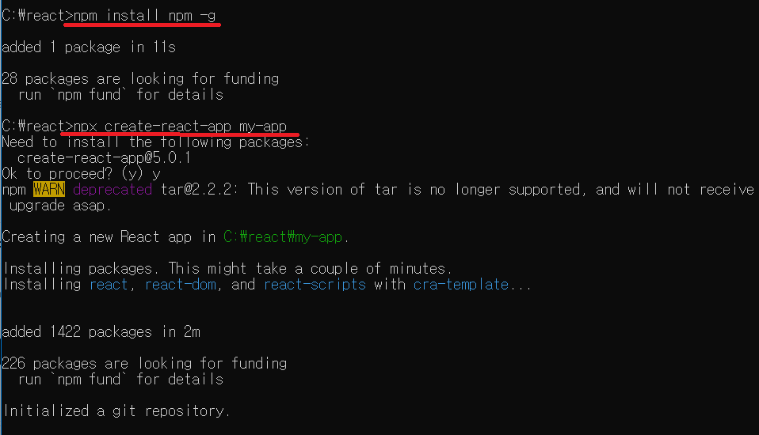   
   npm install [패키지명] [옵션]    

   g 옵션을 붙일 경우 시스템 폴더(Roaming)에 설치를 하는데 npm 패키지를 직접 설치하게 됩니다.   

   <h4>■만약 해결이 안된다면..</h4>   
   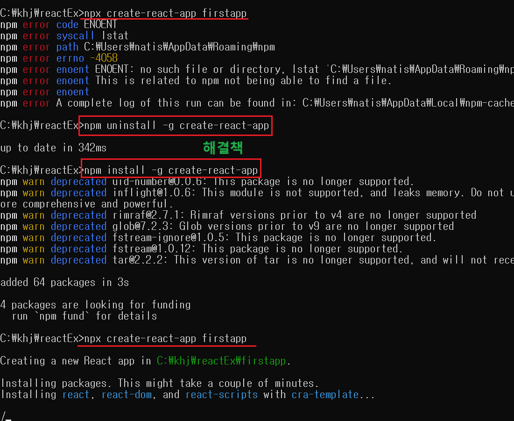   
   ```
      npm uninstall -g create-react-app

      npm install -g create-react-app
   ```   
   전역으로 설치된 create-react-app을 삭제 후 다시 설치합니다.   

1. # 설치 완료 화면   
      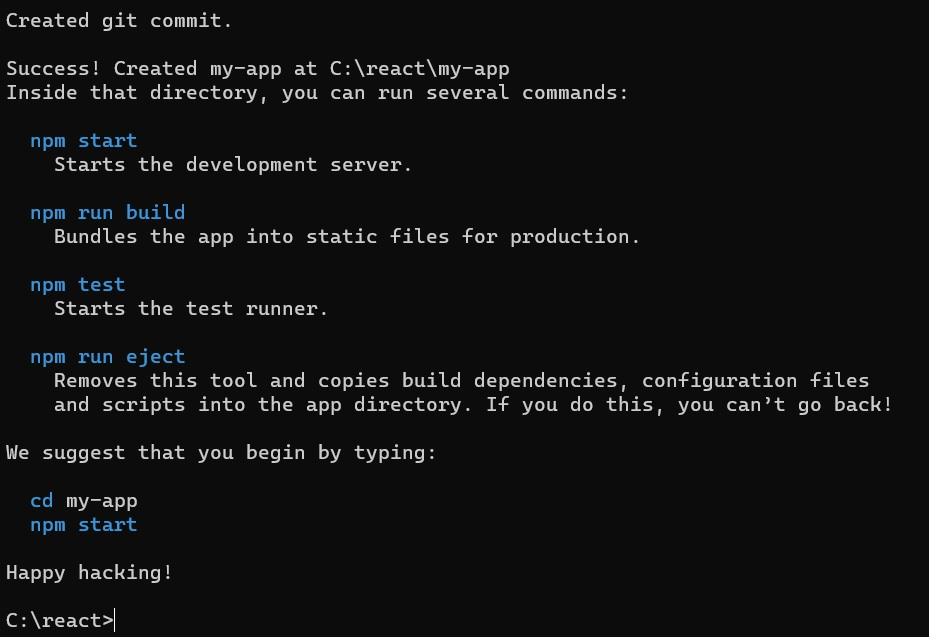   

1. # npm 실행하기   
      반드시 프로젝트 해당 폴더에서 npm start를 입력해야 됩니다.   
      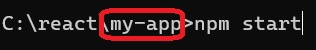   
      경로my-app을 확인합니다.   

      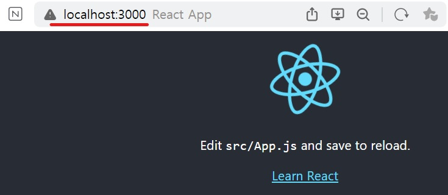   
      locahhost:3000으로 기본 포트가 3000번임을 확인 할 수 있습니다.   

      <h4>■다음과 같은 에러가 뜨는 경우..</h4>   
      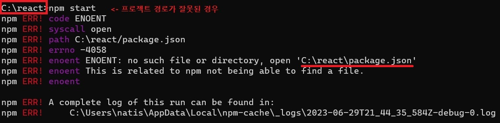   
      프로젝트 폴더(create-react-app를 이용해서 만든my-app)가 아닌 경우 다음과 같은 에러가 나타납니다.   
      현재 실행 폴더를 my-app으로 변경해서 실행합니다.   

1. # 설치할 모듈들
   __부트스트랩__   
   ```
      npm install react-bootstrap bootstrap   
   ```
   *부트스트랩 모듈도 추가 했고, 제공된 사이트 import도 했는데 태그 요소들은 나타나고 스타일이 적용 안 되는 경우   
   ```cs
      import 'bootstrap/dist/css/bootstrap.min.css';
   ```
   css도 적용을 해줘야 됩니다.   

   __라우터__   
   ```javascript
      npm install react-router-dom

      import {Routes, Route, Link} from 'react-router-dom'
      import { BrowserRouter } from 'react-router-dom'
   ```
   
   index.js   
   ```cs
      const root = ReactDOM.createRoot(document.getElementById('root'));
      root.render(
      <React.StrictMode>
         <BrowserRouter>
         <App />
         </BrowserRouter>
      </React.StrictMode>
      );
   ```

   App.js
   ```cs
      <Routers>
         <Router path="/detail" element={<componet/>}>
      </Routers>
   ```

   __Styled__   
   ```javascript
      npm install styled-components
      //component가 아니라 component__s__ 입니다.

      import styled from 'styled-components'  //import
   ```

   __지도__   
   ```
      npm install --save @svg-maps/south-korea
   ```
   node_modules 폴더에 @svg-maps 폴더가 생긴다. 폴더 내부에 있는 south-korea.svg 파일을 public 폴더 내부에 넣어주자.
   ```
      <svg xmlns="south-korea.svg" viewBox="0 0 524 631">
         <path ~~~ />
         <path ~~~ />
         ~~~
      </svg>
   ```
   svg 태그를 만들어주고, 내부에 south-korea.svg의 svg 태그 내부에 있는 모든 path를 복사해서 넣어준다.

   1. VS Extension   
      1.Auto Import - ES6, TS, JSX, TSX : 자동 import   
      1.ESLint : 문법 검사   
      2.Prettier - Code formatter : 코드 정렬   
      3.Reactjs Code snippets : 자동 완성   
      4.vscode-styled-components : css 자동 완성   


1. # 프로젝트 완성 후 배포하기 위해 build하기
      프로젝트 폴더안의 VSCode terminal에서 npm run build 실행. 서버에 올리기위해 압축하는 과정   
      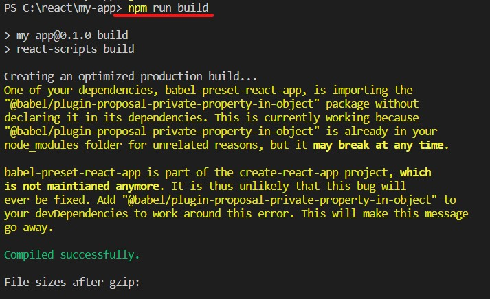   

1. # serve 설치 및 실행   
      1.서버 설치 : npm install serve -g   
      2.서버 실행 : serve -s build   
      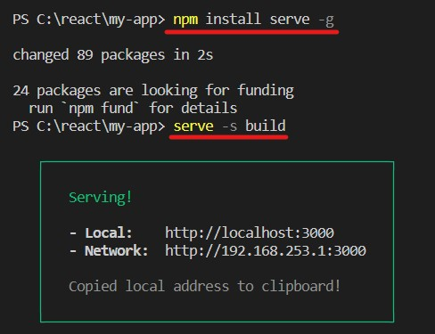     

      <h4> ■다음과 같은 에러가 뜨는 경우..</h4>
      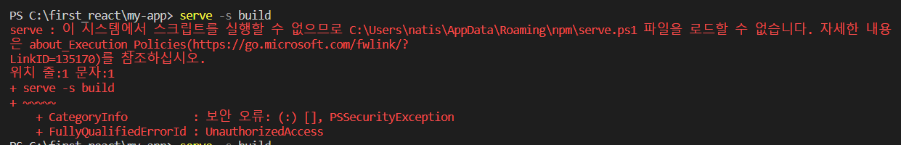   
      ps에서 직접 스크립트를 실행할 수 없도록 막아놓은 보안 정책 때문입니다.   

      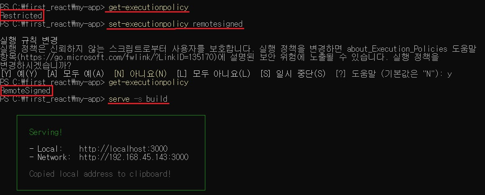   
      get-executionpolicy로 현재 실행정책을 가져오면 restricted로 되어있는데 set-executionpolicy 실행 후 executionPolicy을 6가지 실행정책 중 가장 권장하는 RemoteSigned로 해주시면됩니다.   

      -결과화면-   
      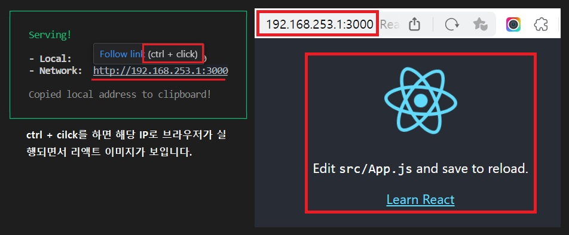   

