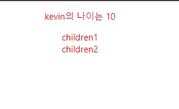

1. # Component?

   어떤 걸 컴포넌트로 만들면 좋은가?   
   1.반복적인 html을 축약을 할 때   
   2.큰 페이지들   
   3.자주 변경되는 것들    

   React에서 페이지를 구성하는 최소단위입니다.
   ```javascript
      //Component   
      const MyComponent = ({children}) => {
         return <div style={ {padding:20, color:'blue'} }>{children}</div>
      }

      //App
      const App = () => {
         return (
            <div>
               <p>안녕</p>
               <MyComponent children="하이"></MyComponent>
            </div>
         )
      }

      결과값 : 
      하이
   ```
1. # Component의 이름은 대문자로 시작
   Component의 시작을 대문자로 적으므로써 기존 HTML코드인지 Component인지 구별할 수 있습니다.
1. # Class component와 Function Component
   ```javascript
      //클래스 Component
      class Hello extends Component{
         render(){
            const {name} = this.props
            return <div>{name}님 안녕하세요</div>
         }
      }

      //function Component
      const Hello = (props) => {
         const {name} = props
         return <div>{name}님 안녕하세요</div>
      }
   ```
   깊은 내용은 나중에
1. # 특징
   ```javascript
      <MyComponent user={ {name:'kim', age:13} } color='red'>
         <div>나는 자식</div>
      <MyComponent>
   ```
   컴포넌트의 속성에 해당하는 부분. user,color,div를 Props(Properties)라고 합니다. 컴포넌트 안에 작성된 하위 Element를 children이라고 합니다. 여기선    
   ```javascript
      <div>나는 자식</div>
   ```
   이 해당합니다   
   <h3>값을 넘겨주고 받을 때</h3>
   ```javascript
   //App
      function App(){
         return (
            <div className="App">
              
               <MyComponent user={ {name: "kevin", age: 10} } color="red">
                  <div>children1</div>
                  <div>children2</div>
                </MyComponent>
            </div>
         )
      }

      /*
      MyComponent의 파라미터로 값이 전달 될때
      {
        user: { name: "kevin", age: 10 },
        color: "red",
        children: <div>children1</div>
                  <div>children2</div>
      }
      다음과 같이 객체로 전달이 됩니다
      */ 

      //MyComponent
      const MyComponent = (props) => {
         const {user, color, children} = props;
         return (
            <div style={ {color} }>
               <p>{user.name}의 나이는 {user.age}</p>
                  {children}
            </div>
         );
      }
   ```
   MyComponent의 요소값들을 객체로 받을 때 객체 전체를 받고 싶으면 props로, 객체의 프로퍼티를 쪼개서 받고싶으면 {props}와 같이 { }를 사용합니다.   
   여기서 중요한 건 children이란 props인데 children은 리액트의 컴포넌트에서 기본으로 전달되는 props로, 해당 컴포넌트 내부에 작성된 "자식 컴포넌트"를 의미 합니다. 자식 컴포넌트를 명시적으로 전달하지 않아도 자동으로 전달됩니다.   
   결과 화면 :   
      
   
1. # 컴포넌트에서 데이터   
   *컴포넌트끼리 데이터를 주고받을 땐 Props*   
   *컴포넌트 내에서 데이터를 관리할 땐 State*    
   *데이터는 "부모"에서 "자식"으로만 전달*   

1. # div 묶기
   의미 없는 div를 묶을 때는 `<></>`를 사용합니다.   

   ```javascript
      const Modal = () => {
         return(
         <>
            <div className="modal">
               <h4>제목</h4>
               <p>날짜</p>
               <p>상세내용</p>
            </div>
            <div>부제목</div>
            <div>작성자</div>
         </>   
         )
      }
   ```   
