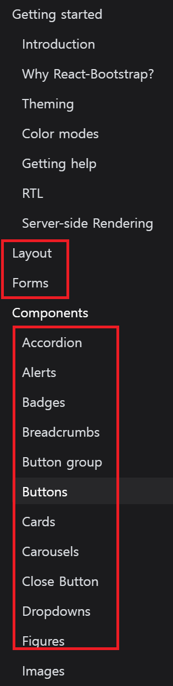

1. # 설치
   <a href="https://react-bootstrap.netlify.app/docs/getting-started/introduction">https://react-bootstrap.netlify.app/docs/getting-started/introduction</a>   

   1.부트스트랩 설치
   ```
      npm install react-bootstrap bootstrap
   ```   

   <br>

   2.css경로 붙혀넣기
   App.js에 import   
   ```javascript
      import 'bootstrap/dist/css/bootstrap.min.css';
   ```   
   
   또는   

   public/index.html의 head에 붙혀넣기
   ```javascript
      <link rel="stylesheet"
      href="https://cdn.jsdelivr.net/npm/bootstrap@5.3.2/dist/css/bootstrap.min.css"
      integrity="sha384-T3c6CoIi6uLrA9TneNEoa7RxnatzjcDSCmG1MXxSR1GAsXEV/Dwwykc2MPK8M2HN"
      crossorigin="anonymous"/>
   ```   

   <br>

   3.요소 선택
      
   왼쪽 메뉴에서 Layout, Forms, Components를 선택할 수 있습니다.   

   버튼 선택   
   ```
       <Button variant="primary">Primary</Button>
   ```   
   앞글자 대문자는 __컴포넌트__ 입니다. 컴포넌트를 사용하려면 import를 해야 합니다.   

   <br>

   4.상단에 import소스를 가져와서 붙혀넣기   
   ```   
      import Button from 'react-bootstrap/Button';
   ```

   <br>

   5.Navbars 추가   
   ```javascript
      <Navbar bg="dark" data-bs-theme="dark">
        <Container>
          <Navbar.Brand href="#home">Navbar</Navbar.Brand>
          <Nav className="me-auto">
            <Nav.Link href="#home">Home</Nav.Link>
            <Nav.Link href="#features">Features</Nav.Link>
            <Nav.Link href="#pricing">Pricing</Nav.Link>
          </Nav>
        </Container>
      </Navbar>
   ```   
   대문자는 컴포넌트이기 때문에 전부 import를 해야합니다.   

   import목록이 3개 입니다.   
   ```import
      import Container from 'react-bootstrap/Container';
      import Nav from 'react-bootstrap/Nav';
      import Navbar from 'react-bootstrap/Navbar';
   ```   

   한번에 import 하기   
   ```javascript
      import {Button, Container, Nav, Navbar }from 'react-bootstrap';
   ```   
   