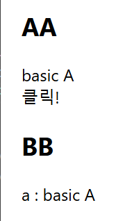
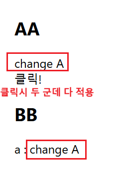

1. # Context API
   부모 state를 저장해서 자식에게 전달하는 기능을 합니다. React는 기본적으로 부모에서 자식으로 데이터가 흐르는 단방향 데이터 흐름을 따릅니다. 즉, 부모 컴포넌트에서 자식 컴포넌트로 props를 통해 데이터를 전달하고, 자식 컴포넌트는 props를 통해 받은 데이터를 기반으로 자신의 상태를 변경할 수 있지만, 그 반대는 되지 않습니다. useContext는 부모 컴포넌트에서 제공한 값을 자식 컴포넌트에서 사용할 수 있도록 해주는 역할을 합니다. 즉, 부모에서 자식으로 데이터를 전달하는 통로 역할을 할 뿐, 자식에서 부모로 데이터를 역전파하는 기능은 제공하지 않습니다.   

1. # create와 provider를 1개로

   __1)부모 컴포넌트__   

      1)createContext를 선언. export해주기!!🪓   
      2)Provider를 붙이고 value에 state를 입력한다.🧹   
      3)state를 넘기 컴포넌트를 둘러싼다.💉   
      
      ```javascript
         -App.js- 

         import './App.css';
         import { createContext, useContext, useState } from 'react';
         import { Routes, Route } from 'react-router-dom';
         import Details from './Details';

         {/*
         1)App에 있는 state를 공유하겠다
         2)context선언
         3)선언한 context로 감싸기
         */}

         export let Context1 = createContext() //1)🪓context 객체 생성

         function App() {

         let [stock] = useState([10,11,12]);
         let [shoes] = useState('shoes');

         return (
            <div className="App">
               <h1>App.js home</h1>

               <h2>{childValue}</h2>

               <Routes>
                  <Route path="/detail" element={
                     <Context1.Provider value={{ stock,shoes }}> {/* 
                     2)🧹Provider를 붙이고 value에 state를 저장한다
                     3)💉context로 둘러싼다 */}
                     <Details/> {/* 여기 안의 모든 컴포넌트는 재고, shoes 사용가능 */}
                     </Context1.Provider>
                  }></Route>
               </Routes>
            </div>
         );
         }
         export default App;
      ```

   __2)자식 컴포넌트__   
      자식 컴포넌트에서 부모 컴포넌트에서 보낸 state를 사용합니다.   

      1)부모에서 선언한 context import하기🔺   
      2)부모에서 선언한 useContext 변수 가져오기🔸   

      ```javascript
         -Details.js-

         import React, { useContext, useState } from 'react'; //useContext 임포트
         import { Context1 } from './App'; //1)🔺Context1 임포트
         
         const Details = () => {

            /* 2)🔸Context1을 넣어서 useContext:Context를 사용하겠다는 뜻
            /* 변수 또는 구조분해 할당으로 useContext 값을 가져온다 */
            let v = useContext(Context1) 
            let {stock, shoes} = useContext(Context1)

            return (
               <div>
                  <h1>Details home</h1>
                  {stock.map((v,i)=> <h2>{v}</h2> )}
                  {shoes}
               </div>
            );
         };

         export default Details;
      ```  


1. # create와 provider를 분리

   1️⃣ContextMaker에서 createContext()생성 : context생성   
   2️⃣ProviderMaker에서 useState선언, ContextMaker로 children감싸기 : state제공   
   3️⃣App에서 ProviderMaker로 실제 자식 컴포넌트 감싸기   
   4️⃣자식 컴포넌트에서 useContext를 사용해서 state값 가져오기   

   *ProviderMaker에서는 children을 ContextMaker로 감싸고, App에서는 자식 컴포넌트들을 ProviderMaker로 감싼다.   

   __1)Context : Context생성__   
   ```javascript
      -ContextMaker-   

      import { createContext } from "react";

      const ContextMaker = createContext();

      export default ContextMaker;
   ```   

   __2)Provider : state제공__
   ```javascript
      -ProviderMaker-

      import React, { useState } from 'react';
      import ContextMaker from './ContextMaker';

      //중괄호 = 자바스크립트로 사용하기 위해서 사용
      //children 매개변수명 바뀌면 안됨
      const ProviderMaker = ({children}) => {

         let [a,b] = useState('basic A');

         return (
            <div>
               {/* {{a,b}} : 자바스크립트기 때문에 {} 한번, 객체를 전달하기 위해서 { } 한번 더 */}
               <ContextMaker.Provider value={{a,b}}>
                  {children} {/* children 이름 바뀌면 안됨, 자식 컴포넌트를 위미 */}
               </ContextMaker.Provider>
            </div>
         );
      };

      export default ProviderMaker;
   ```

   __3)자식 컴포넌트 구성하는 부모 컴포넌트__   
   ```javascript
      -App-

      import ProviderMaker from "./ProviderMaker";
      import AA from "./AA";
      import BB from "./BB";

      const App = () => {
         return (
            <>
            <ProviderMaker>
               <AA></AA>
               <BB></BB>
            </ProviderMaker>
            </>
         );
      };

      export default App;
   ```   
   Provider로 state를 넘겨주고 싶은 컴포넌트를 감쌉니다.   

   4)자식 컴포넌트 AA   
   ```javascript
      -AA-  

      import React from 'react';
      import ContextMaker from './ContextMaker';
      import { useContext } from 'react';

      const AA = () => {
         //useContext의 괄호안에는 Context가 들어간다
         //Provider에서 useState선언시 작명된 변수명을 바꾸면 안됨
         //useContext의 사용은 { }
         //useState의 사용은 [ ]
         let {a,b} = useContext(ContextMaker);

         return (
            <div>
               <h2>AA</h2>
               {a}
               <div onClick={() => {
                  b('change A')
               }}>클릭!</div>
            </div>
         );
      };

      export default AA;
   ```

   5)자식 컴포넌트 BB   
   ```javascript
      -BB-

      import React, { useContext } from 'react';
      import ContextMaker from './ContextMaker';

      const BB = () => {

         let {a,b} = useContext(ContextMaker)

         return (
            <div>
               <h2>BB</h2>
               a : {a}
            </div>
         );
      };

      export default BB;
   ```

   클릭 전   
      
   
   =>AA에서 클릭을 하면 {a}의 값이 바뀌는데, 바뀐 값이 그대로 BB에도 적용   

      